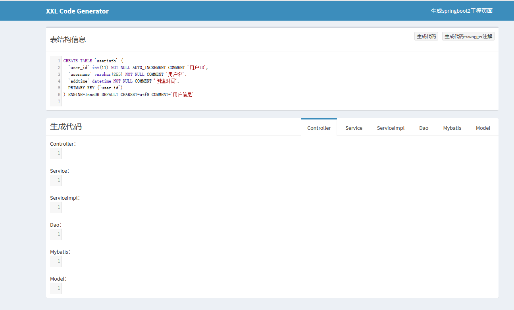
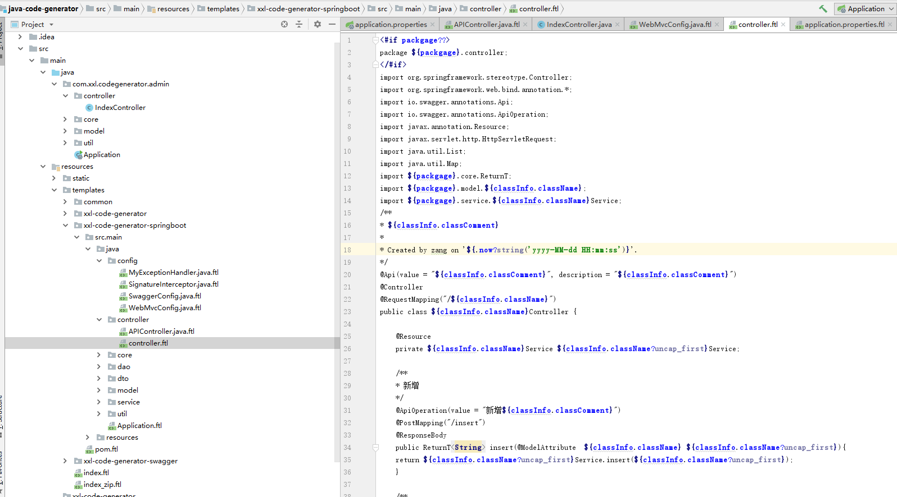

* [一、项目概览](#一数据类型)
    * [1.1 简介](#11-简介) 
    * [1.2 环境](#12-环境)
    * [1.3 源码及官网](#13-源码及官网)
* [二、项目使用](#二项目使用)
* [三、项目设计](#三项目设计)
    * [3.1 总体设计](#31-总体设计)
    * [3.2 关键点分析](#32-关键点分析)
        * [3.2.1 代码生成的实现原理](#321-代码生成的实现原理)  
* [四、其他](#四其他)

# 一、项目概览

## 1.1 简介
- JAVA-CODE-GENERATOR是一个 "controller/service/dao/mybatis/model" 多层的代码生成平台。只需要提供SQL，将会自动生成全部代码。
- web界面方式，生成代码
- [在xxl-code-generator基本上进行增加和修改](http://www.xuxueli.com/xxl-code-generator/)

## 1.2 环境
```aidl
Maven3+
Jdk1.7+
```
## 1.3 源码及官网

[github源码](https://github.com/zanghongmin/java-code-generator)

[官网](http://www.xuxueli.com/xxl-code-generator/)

# 二、项目使用

<br/


- 输入建表语句，点击响应按钮，生成各个类

- 在“生成springboot2工程页面”，可生成一个整个springboot框架的工程


# 三、项目设计

## 3.1 总体设计
无

## 3.2 关键点分析

### 3.2.1 代码生成的实现原理

```aidl
    文件使用freemarker模板,定义好各个类的样式，根据输入的建表语句转化成类信息，放到ftl文件生成代码
    
    // 解析table，转化成ClassInfo类（类名称，表名称，fieldList列表等）
    ClassInfo classInfo = CodeGeneratorTool.processTableIntoClassInfo(tableSql);
    
    使用freemarker.template.Template，处理ftl文件得到处理后的代码
    

```
# 四、其他
