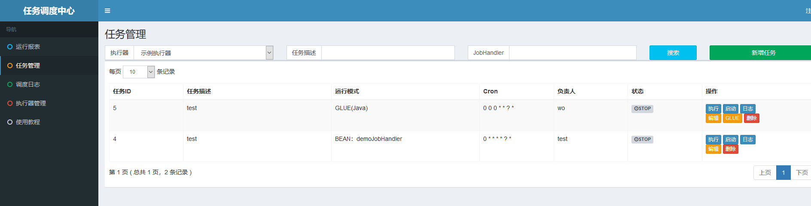

* [一、项目概览](#一数据类型)
    * [1.1 简介](#11-简介) 
    * [1.2 环境](#12-环境)
    * [1.3 源码及官网](#13-源码及官网)
* [二、项目使用](#二项目使用)
* [三、项目设计](#三项目设计)
    * [3.1 总体设计](#31-总体设计)
    * [3.2 关键点分析](#32-关键点分析)
        * [3.2.1 调度中心和执行器怎么通讯](#321-调度中心和执行器怎么通讯)  
        * [3.2.2 调度中心怎么按时调度任务](#322-调度中心怎么按时调度任务)  
        * [3.2.3 调度中心和执行器执行任务的整个流程](#323-调度中心和执行器执行任务的整个流程)  
* [四、其他](#四其他)

# 一、项目概览

## 1.1 简介
XXL-JOB是一个轻量级分布式任务调度平台，其核心设计目标是开发迅速、学习简单、轻量级、易扩展。现已开放源代码并接入多家公司线上产品线，开箱即用。

## 1.2 环境
```aidl
Maven3+
Jdk1.7+
Mysql5.6+

源码版本： 2.0.1 和 2.0.2

```
## 1.3 源码及官网

[github源码](https://github.com/xuxueli/xxl-job/)

[官网](http://www.xuxueli.com/xxl-job)

# 二、项目使用
分为调度中心管理页面和执行器工程
- 调度中心管理页面

默认用户admin/admin,配置执行器和任务（执行器名称和任务名称在执行器工程中配置）

- 执行器工程（如集成到springboot）

```aidl
application.properties 添加配置如下

### xxl-job admin address list, such as "http://address" or "http://address01,http://address02"
xxl.job.admin.addresses=http://127.0.0.1:8080/xxl-job-admin
### xxl-job executor address
xxl.job.executor.appname=xxl-job-executor-sample
xxl.job.executor.ip=
xxl.job.executor.port=9998
### xxl-job, access token
xxl.job.accessToken=
### xxl-job log path
xxl.job.executor.logpath=D:/xxl-job/jobhandler
### xxl-job log retention days
xxl.job.executor.logretentiondays=-1

pom文件引入依赖

<!-- xxl-job-core -->
<dependency>
    <groupId>com.xuxueli</groupId>
    <artifactId>xxl-job-core</artifactId>
    <version>${project.parent.version}</version>
</dependency>

配置springboot XxlJobSpringExecutor.
@Bean(initMethod = "start", destroyMethod = "destroy")
public XxlJobSpringExecutor xxlJobExecutor() {
    logger.info(">>>>>>>>>>> xxl-job config init.");
    XxlJobSpringExecutor xxlJobSpringExecutor = new XxlJobSpringExecutor();
    xxlJobSpringExecutor.setAdminAddresses(adminAddresses);
    xxlJobSpringExecutor.setAppName(appName);
    xxlJobSpringExecutor.setIp(ip);
    xxlJobSpringExecutor.setPort(port);
    xxlJobSpringExecutor.setAccessToken(accessToken);
    xxlJobSpringExecutor.setLogPath(logPath);
    xxlJobSpringExecutor.setLogRetentionDays(logRetentionDays);
    return xxlJobSpringExecutor;
}

编写具体定时任务IJobHandler（demoJobHandler为名称，手动添加到调度中心管理页面的任务管理中）
@JobHandler(value="demoJobHandler")
@Component
public class DemoJobHandler extends IJobHandler {
	@Override
	public ReturnT<String> execute(String param) throws Exception {
		XxlJobLogger.log("XXL-JOB, Hello World.");
		for (int i = 0; i < 5; i++) {
			XxlJobLogger.log("beat at:" + i);
			TimeUnit.SECONDS.sleep(2);
		}
		return SUCCESS;
	}
}
```

# 三、项目设计

## 3.1 总体设计


* 分为调度中心和执行器两个部分
* 调度中心管理定时任务，调度定时任务，和页面显示等
* 执行器主要用来执行定时任务

## 3.2 关键点分析
### 3.2.1 调度中心和执行器怎么通讯
通过XXL-RPC框架进行RPC通讯，先看下执行器访问调度中心的方式
- 执行器配置调度中心地址 http://127.0.0.1:8080/xxl-job-admin , 初始化链接spring boot方式
```
    在springboot配置XxlJobSpringExecutor这个bean进行初始化链接
    @Bean(initMethod = "start", destroyMethod = "destroy")
    public XxlJobSpringExecutor xxlJobExecutor() {
        logger.info(">>>>>>>>>>> xxl-job config init.");
        XxlJobSpringExecutor xxlJobSpringExecutor = new XxlJobSpringExecutor(); 
        xxlJobSpringExecutor.setAdminAddresses(adminAddresses);
        xxlJobSpringExecutor.setAppName(appName);
        xxlJobSpringExecutor.setIp(ip);
        xxlJobSpringExecutor.setPort(port);
        xxlJobSpringExecutor.setAccessToken(accessToken);
        xxlJobSpringExecutor.setLogPath(logPath);
        xxlJobSpringExecutor.setLogRetentionDays(logRetentionDays);
        return xxlJobSpringExecutor;
    }
    XxlJobSpringExecutor中的start方法（支持多个调度中心），初始化调用调度中心的接口AdminBiz
        private void initAdminBizList(String adminAddresses, String accessToken) throws Exception {
            if (adminAddresses!=null && adminAddresses.trim().length()>0) {
                for (String address: adminAddresses.trim().split(",")) {
                    if (address!=null && address.trim().length()>0) { 
                        String addressUrl = address.concat(AdminBiz.MAPPING);   
                        AdminBiz adminBiz = (AdminBiz) new XxlRpcReferenceBean(NetEnum.JETTY, Serializer.SerializeEnum.HESSIAN.getSerializer(), CallType.SYNC,
                                AdminBiz.class, null, 10000, addressUrl, accessToken, null).getObject();    
                        if (adminBizList == null) {
                            adminBizList = new ArrayList<AdminBiz>();
                        }
                        adminBizList.add(adminBiz); } }}
  ```  
   
- XxlRpcReferenceBean的getObject方法是个动态代理方法，根据传入的参数实例化对象，NetEnum.JETTY标识为JETTY方式的HTTP协议链接
 
 ``` 
public Object getObject() {
    return Proxy.newProxyInstance(Thread.currentThread()
            .getContextClassLoader(), new Class[] { iface },
            new InvocationHandler() {
                @Override
                public Object invoke(Object proxy, Method method, Object[] args) throws Throwable {
                    String className = method.getDeclaringClass().getName();
                    // filter method like "Object.toString()"
                    if (Object.class.getName().equals(className)) {
                        logger.info(">>>>>>>>>>> xxl-rpc proxy class-method not support [{}.{}]", className, method.getName());
                        throw new XxlRpcException("xxl-rpc proxy class-method not support");
                    }    
                    // address
                    String address = routeAddress();
                    if (address==null || address.trim().length()==0) {
                        throw new XxlRpcException("xxl-rpc reference bean["+ className +"] address empty");
                    }   
                    // request
                    XxlRpcRequest xxlRpcRequest = new XxlRpcRequest();
                    xxlRpcRequest.setRequestId(UUID.randomUUID().toString());
                    xxlRpcRequest.setCreateMillisTime(System.currentTimeMillis());
                    xxlRpcRequest.setAccessToken(accessToken);
                    xxlRpcRequest.setClassName(className);
                    xxlRpcRequest.setMethodName(method.getName());
                    xxlRpcRequest.setParameterTypes(method.getParameterTypes());
                    xxlRpcRequest.setParameters(args);  	                    
                    // send
                    if (CallType.SYNC == callType) {
                        try {
                            // future set
                            XxlRpcFutureResponse futureResponse = new XxlRpcFutureResponse(xxlRpcRequest, null);

                            // do invoke
                            client.asyncSend(address, xxlRpcRequest);

                            // future get
                            XxlRpcResponse xxlRpcResponse = futureResponse.get(timeout, TimeUnit.MILLISECONDS);
                            if (xxlRpcResponse.getErrorMsg() != null) {
                                throw new XxlRpcException(xxlRpcResponse.getErrorMsg());
                            }
                            return xxlRpcResponse.getResult();
                        } catch (Exception e) {
                            logger.info(">>>>>>>>>>> xxl-job, invoke error, address:{}, XxlRpcRequest{}", address, xxlRpcRequest);

                            throw (e instanceof XxlRpcException)?e:new XxlRpcException(e);
                        } finally{
                            // remove-InvokerFuture
                            XxlRpcFutureResponseFactory.removeInvokerFuture(xxlRpcRequest.getRequestId());
                        }
                    } else if (CallType.FUTURE == callType) {

                        // thread future set
                        XxlRpcInvokeFuture invokeFuture = null;
                        try {
                            // future set
                            invokeFuture = new XxlRpcInvokeFuture(new XxlRpcFutureResponse(xxlRpcRequest, null));
                            XxlRpcInvokeFuture.setFuture(invokeFuture);

                            // do invoke
                            client.asyncSend(address, xxlRpcRequest);

                            return null;
                        } catch (Exception e) {
                            logger.info(">>>>>>>>>>> xxl-job, invoke error, address:{}, XxlRpcRequest{}", address, xxlRpcRequest);

                            // remove-InvokerFuture
                            invokeFuture.stop();

                            throw (e instanceof XxlRpcException)?e:new XxlRpcException(e);
                        }

                    } else if (CallType.CALLBACK == callType) {

                        // get callback
                        XxlRpcInvokeCallback finalInvokeCallback = invokeCallback;
                        XxlRpcInvokeCallback threadInvokeCallback = XxlRpcInvokeCallback.getCallback();
                        if (threadInvokeCallback != null) {
                            finalInvokeCallback = threadInvokeCallback;
                        }
                        if (finalInvokeCallback == null) {
                            throw new XxlRpcException("xxl-rpc XxlRpcInvokeCallback（CallType="+ CallType.CALLBACK.name() +"） cannot be null.");
                        }

                        try {
                            // future set
                            XxlRpcFutureResponse futureResponse = new XxlRpcFutureResponse(xxlRpcRequest, finalInvokeCallback);

                            client.asyncSend(address, xxlRpcRequest);
                        } catch (Exception e) {
                            logger.info(">>>>>>>>>>> xxl-job, invoke error, address:{}, XxlRpcRequest{}", address, xxlRpcRequest);

                            // future remove
                            XxlRpcFutureResponseFactory.removeInvokerFuture(xxlRpcRequest.getRequestId());

                            throw (e instanceof XxlRpcException)?e:new XxlRpcException(e);
                        }

                        return null;
                    } else if (CallType.ONEWAY == callType) {
                        client.asyncSend(address, xxlRpcRequest);
                        return null;
                    } else {
                        throw new XxlRpcException("xxl-rpc callType["+ callType +"] invalid");
                    }

                }
            });
}
  
 ``` 

- 通过client.asyncSend向调度中心发送请求，NetEnum.JETTY具体实现为
```
private void postRequestAsync(String address, XxlRpcRequest xxlRpcRequest) throws Exception {
    // reqURL,请求调度中心的地址为http://127.0.0.1:8080/xxl-job-admin/api
    String reqURL = address; 
    if (!address.toLowerCase().startsWith("http")) {
        reqURL = "http://" + address;	// IP:PORT, need parse to url
    }
    // serialize request 请求前先序列化对象对象xxlRpcRequest
    byte[] requestBytes = xxlRpcReferenceBean.getSerializer().serialize(xxlRpcRequest);
     // httpclient
     HttpClient httpClient = getJettyHttpClient();
     // request
     Request request = httpClient.newRequest(reqURL);
     request.method(HttpMethod.POST);
     request.timeout(xxlRpcReferenceBean.getTimeout() + 500, TimeUnit.MILLISECONDS);		// async, not need timeout
     request.content(new BytesContentProvider(requestBytes));
     // invoke
     request.send(new BufferingResponseListener() {
        @Override
        public void onComplete(Result result) {
            try {
                 // valid status
                 if (result.isFailed()) {
                     throw new XxlRpcException(result.getResponseFailure());
                 }
                 // valid HttpStatus
                 if (result.getResponse().getStatus() != HttpStatus.OK_200) {
                     throw new XxlRpcException("xxl-rpc remoting request fail, http HttpStatus["+ result.getResponse().getStatus() +"] invalid.");
                 }

                 // valid response bytes
                 byte[] responseBytes = getContent();
                 if (responseBytes == null || responseBytes.length==0) {
                     throw new XxlRpcException("xxl-rpc remoting request fail, response bytes is empty.");
                 }
                 // deserialize response反序列化得到XxlRpcResponse对象
                 XxlRpcResponse xxlRpcResponse = (XxlRpcResponse) xxlRpcReferenceBean.getSerializer().deserialize(responseBytes, XxlRpcResponse.class);
                 // notify response 响应结果
                XxlRpcFutureResponseFactory.notifyInvokerFuture(xxlRpcResponse.getRequestId(), xxlRpcResponse);
             } catch (Exception e){
                // fail, request finish, remove request
                if (result.getRequest().getContent() instanceof BytesContentProvider) {
                    try {
                         BytesContentProvider requestCp = (BytesContentProvider) result.getRequest().getContent();
                         XxlRpcRequest requestTmp = (XxlRpcRequest) xxlRpcReferenceBean.getSerializer().deserialize(requestCp.iterator().next().array(), XxlRpcRequest.class);
                        // error msg
                        String errorMsg = null;
                        if (e instanceof XxlRpcException) {
                            XxlRpcException rpcException = (XxlRpcException) e;
                            if (rpcException.getCause() != null) {
                                errorMsg = ThrowableUtil.toString(rpcException.getCause());
                            } else {
                                errorMsg = rpcException.getMessage();
                            }
                        } else {
                            errorMsg = ThrowableUtil.toString(e);
                        }
                        //  make response
                        XxlRpcResponse xxlRpcResponse = new XxlRpcResponse();
                        xxlRpcResponse.setRequestId(requestTmp.getRequestId());
                        xxlRpcResponse.setErrorMsg(errorMsg);
                        // notify response
                        XxlRpcFutureResponseFactory.notifyInvokerFuture(xxlRpcResponse.getRequestId(), xxlRpcResponse);
                     } catch (Exception e2) {
                         logger.info(">>>>>>>>>>> xxl-rpc, remoting request error, and callback error: " + e2.getMessage());
                        logger.info(e.getMessage(), e);
                     }
                 } else {
                    logger.info(">>>>>>>>>>> xxl-rpc, remoting request error.", e);
                }
             }
        }
    });
 }   
```    
    
- AdminBiz接口是在调度中心实现的，在执行器通过rpc远程调用调度中的实现的方法 
```    
    public interface AdminBiz {   
        public static final String MAPPING = "/api";
        public ReturnT<String> callback(List<HandleCallbackParam> callbackParamList);
        public ReturnT<String> registry(RegistryParam registryParam);
        public ReturnT<String> registryRemove(RegistryParam registryParam);    
    }
```
- 调度中心中提供AdminBiz.MAPPING = /api接口,用于执行器远程访问
```  
@Controller
public class JobApiController implements InitializingBean {
    @Override
    public void afterPropertiesSet() throws Exception {

    }
    @RequestMapping(AdminBiz.MAPPING)
    @PermessionLimit(limit=false)
    public void api(HttpServletRequest request, HttpServletResponse response) throws IOException, ServletException {
        XxlJobDynamicScheduler.invokeAdminService(request, response);
    }
}
调度中心实例化JettyServerHandler服务用于处理执行器的请求
private static JettyServerHandler jettyServerHandler;
private void initRpcProvider(){
    // init
    XxlRpcProviderFactory xxlRpcProviderFactory = new XxlRpcProviderFactory();
    xxlRpcProviderFactory.initConfig(NetEnum.JETTY, Serializer.SerializeEnum.HESSIAN.getSerializer(), null, 0, XxlJobAdminConfig.getAdminConfig().getAccessToken(), null, null);
    // add services 增加AdminBiz接口及实现类到XxlRpcProviderFactory中的serviceData = new HashMap<String, Object>();
    xxlRpcProviderFactory.addService(AdminBiz.class.getName(), null, XxlJobAdminConfig.getAdminConfig().getAdminBiz());
    // jetty handler
    jettyServerHandler = new JettyServerHandler(xxlRpcProviderFactory);
}
public static void invokeAdminService(HttpServletRequest request, HttpServletResponse response) throws IOException, ServletException {
    jettyServerHandler.handle(null, new Request(null, null), request, response);
}

invokeAdminService真正调用具体的实现类，并返回结果
@Override
public void handle(String target, Request baseRequest, HttpServletRequest request, HttpServletResponse response) throws IOException, ServletException {
    if ("/services".equals(target)) {	// services mapping
        StringBuffer stringBuffer = new StringBuffer("<ui>");
        for (String serviceKey: xxlRpcProviderFactory.getServiceData().keySet()) {
            stringBuffer.append("<li>").append(serviceKey).append(": ").append(xxlRpcProviderFactory.getServiceData().get(serviceKey)).append("</li>");
        }
        stringBuffer.append("</ui>");
        writeResponse(baseRequest, response, stringBuffer.toString().getBytes());
        return;
    } else {	// default remoting mapping
        // request parse
        XxlRpcRequest xxlRpcRequest = null;
        try {
            xxlRpcRequest = parseRequest(request); //从request对象的参数中等到XxlRpcRequest对象
        } catch (Exception e) {
            writeResponse(baseRequest, response, ThrowableUtil.toString(e).getBytes());
            return;
        }
        // invoke 调用具体方法，并封装返回结果到XxlRpcResponse
        XxlRpcResponse xxlRpcResponse = xxlRpcProviderFactory.invokeService(xxlRpcRequest);
        // response-serialize + response-write
        byte[] responseBytes = xxlRpcProviderFactory.getSerializer().serialize(xxlRpcResponse);
        writeResponse(baseRequest, response, responseBytes);
    }
}

通过反序列化方式得到XxlRpcRequest对象
private XxlRpcRequest parseRequest(HttpServletRequest request) throws Exception {
    // deserialize request
    byte[] requestBytes = readBytes(request);//从request读取全部的字节
    if (requestBytes == null || requestBytes.length==0) {
        throw new XxlRpcException("xxl-rpc request data is empty.");
    }
    XxlRpcRequest rpcXxlRpcRequest = (XxlRpcRequest) xxlRpcProviderFactory.getSerializer().deserialize(requestBytes, XxlRpcRequest.class);
    return rpcXxlRpcRequest;
}
通过反射方式调用xxlRpcRequest中的请求方法
public XxlRpcResponse invokeService(XxlRpcRequest xxlRpcRequest) {

    //  make response
    XxlRpcResponse xxlRpcResponse = new XxlRpcResponse();
    xxlRpcResponse.setRequestId(xxlRpcRequest.getRequestId());

    // match service bean
    String serviceKey = makeServiceKey(xxlRpcRequest.getClassName(), xxlRpcRequest.getVersion());
    Object serviceBean = serviceData.get(serviceKey);

    // valid
    if (serviceBean == null) {
        xxlRpcResponse.setErrorMsg("The serviceKey["+ serviceKey +"] not found.");
        return xxlRpcResponse;
    }

    if (System.currentTimeMillis() - xxlRpcRequest.getCreateMillisTime() > 3*60*1000) {
        xxlRpcResponse.setErrorMsg("The timestamp difference between admin and executor exceeds the limit.");
        return xxlRpcResponse;
    }
    if (accessToken!=null && accessToken.trim().length()>0 && !accessToken.trim().equals(xxlRpcRequest.getAccessToken())) {
        xxlRpcResponse.setErrorMsg("The access token[" + xxlRpcRequest.getAccessToken() + "] is wrong.");
        return xxlRpcResponse;
    }

    // invoke
    try {
        Class<?> serviceClass = serviceBean.getClass();
        String methodName = xxlRpcRequest.getMethodName();
        Class<?>[] parameterTypes = xxlRpcRequest.getParameterTypes();
        Object[] parameters = xxlRpcRequest.getParameters();

        Method method = serviceClass.getMethod(methodName, parameterTypes);
        method.setAccessible(true);
        Object result = method.invoke(serviceBean, parameters);

        /*FastClass serviceFastClass = FastClass.create(serviceClass);
        FastMethod serviceFastMethod = serviceFastClass.getMethod(methodName, parameterTypes);
        Object result = serviceFastMethod.invoke(serviceBean, parameters);*/

        xxlRpcResponse.setResult(result);
    } catch (Throwable t) {
        logger.error("xxl-rpc provider invokeService error.", t);
        xxlRpcResponse.setErrorMsg(ThrowableUtil.toString(t));
    }

    return xxlRpcResponse;
}


```

再看调度中心访问执行器的方式，也是XXL-RPC方式的JETTY协议

在springboot配置XxlJobSpringExecutor这个bean进行初始化链接
```  
    @Bean(initMethod = "start", destroyMethod = "destroy")
    public XxlJobSpringExecutor xxlJobExecutor() {
        logger.info(">>>>>>>>>>> xxl-job config init.");
        XxlJobSpringExecutor xxlJobSpringExecutor = new XxlJobSpringExecutor(); 
        xxlJobSpringExecutor.setAdminAddresses(adminAddresses);
        xxlJobSpringExecutor.setAppName(appName);
        xxlJobSpringExecutor.setIp(ip);
        xxlJobSpringExecutor.setPort(port);
        xxlJobSpringExecutor.setAccessToken(accessToken);
        xxlJobSpringExecutor.setLogPath(logPath);
        xxlJobSpringExecutor.setLogRetentionDays(logRetentionDays);
        return xxlJobSpringExecutor;
    }
 ```   
- 执行器提供JETTY服务端，默认端口为9888，XxlJobSpringExecutor的start中初始化xxlRpcProviderFactory
```aidl
    private void initRpcProvider(String ip, int port, String appName, String accessToken) throws Exception {
        // init invoker factory
        xxlRpcInvokerFactory = new XxlRpcInvokerFactory();
        // init, provider factory
        String address = IpUtil.getIpPort(ip, port);
        Map<String, String> serviceRegistryParam = new HashMap<String, String>();
        serviceRegistryParam.put("appName", appName);//当前执行器名称，同一组执行器一个名称
        serviceRegistryParam.put("address", address);//执行器IP和端口
        xxlRpcProviderFactory = new XxlRpcProviderFactory();
        xxlRpcProviderFactory.initConfig(NetEnum.JETTY, Serializer.SerializeEnum.HESSIAN.getSerializer(), ip, port, accessToken, ExecutorServiceRegistry.class, serviceRegistryParam);
        // add services 增加调度中心远程访问执行器的方法ExecutorBiz
        xxlRpcProviderFactory.addService(ExecutorBiz.class.getName(), null, new ExecutorBizImpl());
        // start
       xxlRpcProviderFactory.start();
    }
    ExecutorServiceRegistry中调用了
        ExecutorRegistryThread.getInstance().start(param.get("appName"), param.get("address"));
    ExecutorRegistryThread启动一个守护线程用于向调用中心不停的注册，调用的方法是ReturnT<String> registryResult = adminBiz.registry(registryParam);            
```
- 调度中心registry实现方法，把注册来的执行器的名称和地址存储
```
    @Override
    public ReturnT<String> registry(RegistryParam registryParam) {
        int ret = xxlJobRegistryDao.registryUpdate(registryParam.getRegistGroup(), registryParam.getRegistryKey(), registryParam.getRegistryValue());
        if (ret < 1) {
            xxlJobRegistryDao.registrySave(registryParam.getRegistGroup(), registryParam.getRegistryKey(), registryParam.getRegistryValue());
        }
        return ReturnT.SUCCESS;
    }
```
- 调度中心调用执行的方法根据address获取ExecutorBiz，调用ExecutorBiz的方法（还是动态代理方式）
```
    public static ExecutorBiz getExecutorBiz(String address) throws Exception {
        // valid
        if (address==null || address.trim().length()==0) {
            return null;
        }

        // load-cache
        address = address.trim();
        ExecutorBiz executorBiz = executorBizRepository.get(address);
        if (executorBiz != null) {
            return executorBiz;
        }

        // set-cache
        executorBiz = (ExecutorBiz) new XxlRpcReferenceBean(NetEnum.JETTY, Serializer.SerializeEnum.HESSIAN.getSerializer(), CallType.SYNC,
                ExecutorBiz.class, null, 10000, address, XxlJobAdminConfig.getAdminConfig().getAccessToken(), null).getObject();

        executorBizRepository.put(address, executorBiz);
        return executorBiz;
    }
```
 
### 3.2.2 调度中心怎么按时调度任务

2.0.1版本时依赖quartz调度

- 调度中心集成quartz
```aidl

配置 quartz.properties 
org.quartz.scheduler.instanceName: DefaultQuartzScheduler
org.quartz.scheduler.instanceId: AUTO
org.quartz.scheduler.rmi.export: false
org.quartz.scheduler.rmi.proxy: false
org.quartz.scheduler.wrapJobExecutionInUserTransaction: false
org.quartz.threadPool.class: org.quartz.simpl.SimpleThreadPool
org.quartz.threadPool.threadCount: 50
org.quartz.threadPool.threadPriority: 5
org.quartz.threadPool.threadsInheritContextClassLoaderOfInitializingThread: true
org.quartz.jobStore.misfireThreshold: 60000
org.quartz.jobStore.maxMisfiresToHandleAtATime: 1
# for cluster
org.quartz.jobStore.tablePrefix: XXL_JOB_QRTZ_
org.quartz.jobStore.class: org.quartz.impl.jdbcjobstore.JobStoreTX
org.quartz.jobStore.isClustered: true
org.quartz.jobStore.clusterCheckinInterval: 5000

配置 quartz的SchedulerFactoryBean 
@Configuration
public class XxlJobDynamicSchedulerConfig {

    @Bean
    public SchedulerFactoryBean getSchedulerFactoryBean(DataSource dataSource){

        SchedulerFactoryBean schedulerFactory = new SchedulerFactoryBean();
        schedulerFactory.setDataSource(dataSource);
        schedulerFactory.setAutoStartup(true);                  // 自动启动
        schedulerFactory.setStartupDelay(20);                   // 延时启动，应用启动成功后在启动
        schedulerFactory.setOverwriteExistingJobs(true);        // 覆盖DB中JOB：true、以数据库中已经存在的为准：false
        schedulerFactory.setApplicationContextSchedulerContextKey("applicationContext");
        schedulerFactory.setConfigLocation(new ClassPathResource("quartz.properties"));

        return schedulerFactory;
    }

    @Bean(initMethod = "start", destroyMethod = "destroy")
    public XxlJobDynamicScheduler getXxlJobDynamicScheduler(SchedulerFactoryBean schedulerFactory){

        Scheduler scheduler = schedulerFactory.getScheduler();

        XxlJobDynamicScheduler xxlJobDynamicScheduler = new XxlJobDynamicScheduler();
        xxlJobDynamicScheduler.setScheduler(scheduler);

        return xxlJobDynamicScheduler;
    }

}

```
添加启动定时任务
```aidl
@Override
public ReturnT<String> start(int id) {
    XxlJobInfo xxlJobInfo = xxlJobInfoDao.loadById(id);
    String group = String.valueOf(xxlJobInfo.getJobGroup());
    String name = String.valueOf(xxlJobInfo.getId());//任务id
    String cronExpression = xxlJobInfo.getJobCron();//任务 时间表达式

    try {
        boolean ret = XxlJobDynamicScheduler.addJob(name, group, cronExpression);
        return ret?ReturnT.SUCCESS:ReturnT.FAIL;
    } catch (SchedulerException e) {
        logger.error(e.getMessage(), e);
        return ReturnT.FAIL;
    }
}

public static boolean addJob(String jobName, String jobGroup, String cronExpression) throws SchedulerException {
    	// 1、job key
        TriggerKey triggerKey = TriggerKey.triggerKey(jobName, jobGroup);
        JobKey jobKey = new JobKey(jobName, jobGroup);

        // 2、valid
        if (scheduler.checkExists(triggerKey)) {
            return true;    // PASS
        }

        // 3、corn trigger
        CronScheduleBuilder cronScheduleBuilder = CronScheduleBuilder.cronSchedule(cronExpression).withMisfireHandlingInstructionDoNothing();   // withMisfireHandlingInstructionDoNothing 忽略掉调度终止过程中忽略的调度
        CronTrigger cronTrigger = TriggerBuilder.newTrigger().withIdentity(triggerKey).withSchedule(cronScheduleBuilder).build();

        // 4、job detail
		Class<? extends Job> jobClass_ = RemoteHttpJobBean.class;   // Class.forName(jobInfo.getJobClass());
		JobDetail jobDetail = JobBuilder.newJob(jobClass_).withIdentity(jobKey).build();

        /*if (jobInfo.getJobData()!=null) {
        	JobDataMap jobDataMap = jobDetail.getJobDataMap();
        	jobDataMap.putAll(JacksonUtil.readValue(jobInfo.getJobData(), Map.class));	
        	// JobExecutionContext context.getMergedJobDataMap().get("mailGuid");
		}*/
        
        // 5、schedule job
        Date date = scheduler.scheduleJob(jobDetail, cronTrigger);

        logger.info(">>>>>>>>>>> addJob success, jobDetail:{}, cronTrigger:{}, date:{}", jobDetail, cronTrigger, date);
        return true;
    }

```
quartz到时间后执行定时任务

```aidl
public class RemoteHttpJobBean extends QuartzJobBean {
	private static Logger logger = LoggerFactory.getLogger(RemoteHttpJobBean.class);
	@Override
	protected void executeInternal(JobExecutionContext context)
			throws JobExecutionException {
		// load jobId
		JobKey jobKey = context.getTrigger().getJobKey();
		Integer jobId = Integer.valueOf(jobKey.getName());
		// trigger
		JobTriggerPoolHelper.trigger(jobId, TriggerTypeEnum.CRON, -1, null, null);
	}
}

JobTriggerPoolHelper.trigger后调用下面的代码，线程池执行一个任务
private ThreadPoolExecutor triggerPool = new ThreadPoolExecutor(
         32,
         256,
         60L,
         TimeUnit.SECONDS,
         new LinkedBlockingQueue<Runnable>(1000));
 public void addTrigger(final int jobId, final TriggerTypeEnum triggerType, final int failRetryCount, final String executorShardingParam, final String executorParam) {
     triggerPool.execute(new Runnable() {
         @Override
         public void run() {
             XxlJobTrigger.trigger(jobId, triggerType, failRetryCount, executorShardingParam, executorParam);
         }
     });
 }
最后执行下面代码，访问执行器工程的RPC接口，启动任务
ExecutorBiz executorBiz = XxlJobDynamicScheduler.getExecutorBiz(address);
runResult = executorBiz.run(triggerParam);
```

2.0.1版本时自己实现任务调度

- 


### 3.2.3 调度中心和执行器执行任务的整个流程

- 调度中心手动执行一个任务
```aidl
@RequestMapping("/trigger")
@ResponseBody
//@PermessionLimit(limit = false)
public ReturnT<String> triggerJob(int id, String executorParam) {
    // force cover job param
    if (executorParam == null) {
        executorParam = "";
    }
    JobTriggerPoolHelper.trigger(id, TriggerTypeEnum.MANUAL, -1, null, executorParam);
    return ReturnT.SUCCESS;
}

这个任务被添加到线程池中异步执行
private ThreadPoolExecutor triggerPool = new ThreadPoolExecutor(
        32,
        256,
        60L,
        TimeUnit.SECONDS,
        new LinkedBlockingQueue<Runnable>(1000));
public void addTrigger(final int jobId, final TriggerTypeEnum triggerType, final int failRetryCount, final String executorShardingParam, final String executorParam) {
    triggerPool.execute(new Runnable() {
        @Override
        public void run() {
            XxlJobTrigger.trigger(jobId, triggerType, failRetryCount, executorShardingParam, executorParam);
        }
    });
}

public static void trigger(int jobId, TriggerTypeEnum triggerType, int failRetryCount, String executorShardingParam, String executorParam) {
    // load data
    XxlJobInfo jobInfo = XxlJobAdminConfig.getAdminConfig().getXxlJobInfoDao().loadById(jobId);
    if (jobInfo == null) {
        logger.warn(">>>>>>>>>>>> trigger fail, jobId invalid，jobId={}", jobId);
        return;
    }
    if (executorParam != null) {
        jobInfo.setExecutorParam(executorParam);
    }
    int finalFailRetryCount = failRetryCount>=0?failRetryCount:jobInfo.getExecutorFailRetryCount();
    XxlJobGroup group = XxlJobAdminConfig.getAdminConfig().getXxlJobGroupDao().load(jobInfo.getJobGroup());
    // sharding param
    int[] shardingParam = null;
    if (executorShardingParam!=null){
        String[] shardingArr = executorShardingParam.split("/");
        if (shardingArr.length==2 && StringUtils.isNumeric(shardingArr[0]) && StringUtils.isNumeric(shardingArr[1])) {
            shardingParam = new int[2];
            shardingParam[0] = Integer.valueOf(shardingArr[0]);
            shardingParam[1] = Integer.valueOf(shardingArr[1]);
        }
    }
    if (ExecutorRouteStrategyEnum.SHARDING_BROADCAST==ExecutorRouteStrategyEnum.match(jobInfo.getExecutorRouteStrategy(), null)
            && CollectionUtils.isNotEmpty(group.getRegistryList()) && shardingParam==null) {           
        for (int i = 0; i < group.getRegistryList().size(); i++) {
            //路由策略为分片广播时，给当前任务组的每个执行器机器都触发任务，每个执行器得到不一样的分片id
            processTrigger(group, jobInfo, finalFailRetryCount, triggerType, i, group.getRegistryList().size());
        }
    } else {
        if (shardingParam == null) {
            shardingParam = new int[]{0, 1};
        }
        processTrigger(group, jobInfo, finalFailRetryCount, triggerType, shardingParam[0], shardingParam[1]);
    }
}


  private static void processTrigger(XxlJobGroup group, XxlJobInfo jobInfo, int finalFailRetryCount, TriggerTypeEnum triggerType, int index, int total){

        // param 阻塞策略 路由策略 分片参数
        ExecutorBlockStrategyEnum blockStrategy = ExecutorBlockStrategyEnum.match(jobInfo.getExecutorBlockStrategy(), ExecutorBlockStrategyEnum.SERIAL_EXECUTION);  // block strategy
        ExecutorRouteStrategyEnum executorRouteStrategyEnum = ExecutorRouteStrategyEnum.match(jobInfo.getExecutorRouteStrategy(), null);    // route strategy
        String shardingParam = (ExecutorRouteStrategyEnum.SHARDING_BROADCAST==executorRouteStrategyEnum)?String.valueOf(index).concat("/").concat(String.valueOf(total)):null;

        // 1、save log-id 在保存调度中心保存 调度日志 到mysql数据库
        XxlJobLog jobLog = new XxlJobLog();
        jobLog.setJobGroup(jobInfo.getJobGroup());
        jobLog.setJobId(jobInfo.getId());
        jobLog.setTriggerTime(new Date());
        XxlJobAdminConfig.getAdminConfig().getXxlJobLogDao().save(jobLog);
        logger.debug(">>>>>>>>>>> xxl-job trigger start, jobId:{}", jobLog.getId());

        // 2、init trigger-param 设置该任务的各项参数
        TriggerParam triggerParam = new TriggerParam();
        triggerParam.setJobId(jobInfo.getId());
        //任务的处理类的名称，即@JobHandler(value="demoJobHandler")的value值
        triggerParam.setExecutorHandler(jobInfo.getExecutorHandler()); 
        triggerParam.setExecutorParams(jobInfo.getExecutorParam());
        //任务的阻塞策略
        triggerParam.setExecutorBlockStrategy(jobInfo.getExecutorBlockStrategy());
        triggerParam.setExecutorTimeout(jobInfo.getExecutorTimeout());
        triggerParam.setLogId(jobLog.getId());
        triggerParam.setLogDateTim(jobLog.getTriggerTime().getTime());
        //为BEAN的话setExecutorHandler有值，为Glue java类型时，在调度中心保存了java源码，发送执行器执行
        triggerParam.setGlueType(jobInfo.getGlueType()); 
        triggerParam.setGlueSource(jobInfo.getGlueSource());
        triggerParam.setGlueUpdatetime(jobInfo.getGlueUpdatetime().getTime());
        //分片Id
        triggerParam.setBroadcastIndex(index);
        //分片总数
        triggerParam.setBroadcastTotal(total);

        // 3、init address
        String address = null;
        ReturnT<String> routeAddressResult = null;
        if (CollectionUtils.isNotEmpty(group.getRegistryList())) {
            if (ExecutorRouteStrategyEnum.SHARDING_BROADCAST == executorRouteStrategyEnum) {
                //路由为分片广播时，给每台机器发送
                if (index < group.getRegistryList().size()) {
                    address = group.getRegistryList().get(index);
                } else {
                    address = group.getRegistryList().get(0);
                }
            } else {
                //路由为其他时，根据路由策略选取执行器地址，具体的下个问题介绍）
                routeAddressResult = executorRouteStrategyEnum.getRouter().route(triggerParam, group.getRegistryList());
                if (routeAddressResult.getCode() == ReturnT.SUCCESS_CODE) {
                    address = routeAddressResult.getContent();
                }
            }
        } else {
            routeAddressResult = new ReturnT<String>(ReturnT.FAIL_CODE, I18nUtil.getString("jobconf_trigger_address_empty"));
        }

        // 4、trigger remote executor
        ReturnT<String> triggerResult = null;
        if (address != null) {
            //发送任务参数到执行器执行并获取执行结果（执行器收到后入队列，直接返回成功，异步执行任务）
            triggerResult = runExecutor(triggerParam, address);
        } else {
            triggerResult = new ReturnT<String>(ReturnT.FAIL_CODE, null);
        }

        // 5、collection trigger info
        StringBuffer triggerMsgSb = new StringBuffer();
        triggerMsgSb.append(I18nUtil.getString("jobconf_trigger_type")).append("：").append(triggerType.getTitle());
        triggerMsgSb.append("<br>").append(I18nUtil.getString("jobconf_trigger_admin_adress")).append("：").append(IpUtil.getIp());
        triggerMsgSb.append("<br>").append(I18nUtil.getString("jobconf_trigger_exe_regtype")).append("：")
                .append( (group.getAddressType() == 0)?I18nUtil.getString("jobgroup_field_addressType_0"):I18nUtil.getString("jobgroup_field_addressType_1") );
        triggerMsgSb.append("<br>").append(I18nUtil.getString("jobconf_trigger_exe_regaddress")).append("：").append(group.getRegistryList());
        triggerMsgSb.append("<br>").append(I18nUtil.getString("jobinfo_field_executorRouteStrategy")).append("：").append(executorRouteStrategyEnum.getTitle());
        if (shardingParam != null) {
            triggerMsgSb.append("("+shardingParam+")");
        }
        triggerMsgSb.append("<br>").append(I18nUtil.getString("jobinfo_field_executorBlockStrategy")).append("：").append(blockStrategy.getTitle());
        triggerMsgSb.append("<br>").append(I18nUtil.getString("jobinfo_field_timeout")).append("：").append(jobInfo.getExecutorTimeout());
        triggerMsgSb.append("<br>").append(I18nUtil.getString("jobinfo_field_executorFailRetryCount")).append("：").append(finalFailRetryCount);

        triggerMsgSb.append("<br><br><span style=\"color:#00c0ef;\" > >>>>>>>>>>>"+ I18nUtil.getString("jobconf_trigger_run") +"<<<<<<<<<<< </span><br>")
                .append((routeAddressResult!=null&&routeAddressResult.getMsg()!=null)?routeAddressResult.getMsg()+"<br><br>":"").append(triggerResult.getMsg()!=null?triggerResult.getMsg():"");

        // 6、save log trigger-info 再次根据执行器返回的信息，跟新调度日志
        jobLog.setExecutorAddress(address);
        jobLog.setExecutorHandler(jobInfo.getExecutorHandler());
        jobLog.setExecutorParam(jobInfo.getExecutorParam());
        jobLog.setExecutorShardingParam(shardingParam);
        jobLog.setExecutorFailRetryCount(finalFailRetryCount);
        //jobLog.setTriggerTime();
        jobLog.setTriggerCode(triggerResult.getCode());
        jobLog.setTriggerMsg(triggerMsgSb.toString());
        XxlJobAdminConfig.getAdminConfig().getXxlJobLogDao().updateTriggerInfo(jobLog);

        // 7、monitor trigger 监控该任务执行情况
        JobFailMonitorHelper.monitor(jobLog.getId());
        logger.debug(">>>>>>>>>>> xxl-job trigger end, jobId:{}", jobLog.getId());
    }

监控任务
public static void monitor(int jobLogId){
    getInstance().queue.offer(jobLogId); //对该调度日志的任务进行如队列监控
}
private Thread monitorThread; 
//该监控线程对queue队列进行监控，判断队列中的任务是否成功
//成功的话，移除队列
//失败的话，进行报警和重试运行任务（调用JobTriggerPoolHelper.trigger重试，有次数限制）


public static ReturnT<String> runExecutor(TriggerParam triggerParam, String address){
    ReturnT<String> runResult = null;
    try {
        //获取执行器的RPC方法，调用run方法给执行器
        //XxlJobDynamicScheduler.getExecutorBiz有缓存，没有的话实例化ExecutorBiz
        ExecutorBiz executorBiz = XxlJobDynamicScheduler.getExecutorBiz(address);
        runResult = executorBiz.run(triggerParam);
    } catch (Exception e) {
        logger.error(">>>>>>>>>>> xxl-job trigger error, please check if the executor[{}] is running.", address, e);
        runResult = new ReturnT<String>(ReturnT.FAIL_CODE, ThrowableUtil.toString(e));
    }
    StringBuffer runResultSB = new StringBuffer(I18nUtil.getString("jobconf_trigger_run") + "：");
    runResultSB.append("<br>address：").append(address);
    runResultSB.append("<br>code：").append(runResult.getCode());
    runResultSB.append("<br>msg：").append(runResult.getMsg());

    runResult.setMsg(runResultSB.toString());
    return runResult;
}

实例化ExecutorBiz,并放入缓存
private static ConcurrentHashMap<String, ExecutorBiz> executorBizRepository = new ConcurrentHashMap<String, ExecutorBiz>();
executorBiz = (ExecutorBiz) new XxlRpcReferenceBean(NetEnum.JETTY, Serializer.SerializeEnum.HESSIAN.getSerializer(), CallType.SYNC,
        ExecutorBiz.class, null, 10000, address, XxlJobAdminConfig.getAdminConfig().getAccessToken(), null).getObject();
executorBizRepository.put(address, executorBiz);

```
- 执行器接受定时任务，并运行

```aidl
run方法是执行器提供远程RPC方法
@Override
public ReturnT<String> run(TriggerParam triggerParam) {
    // load old：jobHandler + jobThread 
    // JobThread是线程类，每来一个新的任务id生成一个新线程运行该任务，相同任务运行入该JobThread中的运行队列
    // 根据任务id,从缓存类中获取jobThread类
    JobThread jobThread = XxlJobExecutor.loadJobThread(triggerParam.getJobId());
    IJobHandler jobHandler = jobThread!=null?jobThread.getHandler():null;
    String removeOldReason = null;
    // valid：jobHandler + jobThread
    GlueTypeEnum glueTypeEnum = GlueTypeEnum.match(triggerParam.getGlueType());
    if (GlueTypeEnum.BEAN == glueTypeEnum) {
        // new jobhandler 
        IJobHandler newJobHandler = XxlJobExecutor.loadJobHandler(triggerParam.getExecutorHandler());
        // valid old jobThread
        if (jobThread!=null && jobHandler != newJobHandler) {
            // change handler, need kill old thread
            removeOldReason = "change jobhandler or glue type, and terminate the old job thread.";
            jobThread = null;
            jobHandler = null;
        }
        // valid handler
        if (jobHandler == null) {
            jobHandler = newJobHandler;
            if (jobHandler == null) {
                return new ReturnT<String>(ReturnT.FAIL_CODE, "job handler [" + triggerParam.getExecutorHandler() + "] not found.");
            }
        }
    } else if (GlueTypeEnum.GLUE_GROOVY == glueTypeEnum) {
        // valid old jobThread
        if (jobThread != null &&
                !(jobThread.getHandler() instanceof GlueJobHandler
                    && ((GlueJobHandler) jobThread.getHandler()).getGlueUpdatetime()==triggerParam.getGlueUpdatetime() )) {
            // change handler or gluesource updated, need kill old thread
            removeOldReason = "change job source or glue type, and terminate the old job thread.";
            jobThread = null;
            jobHandler = null;
        }
        // valid handler
        if (jobHandler == null) {
            try {
                IJobHandler originJobHandler = GlueFactory.getInstance().loadNewInstance(triggerParam.getGlueSource());
                jobHandler = new GlueJobHandler(originJobHandler, triggerParam.getGlueUpdatetime());
            } catch (Exception e) {
                logger.error(e.getMessage(), e);
                return new ReturnT<String>(ReturnT.FAIL_CODE, e.getMessage());
            }
        }
    } else if (glueTypeEnum!=null && glueTypeEnum.isScript()) {
        // valid old jobThread
        if (jobThread != null &&
                !(jobThread.getHandler() instanceof ScriptJobHandler
                        && ((ScriptJobHandler) jobThread.getHandler()).getGlueUpdatetime()==triggerParam.getGlueUpdatetime() )) {
            // change script or gluesource updated, need kill old thread
            removeOldReason = "change job source or glue type, and terminate the old job thread.";
            jobThread = null;
            jobHandler = null;
        }
        // valid handler
        if (jobHandler == null) {
            jobHandler = new ScriptJobHandler(triggerParam.getJobId(), triggerParam.getGlueUpdatetime(), triggerParam.getGlueSource(), GlueTypeEnum.match(triggerParam.getGlueType()));
        }
    } else {
        return new ReturnT<String>(ReturnT.FAIL_CODE, "glueType[" + triggerParam.getGlueType() + "] is not valid.");
    }
    // executor block strategy
    if (jobThread != null) {
        ExecutorBlockStrategyEnum blockStrategy = ExecutorBlockStrategyEnum.match(triggerParam.getExecutorBlockStrategy(), null);
        //阻塞策略为丢弃最新任务，新任务来时
        //如果jobThread中正在运行或运行队列中有待运行的任务，那么丢弃该新任务，并返回给调用中心失败
        if (ExecutorBlockStrategyEnum.DISCARD_LATER == blockStrategy) { 
            // discard when running
            if (jobThread.isRunningOrHasQueue()) {
                return new ReturnT<String>(ReturnT.FAIL_CODE, "block strategy effect："+ExecutorBlockStrategyEnum.DISCARD_LATER.getTitle());
            }
         //阻塞策略为覆盖之前的任务，新任务来时
        //如果jobThread中正在运行或运行队列中有待运行的任务，那么jobThread = null，以后的代码会新创建jobThread，并执行新任务
        } else if (ExecutorBlockStrategyEnum.COVER_EARLY == blockStrategy) {
            // kill running jobThread
            if (jobThread.isRunningOrHasQueue()) {
                removeOldReason = "block strategy effect：" + ExecutorBlockStrategyEnum.COVER_EARLY.getTitle();
                jobThread = null;
            }
        } else {
            // just queue trigger
        }
    }
    // replace thread (new or exists invalid) 
    if (jobThread == null) {
        //该任务第一次运行时，在执行器启动jobThread线程并启动运行
        //如果之前该任务id的jobThread，调用tostop方法执行之前的jobThread线程
        jobThread = XxlJobExecutor.registJobThread(triggerParam.getJobId(), jobHandler, removeOldReason);
    }
    // push data to queue
    // 把该次运行任务的参数，放入jobThread线程的运行队列中，等待运行
    ReturnT<String> pushResult = jobThread.pushTriggerQueue(triggerParam);
    return pushResult;
}

jobThread类真正运行定时任务的

public class JobThread extends Thread{
	private static Logger logger = LoggerFactory.getLogger(JobThread.class);

	private int jobId;
	private IJobHandler handler;
	private LinkedBlockingQueue<TriggerParam> triggerQueue;
	private Set<Integer> triggerLogIdSet;		// avoid repeat trigger for the same TRIGGER_LOG_ID

	private volatile boolean toStop = false;
	private String stopReason;

    private boolean running = false;    // if running job
	private int idleTimes = 0;			// idel times


	public JobThread(int jobId, IJobHandler handler) {
		this.jobId = jobId;
		this.handler = handler;
		this.triggerQueue = new LinkedBlockingQueue<TriggerParam>();
		this.triggerLogIdSet = Collections.synchronizedSet(new HashSet<Integer>());
	}
	public IJobHandler getHandler() {
		return handler;
	}

    /**
     * new trigger to queue
     *
     * @param triggerParam
     * @return
     */
	public ReturnT<String> pushTriggerQueue(TriggerParam triggerParam) {
		// avoid repeat
		if (triggerLogIdSet.contains(triggerParam.getLogId())) {
			logger.info(">>>>>>>>>>> repeate trigger job, logId:{}", triggerParam.getLogId());
			return new ReturnT<String>(ReturnT.FAIL_CODE, "repeate trigger job, logId:" + triggerParam.getLogId());
		}

		triggerLogIdSet.add(triggerParam.getLogId());
		triggerQueue.add(triggerParam);
        return ReturnT.SUCCESS;
	}

    /**
     * kill job thread
     *
     * @param stopReason
     */
	public void toStop(String stopReason) {
		/**
		 * Thread.interrupt只支持终止线程的阻塞状态(wait、join、sleep)，
		 * 在阻塞出抛出InterruptedException异常,但是并不会终止运行的线程本身；
		 * 所以需要注意，此处彻底销毁本线程，需要通过共享变量方式；
		 */
		this.toStop = true;
		this.stopReason = stopReason;
	}

    /**
     * is running job
     * @return
     */
    public boolean isRunningOrHasQueue() {
        return running || triggerQueue.size()>0;
    }

    @Override
	public void run() {

    	// init
    	try {
			handler.init();
		} catch (Throwable e) {
    		logger.error(e.getMessage(), e);
		}

		// execute
		while(!toStop){
			running = false;
			idleTimes++;

            TriggerParam triggerParam = null;
            ReturnT<String> executeResult = null;
            try {
				// to check toStop signal, we need cycle, so wo cannot use queue.take(), instand of poll(timeout)
				triggerParam = triggerQueue.poll(3L, TimeUnit.SECONDS);
				if (triggerParam!=null) {
					running = true;
					idleTimes = 0;
					triggerLogIdSet.remove(triggerParam.getLogId());

					// log filename, like "logPath/yyyy-MM-dd/9999.log"
					String logFileName = XxlJobFileAppender.makeLogFileName(new Date(triggerParam.getLogDateTim()), triggerParam.getLogId());
					//给当前线程设置，本地日志文件名称，本线程记录日志到这个文件中
					XxlJobFileAppender.contextHolder.set(logFileName);
					//给当前线程设置，分片参数
					ShardingUtil.setShardingVo(new ShardingUtil.ShardingVO(triggerParam.getBroadcastIndex(), triggerParam.getBroadcastTotal()));

					// execute
					//记录日志，内部使用XxlJobFileAppender.contextHolder.get()获取本线程对应的文件名称，进行日志记录
					XxlJobLogger.log("<br>----------- xxl-job job execute start -----------<br>----------- Param:" + triggerParam.getExecutorParams());

                    //如果有超时时间的话，使用FutureTask来先实现超时功能，并futureThread.interrupt();停止该任务
					if (triggerParam.getExecutorTimeout() > 0) {
						// limit timeout
						Thread futureThread = null;
						try {
							final TriggerParam triggerParamTmp = triggerParam;
							FutureTask<ReturnT<String>> futureTask = new FutureTask<ReturnT<String>>(new Callable<ReturnT<String>>() {
								@Override
								public ReturnT<String> call() throws Exception {
									return handler.execute(triggerParamTmp.getExecutorParams());
								}
							});
							futureThread = new Thread(futureTask);
							futureThread.start();

							executeResult = futureTask.get(triggerParam.getExecutorTimeout(), TimeUnit.SECONDS);
						} catch (TimeoutException e) {

							XxlJobLogger.log("<br>----------- xxl-job job execute timeout");
							XxlJobLogger.log(e);

							executeResult = new ReturnT<String>(IJobHandler.FAIL_TIMEOUT.getCode(), "job execute timeout ");
						} finally {
							futureThread.interrupt();
						}
					} else {
						// just execute
						//执行该任务
						executeResult = handler.execute(triggerParam.getExecutorParams());
					}

					if (executeResult == null) {
						executeResult = IJobHandler.FAIL;
					}
					XxlJobLogger.log("<br>----------- xxl-job job execute end(finish) -----------<br>----------- ReturnT:" + executeResult);

				} else {
				    //空闲次数大于30时，停止并移除该线程
					if (idleTimes > 30) {
						XxlJobExecutor.removeJobThread(jobId, "excutor idel times over limit.");
					}
				}
			} catch (Throwable e) {
				if (toStop) {
					XxlJobLogger.log("<br>----------- JobThread toStop, stopReason:" + stopReason);
				}

				StringWriter stringWriter = new StringWriter();
				e.printStackTrace(new PrintWriter(stringWriter));
				String errorMsg = stringWriter.toString();
				executeResult = new ReturnT<String>(ReturnT.FAIL_CODE, errorMsg);

				XxlJobLogger.log("<br>----------- JobThread Exception:" + errorMsg + "<br>----------- xxl-job job execute end(error) -----------");
			} finally {
                if(triggerParam != null) {
                    // callback handler info
                    if (!toStop) {
                        // commonm
                        //把执行结果返回给调度中心，先入 LinkedBlockingQueue<HandleCallbackParam> callBackQueue = new LinkedBlockingQueue<HandleCallbackParam>(); 队列
                        //再由callback线程，执行ReturnT<String> callbackResult = adminBiz.callback(callbackParamList);给调度中心
                        TriggerCallbackThread.pushCallBack(new HandleCallbackParam(triggerParam.getLogId(), triggerParam.getLogDateTim(), executeResult));
                    } else {
                        // is killed
                        ReturnT<String> stopResult = new ReturnT<String>(ReturnT.FAIL_CODE, stopReason + " [job running，killed]");
                        TriggerCallbackThread.pushCallBack(new HandleCallbackParam(triggerParam.getLogId(), triggerParam.getLogDateTim(), stopResult));
                    }
                }
            }
        }

		// callback trigger request in queue
		while(triggerQueue !=null && triggerQueue.size()>0){
			TriggerParam triggerParam = triggerQueue.poll();
			if (triggerParam!=null) {
				// is killed
				ReturnT<String> stopResult = new ReturnT<String>(ReturnT.FAIL_CODE, stopReason + " [job not executed, in the job queue, killed.]");
				TriggerCallbackThread.pushCallBack(new HandleCallbackParam(triggerParam.getLogId(), triggerParam.getLogDateTim(), stopResult));
			}
		}

		// destroy
		try {
			handler.destroy();
		} catch (Throwable e) {
			logger.error(e.getMessage(), e);
		}

		logger.info(">>>>>>>>>>> xxl-job JobThread stoped, hashCode:{}", Thread.currentThread());
	}
}
//移除空闲的线程
public static void removeJobThread(int jobId, String removeOldReason){
    JobThread oldJobThread = jobThreadRepository.remove(jobId);
    if (oldJobThread != null) {
        oldJobThread.toStop(removeOldReason);
        oldJobThread.interrupt();
    }
}


```

# 四、其他
