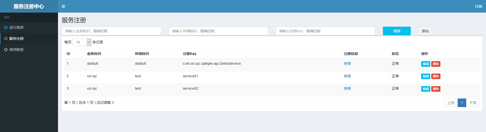
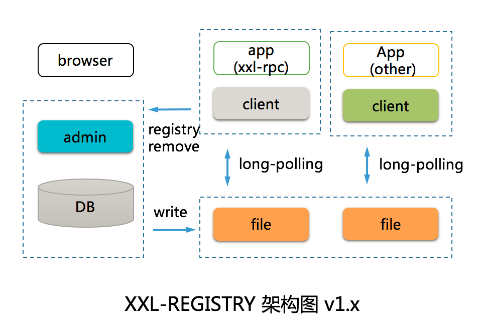

* [一、项目概览](#一数据类型)
    * [1.1 简介](#11-简介) 
    * [1.2 环境](#12-环境)
    * [1.3 源码及官网](#13-源码及官网)
* [二、项目使用](#二项目使用)
* [三、项目设计](#三项目设计)
    * [3.1 总体设计](#31-总体设计)
    * [3.2 关键点分析](#32-关键点分析)
        * [3.2.1 服务提供者和服务调用者的通讯流程是怎样](#321-服务提供者和服务调用者的通讯流程是怎样)  
        * [3.2.2 RPC框架中使用的NETTY、MINA、NETTY_HTTP和Jetty使用方式介绍](#322-RPC框架中使用的NETTYMINANETTY_HTTP和Jetty使用方式介绍)
        * [3.2.3 RPC框架中使用的序列化介绍](#323-RPC框架中使用的序列化介绍)
        * [3.2.4 RPC框架中不同注册中心介绍](#324-RPC框架中不同注册中心介绍)
* [四、其他](#四其他)

# 一、项目概览

## 1.1 简介
XXL-REGISTRY 是一个轻量级分布式服务注册中心，拥有"轻量级、秒级注册上线、多环境、跨语言、跨机房"等特性。现已开放源代码，开箱即用。
## 1.2 环境
```aidl
Maven3+
Jdk1.7+
Mysql5.6+
源码版本：1.1.0
```
## 1.3 源码及官网

[github源码](https://github.com/xuxueli/xxl-registry/)

[官网](http://www.xuxueli.com/xxl-registry)

# 二、项目使用

- 添加maven依赖
```aidl
    <!-- xxl-registry-client -->
    <dependency>
        <groupId>com.xuxueli</groupId>
        <artifactId>xxl-registry-client</artifactId>
        <version>${xxl-registry.version}</version>
    </dependency>
```
- 服务端启动
```aidl
    启动XxlRegistryAdmin服务器端，SpringBoot启动
```


- 注册端注册
```aidl
    public static void main(String[] args) throws InterruptedException {
        XxlRegistryClient registryClient = new XxlRegistryClient("http://localhost:8080/xxl-registry-admin/", null, "xxl-rpc", "test");
        // registry test
        List<XxlRegistryDataParamVO> registryDataList = new ArrayList<>();
        registryDataList.add(new XxlRegistryDataParamVO("service01", "address01"));
        registryDataList.add(new XxlRegistryDataParamVO("service02", "address02"));
        System.out.println("registry:" + registryClient.registry(registryDataList));
        TimeUnit.SECONDS.sleep(2);
        // discovery test
        Set<String> keys = new TreeSet<>();
        keys.add("service01");
        keys.add("service02");
        System.out.println("discovery:" + registryClient.discovery(keys));
        while (true) {
            TimeUnit.SECONDS.sleep(1);
        }
    }
    或者简单客户端版本
        XxlRegistryBaseClient registryClient = new XxlRegistryBaseClient("http://localhost:8080/xxl-registry-admin/", null, "xxl-rpc", "dev");
        // registry test
        List<XxlRegistryDataParamVO> registryDataList = new ArrayList<>();
        registryDataList.add(new XxlRegistryDataParamVO("service01", "address01"));
        registryDataList.add(new XxlRegistryDataParamVO("service02", "address02"));
        System.out.println("registry:" + registryClient.registry(registryDataList));
        TimeUnit.SECONDS.sleep(2);
        // discovery test
        Set<String> keys = new TreeSet<>();
        keys.add("service01");
        keys.add("service02");
        System.out.println("discovery:" + registryClient.discovery(keys));
        // remove test
        System.out.println("remove:" + registryClient.remove(registryDataList));
        TimeUnit.SECONDS.sleep(2);
        // discovery test
        System.out.println("discovery:" + registryClient.discovery(keys));
        // monitor test
        TimeUnit.SECONDS.sleep(10);
        System.out.println("monitor...");
        registryClient.monitor(keys);    
    
```


# 三、项目设计

## 3.1 总体设计


XXL-REGISTRY内部通过广播机制，集群节点实时同步服务注册信息，确保一致。
客户端借助 long pollong 实时感知服务注册信息，简洁、高效；


## 3.2 关键点分析

### 3.2.1 基本的XxlRegistryBaseClient与服务端各种交互实现原理

- 交互方式
```aidl
1. 服务器端提供API
2. 客户端使用HTTP完成请求
3. 有服务注册，服务发现，服务摘除，服务监控4个功能

```

- 服务注册
```aidl
1. 服务器端
    注册数据通过异步线程的方式，同步到数据库和本地磁盘文件，通过异步线程的方式（多个注册服务器端时）
    其他注册服务器端也同步注册数据本地磁盘文件
    /**
     * 服务注册 & 续约 API
     * 说明：新服务注册上线1s内广播通知接入方；需要接入方循环续约，否则服务将会过期（三倍于注册中心心跳时间）下线；
     * 地址格式：{服务注册中心跟地址}/registry
     * 请求参数说明：
     *  1、accessToken：请求令牌；
     *  2、biz：业务标识
     *  2、env：环境标识
     *  3、registryDataList：服务注册信息
     * 请求数据格式如下，放置在 RequestBody 中，JSON格式：
     *
     *     {
     *         "accessToken" : "xx",
     *         "biz" : "xx",
     *         "env" : "xx",
     *         "registryDataList" : [{
     *             "key" : "service01",
     *             "value" : "address01"
     *         }]
     *     }
     * @param data
     * @return
     */
    @RequestMapping("/registry")
    @ResponseBody
    @PermessionLimit(limit=false)
    public ReturnT<String> registry(@RequestBody(required = false) String data){
        // parse data
        XxlRegistryParamVO registryParamVO = null;
        try {
            registryParamVO = (XxlRegistryParamVO) JacksonUtil.readValue(data, XxlRegistryParamVO.class);
        } catch (Exception e) { }
        // parse param
        String accessToken = null;
        String biz = null;
        String env = null;
        List<XxlRegistryData> registryDataList = null;
        if (registryParamVO != null) {
            accessToken = registryParamVO.getAccessToken();
            biz = registryParamVO.getBiz();
            env = registryParamVO.getEnv();
            if (registryParamVO.getRegistryDataList()!=null) {
                registryDataList = new ArrayList<>();
                for (XxlRegistryDataParamVO dataParamVO: registryParamVO.getRegistryDataList()) {
                    XxlRegistryData dateItem = new XxlRegistryData();
                    dateItem.setKey(dataParamVO.getKey());
                    dateItem.setValue(dataParamVO.getValue());
                    registryDataList.add(dateItem);
                }
            }
        }
        return xxlRegistryService.registry(accessToken, biz, env, registryDataList);
    }
    xxlRegistryService.registry中把注册的数据存入LinkedBlockingQueue阻塞队列，之后就直接返回
    private volatile LinkedBlockingQueue<XxlRegistryData> registryQueue = new LinkedBlockingQueue<XxlRegistryData>();   
    另外的线程registryQueue.take(),进一步处理注册来的数据
    启动10这样的线程（不断循环），主要逻辑
        XxlRegistryData xxlRegistryData = registryQueue.take(); //实时获取注册来的数据
        if (xxlRegistryData !=null) {
            // refresh or add
            int ret = xxlRegistryDataDao.refresh(xxlRegistryData);  //更新注册时间 `updateTime` = now()
            if (ret == 0) {
                xxlRegistryDataDao.add(xxlRegistryData);//第一次注册的话，增加到记录
            }
            // valid file status
            // 本地磁盘中保存 service01.properties文件
            // 内容为    status=0
            //           data=[]
            //data为注册的地址列表
            XxlRegistry fileXxlRegistry = getFileRegistryData(xxlRegistryData);
            if (fileXxlRegistry == null) {
                // go on
            } else if (fileXxlRegistry.getStatus() != 0) {
                continue;     // "Status limited."
            } else {
                if (fileXxlRegistry.getDataList().contains(xxlRegistryData.getValue())) { //本地磁盘文件中注册的地址列表包含新注册的数据时，不需要处理
                    continue;     // "Repeated limited."
                }
            }
            // checkRegistryDataAndSendMessage
            // 新注册的数据为新数据时，需要更新XxlRegistry表和插入XxlRegistryMessage表中注册更新信息
            checkRegistryDataAndSendMessage(xxlRegistryData);
            
    另一个线程（不断循环）主要清除过期的注册数据和从XxlRegistryData更新数据到XxlRegistry表并把XxlRegistry内写入到本地磁盘，
    变成service01.properties等文件，主要逻辑
            // clean old registry-data in db
            // 清除注册时间大于心跳时间3倍的注册数据
            xxlRegistryDataDao.cleanData(registryBeatTime * 3);
            // sync registry-data, db + file
            int offset = 0;
            int pagesize = 1000;
            List<String> registryDataFileList = new ArrayList<>();
            // XxlRegistry中所有历史出现过的注册服务的注册信息
            List<XxlRegistry> registryList = xxlRegistryDao.pageList(offset, pagesize, null, null, null);
            while (registryList!=null && registryList.size()>0) {
                for (XxlRegistry registryItem: registryList) {
                    // process data by status
                    // 状态：0-正常、1-锁定、2-禁用
                    if (registryItem.getStatus() == 1) { 
                        // locked, not updated
                    } else if (registryItem.getStatus() == 2) {
                        // disabled, write empty
                        String dataJson = JacksonUtil.writeValueAsString(new ArrayList<String>());
                        registryItem.setData(dataJson);
                    } else {
                        // default, sync from db
                        // 从最新的XxlRegistryData注册表中，更新注册信息到XxlRegistry表
                        List<XxlRegistryData> xxlRegistryDataList = xxlRegistryDataDao.findData(registryItem.getBiz(), registryItem.getEnv(), registryItem.getKey());
                        List<String> valueList = new ArrayList<String>();
                        if (xxlRegistryDataList!=null && xxlRegistryDataList.size()>0) {
                            for (XxlRegistryData dataItem: xxlRegistryDataList) {
                                valueList.add(dataItem.getValue());
                            }
                        }
                        String dataJson = JacksonUtil.writeValueAsString(valueList);
                        // check update, sync db
                        if (!registryItem.getData().equals(dataJson)) {
                            registryItem.setData(dataJson);
                            xxlRegistryDao.update(registryItem);
                        }
                    }
                    // sync file
                    // 把XxlRegistry表的内容同步写入本地文件
                    String registryDataFile = setFileRegistryData(registryItem);
                    // collect registryDataFile
                    registryDataFileList.add(registryDataFile);
                }
                offset += 1000;
                registryList = xxlRegistryDao.pageList(offset, pagesize, null, null, null);
            }
            // clean old registry-data file
            // 清除不存在的文件
            cleanFileRegistryData(registryDataFileList);
    另一个线程（不断循环）主要获取XxlRegistryMessage中注册更新的信息并同步写入本地service01.properties等文件，
    多台注册服务器时，通过这个线程完成状态同步。主要逻辑  
            // new message, filter readed
            List<XxlRegistryMessage> messageList = xxlRegistryMessageDao.findMessage(readedMessageIds);
            if (messageList!=null && messageList.size()>0) {
                for (XxlRegistryMessage message: messageList) {
                    readedMessageIds.add(message.getId());
                    if (message.getType() == 0) {   // from registry、add、update、deelete，ne need sync from db, only write
                        XxlRegistry xxlRegistry = JacksonUtil.readValue(message.getData(), XxlRegistry.class);
                        // process data by status
                        if (xxlRegistry.getStatus() == 1) {
                            // locked, not updated
                        } else if (xxlRegistry.getStatus() == 2) {
                            // disabled, write empty
                            xxlRegistry.setData(JacksonUtil.writeValueAsString(new ArrayList<String>()));
                        } else {
                            // default, sync from db （aready sync before message, only write）
                        }
                        // sync file
                        // 把XxlRegistry表的内容同步写入本地文件
                        setFileRegistryData(xxlRegistry);
                    }
                }
            }
            // clean old message;
            if ( (System.currentTimeMillis()/1000) % registryBeatTime ==0) {
                xxlRegistryMessageDao.cleanMessage(registryBeatTime);
                readedMessageIds.clear();
            }
2. 客户端    
        XxlRegistryBaseClient registryClient = new XxlRegistryBaseClient("http://localhost:8080/xxl-registry-admin/", null, "xxl-rpc", "dev");    
        // registry test
        List<XxlRegistryDataParamVO> registryDataList = new ArrayList<>();
        registryDataList.add(new XxlRegistryDataParamVO("service01", "address01"));
        registryDataList.add(new XxlRegistryDataParamVO("service02", "address02"));
        System.out.println("registry:" + registryClient.registry(registryDataList));
        
        构造函数：
            public XxlRegistryBaseClient(String adminAddress, String accessToken, String biz, String env) {
                this.adminAddress = adminAddress;
                this.accessToken = accessToken;
                this.biz = biz;
                this.env = env;
                adminAddressArr = new ArrayList<>();
                if (adminAddress.contains(",")) {
                    adminAddressArr.addAll(Arrays.asList(adminAddress.split(",")));
                } else {
                    adminAddressArr.add(adminAddress);
                }     
            }
         调用注册方法主要逻辑
             public boolean registry(List<XxlRegistryDataParamVO> registryDataList){        
                    // pathUrl
                    String pathUrl = "/api/registry";    
                    // param
                    XxlRegistryParamVO registryParamVO = new XxlRegistryParamVO();
                    registryParamVO.setAccessToken(this.accessToken);
                    registryParamVO.setBiz(this.biz);
                    registryParamVO.setEnv(this.env);
                    registryParamVO.setRegistryDataList(registryDataList);    
                    String paramsJson = BasicJson.toJson(registryParamVO);      
                    // result
                    // 向http接口发起请求
                    Map<String, Object> respObj = requestAndValid(pathUrl, paramsJson, 5);
                    return respObj!=null?true:false;
                }
        http接口发起请求主要逻辑
             private Map<String, Object> requestAndValid(String pathUrl, String requestBody, int timeout){
                    //多个注册服务，只需要对其中一个发送成功就返回
                    for (String adminAddressUrl: adminAddressArr) {
                        String finalUrl = adminAddressUrl + pathUrl;
                        // request
                        String responseData = BasicHttpUtil.postBody(finalUrl, requestBody, timeout);
                        if (responseData == null) {
                            return null;
                        }
                        // parse resopnse
                        Map<String, Object> resopnseMap = null;
                        try {
                            resopnseMap = BasicJson.parseMap(responseData);
                        } catch (Exception e) { }
                        // valid resopnse
                        if (resopnseMap==null
                                || !resopnseMap.containsKey("code")
                                || !"200".equals(String.valueOf(resopnseMap.get("code")))
                                ) {
                            logger.warn("XxlRegistryBaseClient response fail, responseData={}", responseData);
                            return null;
                        }
                        return resopnseMap;
                    }
                    return null;
                }


```

- 服务发现
```aidl

1. 服务端
    接口API
        /**
         * 服务发现 API
         * 说明：查询在线服务地址列表；
         * 地址格式：{服务注册中心跟地址}/discovery
         * 请求参数说明：
         *  1、accessToken：请求令牌；
         *  2、biz：业务标识
         *  2、env：环境标识
         *  3、keys：服务注册Key列表
         * 请求数据格式如下，放置在 RequestBody 中，JSON格式：
         *     {
         *         "accessToken" : "xx",
         *         "biz" : "xx",
         *         "env" : "xx",
         *         "keys" : [
         *             "service01",
         *             "service02"
         *         ]
         *     }
         * @param data
         * @return
         */
        @RequestMapping("/discovery")
        @ResponseBody
        @PermessionLimit(limit=false)
        public ReturnT<Map<String, List<String>>> discovery(@RequestBody(required = false) String data) {
            // parse data
            XxlRegistryParamVO registryParamVO = null;
            try {
                registryParamVO = (XxlRegistryParamVO) JacksonUtil.readValue(data, XxlRegistryParamVO.class);
            } catch (Exception e) { }
            // parse param
            String accessToken = null;
            String biz = null;
            String env = null;
            List<String> keys = null;
            if (registryParamVO != null) {
                accessToken = registryParamVO.getAccessToken();
                biz = registryParamVO.getBiz();
                env = registryParamVO.getEnv();
                keys = registryParamVO.getKeys();
            }
            return xxlRegistryService.discovery(accessToken, biz, env, keys);
        }
    服务发现主要逻辑
        public ReturnT<Map<String, List<String>>> discovery(String accessToken, String biz, String env, List<String> keys) {
            Map<String, List<String>> result = new HashMap<String, List<String>>();
            for (String key: keys) {
                XxlRegistryData xxlRegistryData = new XxlRegistryData();
                xxlRegistryData.setBiz(biz);
                xxlRegistryData.setEnv(env);
                xxlRegistryData.setKey(key);
                List<String> dataList = new ArrayList<String>();
                //从本地文件中获取最新的注册数据
                XxlRegistry fileXxlRegistry = getFileRegistryData(xxlRegistryData);
                if (fileXxlRegistry!=null) {
                    dataList = fileXxlRegistry.getDataList();
                }
                result.put(key, dataList);
            }
            return new ReturnT<Map<String, List<String>>>(result);
        }
     从本地文件中获取最新的注册数据           
        public XxlRegistry getFileRegistryData(XxlRegistryData xxlRegistryData){     
            // fileName
            String fileName = parseRegistryDataFileName(xxlRegistryData.getBiz(), xxlRegistryData.getEnv(), xxlRegistryData.getKey());     
            // read
            Properties prop = PropUtil.loadProp(fileName);
            if (prop!=null) {
                XxlRegistry fileXxlRegistry = new XxlRegistry();
                fileXxlRegistry.setData(prop.getProperty("data"));
                fileXxlRegistry.setStatus(Integer.valueOf(prop.getProperty("status")));
                fileXxlRegistry.setDataList(JacksonUtil.readValue(fileXxlRegistry.getData(), List.class));
                return fileXxlRegistry;
            }
            return null;
        }      
       public static Properties loadProp(String propertyFileName) {
            InputStream in = null;
            try {
                // load file location, disk
                File file = new File(propertyFileName);
                if (!file.exists()) {
                    return null;
                }
                URL url = new File(propertyFileName).toURI().toURL();
                in = new FileInputStream(url.getPath());
                if (in == null) {
                    return null;
                }      
                Properties prop = new Properties();
                prop.load(new InputStreamReader(in, "utf-8"));       
                return prop;
            } catch (IOException e) {
                logger.error(e.getMessage(), e);
            } finally {
                if (in != null) {
                    try {
                        in.close();
                    } catch (IOException e) {
                        logger.error(e.getMessage(), e);
                    }
                }
            }
            return null;
        }
2. 客户端
        public Map<String, TreeSet<String>> discovery(Set<String> keys) {
            // valid
            if (keys==null || keys.size()==0) {
                throw new RuntimeException("xxl-registry keys empty");
            }  
            // pathUrl
            String pathUrl = "/api/discovery";  
            // param
            XxlRegistryParamVO registryParamVO = new XxlRegistryParamVO();
            registryParamVO.setAccessToken(this.accessToken);
            registryParamVO.setBiz(this.biz);
            registryParamVO.setEnv(this.env);
            registryParamVO.setKeys(new ArrayList<String>(keys));    
            String paramsJson = BasicJson.toJson(registryParamVO);    
            // result
            Map<String, Object> respObj = requestAndValid(pathUrl, paramsJson, 5);    
            // parse
            if (respObj!=null && respObj.containsKey("data")) {
                Map<String, TreeSet<String>> data = (Map<String, TreeSet<String>>) respObj.get("data");
                return data;
            } 
            return null;
        }

```
- 服务摘除
```aidl
 /**
     * 服务摘除 API
     * 说明：新服务摘除下线1s内广播通知接入方；
     * 地址格式：{服务注册中心跟地址}/remove
     *
     * 请求参数说明：
     *  1、accessToken：请求令牌；
     *  2、biz：业务标识
     *  2、env：环境标识
     *  3、registryDataList：服务注册信息
     *
     * 请求数据格式如下，放置在 RequestBody 中，JSON格式：
     *
     *     {
     *         "accessToken" : "xx",
     *         "biz" : "xx",
     *         "env" : "xx",
     *         "registryDataList" : [{
     *             "key" : "service01",
     *             "value" : "address01"
     *         }]
     *     }
     *
     * @param data
     * @return
     */
    @RequestMapping("/remove")
    @ResponseBody
    @PermessionLimit(limit=false)
    public ReturnT<String> remove(@RequestBody(required = false) String data){
        // parse data
        XxlRegistryParamVO registryParamVO = null;
        try {
            registryParamVO = (XxlRegistryParamVO) JacksonUtil.readValue(data, XxlRegistryParamVO.class);
        } catch (Exception e) { }
        // parse param
        String accessToken = null;
        String biz = null;
        String env = null;
        List<XxlRegistryData> registryDataList = null;
        if (registryParamVO != null) {
            accessToken = registryParamVO.getAccessToken();
            biz = registryParamVO.getBiz();
            env = registryParamVO.getEnv();
            if (registryParamVO.getRegistryDataList()!=null) {
                registryDataList = new ArrayList<>();
                for (XxlRegistryDataParamVO dataParamVO: registryParamVO.getRegistryDataList()) {
                    XxlRegistryData dateItem = new XxlRegistryData();
                    dateItem.setKey(dataParamVO.getKey());
                    dateItem.setValue(dataParamVO.getValue());
                    registryDataList.add(dateItem);
                }
            }
        }
        return xxlRegistryService.remove(accessToken, biz, env, registryDataList);
    }
    
    服务摘除把需要摘除的数据放入removeQueue队列
        public ReturnT<String> remove(String accessToken, String biz, String env, List<XxlRegistryData> registryDataList) {
            // fill + add queue
            for (XxlRegistryData registryData: registryDataList) {
                registryData.setBiz(biz);
                registryData.setEnv(env);
            }
            removeQueue.addAll(registryDataList);  
            return ReturnT.SUCCESS;
        }
        private volatile LinkedBlockingQueue<XxlRegistryData> removeQueue = new LinkedBlockingQueue<XxlRegistryData>();   
   另一个线程（不断循环）执行服务摘除操作   
       XxlRegistryData xxlRegistryData = removeQueue.take();//阻塞获取删除的服务
       if (xxlRegistryData != null) {
           // delete 删除xxlRegistryData表中这条数据
           xxlRegistryDataDao.deleteDataValue(xxlRegistryData.getBiz(), xxlRegistryData.getEnv(), xxlRegistryData.getKey(), xxlRegistryData.getValue());
           // valid file status
           //获取删除前当前注册信息的内容
           XxlRegistry fileXxlRegistry = getFileRegistryData(xxlRegistryData);
           if (fileXxlRegistry == null) {
               // go on
           } else if (fileXxlRegistry.getStatus() != 0) {
               continue;   // "Status limited."
           } else {
               if (!fileXxlRegistry.getDataList().contains(xxlRegistryData.getValue())) {
                   continue;   // "Repeated limited."
               }
           }
           // checkRegistryDataAndSendMessage
           // 当前注册信息中有这个要删除的注册信息，需要执行这个、
           // 从xxlRegistryData更新注册信息到xxlRegistry表，并xxlRegistry表的数据不一样有变化时，再插入一条信息到XxlRegistryMessage表
           checkRegistryDataAndSendMessage(xxlRegistryData);
       }
    另一个线程（不断循环）主要获取XxlRegistryMessage中注册更新的信息并同步写入本地service01.properties等文件，
    多台注册服务器时，通过这个线程完成状态同步。主要逻辑  
            // new message, filter readed
            List<XxlRegistryMessage> messageList = xxlRegistryMessageDao.findMessage(readedMessageIds);
            if (messageList!=null && messageList.size()>0) {
                for (XxlRegistryMessage message: messageList) {
                    readedMessageIds.add(message.getId());
                    if (message.getType() == 0) {   // from registry、add、update、deelete，ne need sync from db, only write
                        XxlRegistry xxlRegistry = JacksonUtil.readValue(message.getData(), XxlRegistry.class);
                        // process data by status
                        if (xxlRegistry.getStatus() == 1) {
                            // locked, not updated
                        } else if (xxlRegistry.getStatus() == 2) {
                            // disabled, write empty
                            xxlRegistry.setData(JacksonUtil.writeValueAsString(new ArrayList<String>()));
                        } else {
                            // default, sync from db （aready sync before message, only write）
                        }
                        // sync file
                        // 把XxlRegistry表的内容同步写入本地文件
                        setFileRegistryData(xxlRegistry);
                    }
                }
            }
            // clean old message;
            if ( (System.currentTimeMillis()/1000) % registryBeatTime ==0) {
                xxlRegistryMessageDao.cleanMessage(registryBeatTime);
                readedMessageIds.clear();
            }
2. 客户端
         public boolean remove(List<XxlRegistryDataParamVO> registryDataList) {
            String pathUrl = "/api/remove";
            // param
            XxlRegistryParamVO registryParamVO = new XxlRegistryParamVO();
            registryParamVO.setAccessToken(this.accessToken);
            registryParamVO.setBiz(this.biz);
            registryParamVO.setEnv(this.env);
            registryParamVO.setRegistryDataList(registryDataList);
            String paramsJson = BasicJson.toJson(registryParamVO);   
            // result
            Map<String, Object> respObj = requestAndValid(pathUrl, paramsJson, 5);
            return respObj!=null?true:false;
        }     
```
- 服务监控

```aidl
 /**
     * 服务监控 API
     * 说明：long-polling 接口，主动阻塞一段时间（三倍于注册中心心跳时间）；直至阻塞超时或服务注册信息变动时响应；
     * 地址格式：{服务注册中心跟地址}/monitor
     * 请求参数说明：
     *  1、accessToken：请求令牌；
     *  2、biz：业务标识
     *  2、env：环境标识
     *  3、keys：服务注册Key列表
     * 请求数据格式如下，放置在 RequestBody 中，JSON格式：
     *     {
     *         "accessToken" : "xx",
     *         "biz" : "xx",
     *         "env" : "xx",
     *         "keys" : [
     *             "service01",
     *             "service02"
     *         ]
     *     }
     * @param data
     * @return
     */
    @RequestMapping("/monitor")
    @ResponseBody
    @PermessionLimit(limit=false)
    public DeferredResult monitor(@RequestBody(required = false) String data) {
        // parse data
        XxlRegistryParamVO registryParamVO = null;
        try {
            registryParamVO = (XxlRegistryParamVO) JacksonUtil.readValue(data, XxlRegistryParamVO.class);
        } catch (Exception e) { }
        // parse param
        String accessToken = null;
        String biz = null;
        String env = null;
        List<String> keys = null;
        if (registryParamVO != null) {
            accessToken = registryParamVO.getAccessToken();
            biz = registryParamVO.getBiz();
            env = registryParamVO.getEnv();
            keys = registryParamVO.getKeys();
        }
        return xxlRegistryService.monitor(accessToken, biz, env, keys);
    }
    
    public DeferredResult<ReturnT<String>> monitor(String accessToken, String biz, String env, List<String> keys) { 
        // init
        //DeferredResult为异步回调，30秒内deferredResult没有变化，返回默认 new ReturnT<>(ReturnT.SUCCESS_CODE, "Monitor timeout, no key updated.")
        DeferredResult deferredResult = new DeferredResult(30 * 1000L, new ReturnT<>(ReturnT.SUCCESS_CODE, "Monitor timeout, no key updated."));
        // monitor by client
        for (String key: keys) {
            String fileName = parseRegistryDataFileName(biz, env, key);
            List<DeferredResult> deferredResultList = registryDeferredResultMap.get(fileName);
            if (deferredResultList == null) {
                deferredResultList = new ArrayList<>();
                registryDeferredResultMap.put(fileName, deferredResultList);
             }
             //把当前监控请求的链接放入List中
            deferredResultList.add(deferredResult);
        }
        return deferredResult;
    }
    //key为文件名及注册的服务名称，value为监控请求的链接
    private Map<String, List<DeferredResult>> registryDeferredResultMap = new ConcurrentHashMap<>();
    当新的服务注册和摘除时，会调用setFileRegistryData方法，其中包括如下代码
        // brocast monitor client
        // 获取该注册服务的监控请求的链接
        List<DeferredResult> deferredResultList = registryDeferredResultMap.get(fileName);
        if (deferredResultList != null) {
            registryDeferredResultMap.remove(fileName);
            for (DeferredResult deferredResult: deferredResultList) {
                deferredResult.setResult(new ReturnT<>(ReturnT.SUCCESS_CODE, "Monitor key update."));
            }
        }
 2. 客户端（请求阻塞30秒返回，30秒内当服务端注册信息有更新会直接返回）
    public boolean monitor(Set<String> keys) {
        // valid
        if (keys==null || keys.size()==0) {
            throw new RuntimeException("xxl-registry keys empty");
        }
        // pathUrl
        String pathUrl = "/api/monitor";
        // param
        XxlRegistryParamVO registryParamVO = new XxlRegistryParamVO();
        registryParamVO.setAccessToken(this.accessToken);
        registryParamVO.setBiz(this.biz);
        registryParamVO.setEnv(this.env);
        registryParamVO.setKeys(new ArrayList<String>(keys));
        String paramsJson = BasicJson.toJson(registryParamVO);
        // result
        Map<String, Object> respObj = requestAndValid(pathUrl, paramsJson, 60);
        return respObj!=null?true:false;
    }     
    
    
    
```

### 3.2.2 增加客户端的XxlRegistryClient实现原理

```aidl
启动两个线程，分别主动去服务注册和服务发现。

        XxlRegistryClient registryClient = new XxlRegistryClient("http://localhost:8080/xxl-registry-admin/", null, "xxl-rpc", "test");
        // registry test
        List<XxlRegistryDataParamVO> registryDataList = new ArrayList<>();
        registryDataList.add(new XxlRegistryDataParamVO("service01", "address01"));
        registryDataList.add(new XxlRegistryDataParamVO("service02", "address02"));
        System.out.println("registry:" + registryClient.registry(registryDataList));
        TimeUnit.SECONDS.sleep(2);
        // discovery test
        Set<String> keys = new TreeSet<>();
        keys.add("service01");
        keys.add("service02");
        System.out.println("discovery:" + registryClient.discovery(keys));
    XxlRegistryClient构造函数
         public XxlRegistryClient(String adminAddress, String accessToken, String biz, String env) {
                registryBaseClient = new XxlRegistryBaseClient(adminAddress, accessToken, biz, env);
                logger.info(">>>>>>>>>>> xxl-registry, XxlRegistryClient init .... [adminAddress={}, accessToken={}, biz={}, env={}]", adminAddress, accessToken, biz, env);      
                // registry thread
                //注册过一次后，每隔10秒进行注册
                registryThread = new Thread(new Runnable() {
                    @Override
                    public void run() {
                        while (!registryThreadStop) {
                            try {
                                if (registryData.size() > 0) {
        
                                    boolean ret = registryBaseClient.registry(new ArrayList<XxlRegistryDataParamVO>(registryData));
                                    logger.debug(">>>>>>>>>>> xxl-registry, refresh registry data {}, registryData = {}", ret?"success":"fail",registryData);
                                }
                            } catch (Exception e) {
                                if (!registryThreadStop) {
                                    logger.error(">>>>>>>>>>> xxl-registry, registryThread error.", e);
                                }
                            }
                            try {
                                TimeUnit.SECONDS.sleep(10);
                            } catch (Exception e) {
                                if (!registryThreadStop) {
                                    logger.error(">>>>>>>>>>> xxl-registry, registryThread error.", e);
                                }
                            }
                        }
                        logger.info(">>>>>>>>>>> xxl-registry, registryThread stoped.");
                    }
                });
                registryThread.setName("xxl-registry, XxlRegistryClient registryThread.");
                registryThread.setDaemon(true);
                registryThread.start();       
                // discovery thread
                //发现服务后，每10秒去monitor监控一下，再主动调用服务发现接口
                discoveryThread = new Thread(new Runnable() {
                    @Override
                    public void run() {
                        while (!registryThreadStop) {       
                            if (discoveryData.size() == 0) {
                                try {
                                    TimeUnit.SECONDS.sleep(3);
                                } catch (Exception e) {
                                    if (!registryThreadStop) {
                                        logger.error(">>>>>>>>>>> xxl-registry, discoveryThread error.", e);
                                    }
                                }
                            } else {
                                try {
                                    // monitor
                                    boolean monitorRet = registryBaseClient.monitor(discoveryData.keySet());       
                                    // avoid fail-retry request too quick
                                    if (!monitorRet){
                                        TimeUnit.SECONDS.sleep(10);
                                    }
                                    // refreshDiscoveryData, all
                                    refreshDiscoveryData(discoveryData.keySet());
                                } catch (Exception e) {
                                    if (!registryThreadStop) {
                                        logger.error(">>>>>>>>>>> xxl-registry, discoveryThread error.", e);
                                    }
                                }
                            }      
                        }
                        logger.info(">>>>>>>>>>> xxl-registry, discoveryThread stoped.");
                    }
                });
                discoveryThread.setName("xxl-registry, XxlRegistryClient discoveryThread.");
                discoveryThread.setDaemon(true);
                discoveryThread.start();
        
                logger.info(">>>>>>>>>>> xxl-registry, XxlRegistryClient init success.");
            }   
     主动调用服务发现接口
        private void refreshDiscoveryData(Set<String> keys){
                // discovery mult
                Map<String, TreeSet<String>> updatedData = new HashMap<>();       
                Map<String, TreeSet<String>> keyValueListData = registryBaseClient.discovery(keys);
                if (keyValueListData!=null) {
                    for (String keyItem: keyValueListData.keySet()) {       
                        // list > set
                        TreeSet<String> valueSet = new TreeSet<>();
                        valueSet.addAll(keyValueListData.get(keyItem));      
                        // valid if updated
                        boolean updated = true;
                        TreeSet<String> oldValSet = discoveryData.get(keyItem);
                        if (oldValSet!=null && BasicJson.toJson(oldValSet).equals(BasicJson.toJson(valueSet))) {
                            updated = false;
                        }       
                        // set
                        if (updated) {
                            discoveryData.put(keyItem, valueSet);
                            updatedData.put(keyItem, valueSet);
                        }
                    }
                }
                if (updatedData.size() > 0) {
                    logger.info(">>>>>>>>>>> xxl-registry, refresh discovery data finish, discoveryData(updated) = {}", updatedData);
                }
                logger.debug(">>>>>>>>>>> xxl-registry, refresh discovery data finish, discoveryData = {}", discoveryData);
            }

```

### 3.2.3 长轮询方式long-polling实现原理

```aidl

     接口controller（deferredResult没有变化的话，接口30秒后返回默认值）
        DeferredResult deferredResult = new DeferredResult(30 * 1000L, new ReturnT<>(ReturnT.SUCCESS_CODE, "Monitor timeout, no key updated."));
        list.add(deferredResult);//把deferredResult放到list中
        return deferredResult;
    其他线程
        操作list中deferredResult.setResult(new ReturnT<>(ReturnT.SUCCESS_CODE, "Monitor key update."))
        当deferredResult有变化时，controller接口立刻返回
```

# 四、其他
