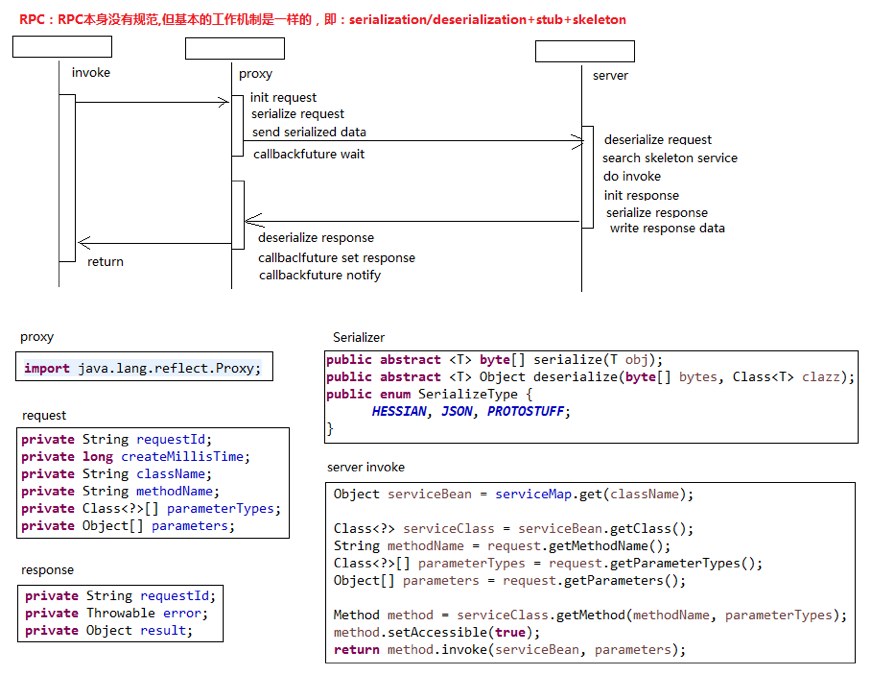
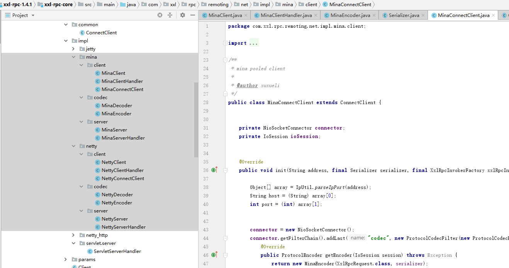
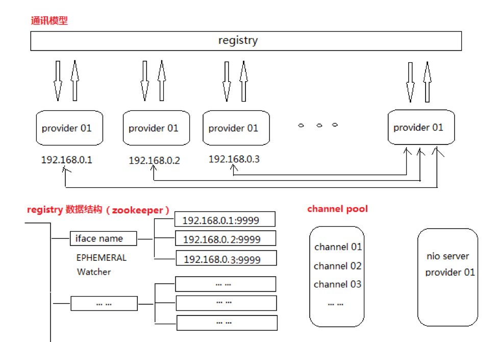

* [一、项目概览](#一数据类型)
    * [1.1 简介](#11-简介) 
    * [1.2 环境](#12-环境)
    * [1.3 源码及官网](#13-源码及官网)
* [二、项目使用](#二项目使用)
* [三、项目设计](#三项目设计)
    * [3.1 总体设计](#31-总体设计)
    * [3.2 关键点分析](#32-关键点分析)
        * [3.2.1 服务提供者和服务调用者的通讯流程是怎样](#321-服务提供者和服务调用者的通讯流程是怎样)  
        * [3.2.2 RPC框架中使用的NETTY、MINA、NETTY_HTTP和Jetty使用方式介绍](#322-RPC框架中使用的NETTYMINANETTY_HTTP和Jetty使用方式介绍)
        * [3.2.3 RPC框架中使用的序列化介绍](#323-RPC框架中使用的序列化介绍)
        * [3.2.4 RPC框架中不同注册中心介绍](#324-RPC框架中不同注册中心介绍)
* [四、其他](#四其他)

# 一、项目概览

## 1.1 简介
XXL-RPC 是一个分布式服务框架，提供稳定高性能的RPC远程服务调用功能。拥有"高性能、分布式、注册中心、负载均衡、服务治理"等特性。现已开放源代码，开箱即用。
## 1.2 环境
```aidl
Maven3+
Jdk1.7+
Tomcat7+
源码版本：1.4.1
```
## 1.3 源码及官网

[github源码](https://github.com/xuxueli/xxl-rpc/)

[官网](http://www.xuxueli.com/xxl-rpc)

# 二、项目使用

- 添加maven依赖
```aidl
    <!-- xxl-rpc-core -->
    <dependency>
        <groupId>com.xuxueli</groupId>
        <artifactId>xxl-rpc-core</artifactId>
        <version>${project.parent.version}</version>
    </dependency>
```
- 服务器启动，建立服务提供者
```aidl
    public static void main(String[] args) throws Exception {
        // init
        XxlRpcProviderFactory providerFactory = new XxlRpcProviderFactory();
        //使用NETTY服务建立服务，HESSIAN序列化传输的对象，端口为7080
        providerFactory.initConfig(NetEnum.NETTY, Serializer.SerializeEnum.HESSIAN.getSerializer(), null, 7080, null, null, null);
        // add services
        //添加提供的服务
        providerFactory.addService(DemoService.class.getName(), null, new DemoServiceImpl());
        // start
        providerFactory.start();
        while (!Thread.currentThread().isInterrupted()) {
            TimeUnit.HOURS.sleep(1);
        }
        // stop
        providerFactory.stop();
    }
    
    public class DemoServiceImpl implements DemoService {
        private static Logger logger = LoggerFactory.getLogger(DemoServiceImpl.class);
        @Override
        public UserDTO sayHi(String name) {
            String word = MessageFormat.format("Hi {0}, from {1} as {2}",
                    name, DemoServiceImpl.class.getName(), String.valueOf(System.currentTimeMillis()));
            if ("error".equalsIgnoreCase(name)) throw new RuntimeException("test exception.");
            UserDTO userDTO = new UserDTO(name, word);
            logger.info(userDTO.toString());
            return userDTO;
        }
    }   
```
- 客户端启动，链接服务器提供者进行远程调用
```aidl
    //使用NETTY协议，序列化使用HESSIAN，链接127.0.0.1:7080，getObject()动态代理方式重新定义了DemoService中的方法
    DemoService demoService = (DemoService) new XxlRpcReferenceBean(NetEnum.NETTY, Serializer.SerializeEnum.HESSIAN.getSerializer(), CallType.SYNC, LoadBalance.ROUND,
            DemoService.class, null, 500, "127.0.0.1:7080", null, null, null).getObject();
    //test
    //调用sayHi方法（动态代理方式已把sayHi方法，重新修改为远程访问服务器的中方法并返回结果）
    UserDTO userDTO = demoService.sayHi("[SYNC]jack");
    System.out.println(userDTO);

```


# 三、项目设计

## 3.1 总体设计


分为服务提供者和服务调用者
* 服务提供者使用netty、jetty等协议提供服务
* 服务调用者通过动态代理方式访问服务提供者实现的方法
* 服务提供者和服务调用者可注册到注册中心，进行服务发现和管理
* provider：服务提供方；
* invoker：服务消费方；
* serializer: 序列化模块；
* remoting：服务通讯模块；
* registry：服务注册中心；

## 3.2 关键点分析

### 3.2.1 服务提供者和服务调用者的通讯流程是怎样


```aidl
概念：
    1、serialization：序列化，通讯数据需要经过序列化，从而支持在网络中传输；
    2、deserialization：反序列化，服务接受到序列化的请求数据，需要序列化为底层原始数据；
    3、stub：体现在XXL-RPC为服务的api接口；
    4、skeleton：体现在XXL-RPC为服务的实现api接口的具体服务；
    5、proxy：根据远程服务的stub生成的代理服务，对开发人员透明；
    6、provider：远程服务的提供方；
    7、consumer：远程服务的消费方；
RPC通讯，可大致划分为四个步骤，可参考上图进行理解：（XXL-RPC提供了多种调用方案，此处以 “SYNC” 方案为例讲解；）
    1、consumer发起请求：consumer会根据远程服务的stub实例化远程服务的代理服务，在发起请求时，代理服务会封装本次请求相关底层数据，如服务iface、methos、params等等，然后将数据经过serialization之后发送给provider；
    2、provider接收请求：provider接收到请求数据，首先会deserialization获取原始请求数据，然后根据stub匹配目标服务并调用；
    3、provider响应请求：provider在调用目标服务后，封装服务返回数据并进行serialization，然后把数据传输给consumer；
    4、consumer接收响应：consumer接受到相应数据后，首先会deserialization获取原始数据，然后根据stub生成调用返回结果，返回给请求调用处。结束。
```
- consumer发起请求和接收响应
```aidl
//根据远程服务的stub实例化远程服务的代理服务
    DemoService demoService = (DemoService) new XxlRpcReferenceBean(NetEnum.NETTY, Serializer.SerializeEnum.HESSIAN.getSerializer(), CallType.SYNC, LoadBalance.ROUND,
            DemoService.class, null, 500, "127.0.0.1:7080", null, null, null).getObject();
    UserDTO userDTO = demoService.sayHi("[SYNC]jack");
//代理服务会封装本次请求相关底层数据
    public Object getObject() {
            //把API接口类（DemoService），使用动态代理方式生成一个新对象
            return Proxy.newProxyInstance(Thread.currentThread()
                    .getContextClassLoader(), new Class[] { iface },
                    new InvocationHandler() {
                        @Override
                        public Object invoke(Object proxy, Method method, Object[] args) throws Throwable {
                            // method param
                            String className = method.getDeclaringClass().getName();	// iface.getName()
                            String varsion_ = version;
                            String methodName = method.getName();
                            Class<?>[] parameterTypes = method.getParameterTypes();
                            Object[] parameters = args;
                            // filter for generic
                            //暂时没有用,XxlRpcGenericService调用其他接口类方法
                            if (className.equals(XxlRpcGenericService.class.getName()) && methodName.equals("invoke")) {
                                Class<?>[] paramTypes = null;
                                if (args[3]!=null) {
                                    String[] paramTypes_str = (String[]) args[3];
                                    if (paramTypes_str.length > 0) {
                                        paramTypes = new Class[paramTypes_str.length];
                                        for (int i = 0; i < paramTypes_str.length; i++) {
                                            paramTypes[i] = ClassUtil.resolveClass(paramTypes_str[i]);
                                        }
                                    }
                                }
                                className = (String) args[0];
                                varsion_ = (String) args[1];
                                methodName = (String) args[2];
                                parameterTypes = paramTypes;
                                parameters = (Object[]) args[4];
                            }
                            // filter method like "Object.toString()"
                            //过滤掉Object对象
                            if (className.equals(Object.class.getName())) {
                                logger.info(">>>>>>>>>>> xxl-rpc proxy class-method not support [{}#{}]", className, methodName);
                                throw new XxlRpcException("xxl-rpc proxy class-method not support");
                            }
                            // address
                            //远程RPC服务器的地址
                            String finalAddress = address;
                            if (finalAddress==null || finalAddress.trim().length()==0) {
                                //如果当前使用了注册中心，那么去注册中心查找服务提供者的地址列表
                                if (invokerFactory!=null && invokerFactory.getServiceRegistry()!=null) {
                                    // discovery
                                    String serviceKey = XxlRpcProviderFactory.makeServiceKey(className, varsion_);
                                    //调用discovery方法去注册中心服务接口查找服务提供者的地址列表
                                    TreeSet<String> addressSet = invokerFactory.getServiceRegistry().discovery(serviceKey);
                                    // load balance
                                    if (addressSet==null || addressSet.size()==0) {
                                        // pass
                                    } else if (addressSet.size()==1) {
                                        finalAddress = addressSet.first();
                                    } else {
                                        //如果服务提供者的地址列表大于1时，根据设置路由策略选择一个地址
                                        finalAddress = loadBalance.xxlRpcInvokerRouter.route(serviceKey, addressSet);
                                    }
                                }
                            }
                            if (finalAddress==null || finalAddress.trim().length()==0) {
                                throw new XxlRpcException("xxl-rpc reference bean["+ className +"] address empty");
                            }
                            // request
                            //服务器调用者和提供者之间公用的XxlRpcRequest对象，主要有调用的类名、方法名和参数等
                            XxlRpcRequest xxlRpcRequest = new XxlRpcRequest();
                            xxlRpcRequest.setRequestId(UUID.randomUUID().toString());
                            xxlRpcRequest.setCreateMillisTime(System.currentTimeMillis());
                            xxlRpcRequest.setAccessToken(accessToken);
                            xxlRpcRequest.setClassName(className);
                            xxlRpcRequest.setMethodName(methodName);
                            xxlRpcRequest.setParameterTypes(parameterTypes);
                            xxlRpcRequest.setParameters(parameters);
                            
                            // send
                            //调用方式为同步方式
                            if (CallType.SYNC == callType) {
                                // future-response set
                                XxlRpcFutureResponse futureResponse = new XxlRpcFutureResponse(invokerFactory, xxlRpcRequest, null);
                                try {
                                    // do invoke
                                    //发送xxlRpcRequest对象到远程地址finalAddress，进行RPC调用
                                    //client协议支持 TCP 和 HTTP ；其中 TCP 提供可选方案 NETTY 或 MINA ，HTTP 提供可选方案 NETTY_HTTP 或 Jetty
                                    //client.asyncSend中把xxlRpcRequest序列化进行发送
                                    client.asyncSend(finalAddress, xxlRpcRequest);
                                    // future get
                                    //阻塞的等待调用的结果，通过synchronized方式阻塞同步结果，有超时设置
                                    XxlRpcResponse xxlRpcResponse = futureResponse.get(timeout, TimeUnit.MILLISECONDS);
                                    if (xxlRpcResponse.getErrorMsg() != null) {
                                        throw new XxlRpcException(xxlRpcResponse.getErrorMsg());
                                    }
                                    return xxlRpcResponse.getResult();
                                } catch (Exception e) {
                                    logger.info(">>>>>>>>>>> xxl-rpc, invoke error, address:{}, XxlRpcRequest{}", finalAddress, xxlRpcRequest);
                                    throw (e instanceof XxlRpcException)?e:new XxlRpcException(e);
                                } finally{
                                    // future-response remove
                                    futureResponse.removeInvokerFuture();
                                }
                            } else if (CallType.FUTURE == callType) {
                                //调用方式为FUTURE方式
                                // future-response set
                                XxlRpcFutureResponse futureResponse = new XxlRpcFutureResponse(invokerFactory, xxlRpcRequest, null);
                                try {
                                    // invoke future set
                                    XxlRpcInvokeFuture invokeFuture = new XxlRpcInvokeFuture(futureResponse);
                                    XxlRpcInvokeFuture.setFuture(invokeFuture);
                                    // do invoke
                                    client.asyncSend(finalAddress, xxlRpcRequest);
                                    return null;
                                    // 获取结果使用下面的方式
                                    // Future<UserDTO> userDTOFuture = XxlRpcInvokeFuture.getFuture(UserDTO.class);
                                    // UserDTO userDTO = userDTOFuture.get();
                                    
                                } catch (Exception e) {
                                    logger.info(">>>>>>>>>>> xxl-rpc, invoke error, address:{}, XxlRpcRequest{}", finalAddress, xxlRpcRequest);
                                    // future-response remove
                                    futureResponse.removeInvokerFuture();
                                    throw (e instanceof XxlRpcException)?e:new XxlRpcException(e);
                                }
                            } else if (CallType.CALLBACK == callType) {
                                //调用方式为CALLBACK方式，结果通过CALLBACK函数进行响应
                                // get callback
                                XxlRpcInvokeCallback finalInvokeCallback = invokeCallback;
                                XxlRpcInvokeCallback threadInvokeCallback = XxlRpcInvokeCallback.getCallback();
                                if (threadInvokeCallback != null) {
                                    finalInvokeCallback = threadInvokeCallback;
                                }
                                if (finalInvokeCallback == null) {
                                    throw new XxlRpcException("xxl-rpc XxlRpcInvokeCallback（CallType="+ CallType.CALLBACK.name() +"） cannot be null.");
                                }
                                // future-response set
                                XxlRpcFutureResponse futureResponse = new XxlRpcFutureResponse(invokerFactory, xxlRpcRequest, finalInvokeCallback);
                                try {
                                    client.asyncSend(finalAddress, xxlRpcRequest);
                                } catch (Exception e) {
                                    logger.info(">>>>>>>>>>> xxl-rpc, invoke error, address:{}, XxlRpcRequest{}", finalAddress, xxlRpcRequest);
                                    // future-response remove
                                    futureResponse.removeInvokerFuture();
                                    throw (e instanceof XxlRpcException)?e:new XxlRpcException(e);
                                }
                                return null;
                            } else if (CallType.ONEWAY == callType) {
                                //调用方式为ONEWAY方式，只发送不管结果
                                client.asyncSend(finalAddress, xxlRpcRequest);
                                return null;
                            } else {
                                throw new XxlRpcException("xxl-rpc callType["+ callType +"] invalid");
                            }
                        }
                    });
        }
    
```
- provider接收请求和响应请求
```aidl
provider使用NETTY 或 MINA等建立服务器
    XxlRpcProviderFactory providerFactory = new XxlRpcProviderFactory();
    providerFactory.initConfig(NetEnum.NETTY, Serializer.SerializeEnum.HESSIAN.getSerializer(), null, 7080, null, null, null);
    providerFactory.addService(DemoService.class.getName(), null, new DemoServiceImpl());
    providerFactory.start();
provider使用NETTY 或 MINA等建立服务器，接收请求并反序列化请求数据得到XxlRpcRequest
再调用invokeService(XxlRpcRequest xxlRpcRequest)处理请求，把结果封装为XxlRpcResponse
服务器再序列化XxlRpcResponse响应请求
	public XxlRpcResponse invokeService(XxlRpcRequest xxlRpcRequest) {
		//  make response
		XxlRpcResponse xxlRpcResponse = new XxlRpcResponse();
		xxlRpcResponse.setRequestId(xxlRpcRequest.getRequestId());
		// match service bean
		//通过调用的类名和方法名得到，真正调用服务的key
		String serviceKey = makeServiceKey(xxlRpcRequest.getClassName(), xxlRpcRequest.getVersion());
		//serviceData缓存了服务方法的key和服务方法的实例
		Object serviceBean = serviceData.get(serviceKey);
		// valid
		if (serviceBean == null) {
			xxlRpcResponse.setErrorMsg("The serviceKey["+ serviceKey +"] not found.");
			return xxlRpcResponse;
		}
		if (System.currentTimeMillis() - xxlRpcRequest.getCreateMillisTime() > 3*60*1000) {
			xxlRpcResponse.setErrorMsg("The timestamp difference between admin and executor exceeds the limit.");
			return xxlRpcResponse;
		}
		if (accessToken!=null && accessToken.trim().length()>0 && !accessToken.trim().equals(xxlRpcRequest.getAccessToken())) {
			xxlRpcResponse.setErrorMsg("The access token[" + xxlRpcRequest.getAccessToken() + "] is wrong.");
			return xxlRpcResponse;
		}
		try {
			// invoke
			//反射的方式调用这个对象的方法
			Class<?> serviceClass = serviceBean.getClass();
			String methodName = xxlRpcRequest.getMethodName();
			Class<?>[] parameterTypes = xxlRpcRequest.getParameterTypes();
			Object[] parameters = xxlRpcRequest.getParameters();
            Method method = serviceClass.getMethod(methodName, parameterTypes);
            method.setAccessible(true);
			Object result = method.invoke(serviceBean, parameters);
			/*FastClass serviceFastClass = FastClass.create(serviceClass);
			FastMethod serviceFastMethod = serviceFastClass.getMethod(methodName, parameterTypes);
			Object result = serviceFastMethod.invoke(serviceBean, parameters);*/
			xxlRpcResponse.setResult(result);
		} catch (Throwable t) {
			// catch error
			logger.error("xxl-rpc provider invokeService error.", t);
			xxlRpcResponse.setErrorMsg(ThrowableUtil.toString(t));
		}
		return xxlRpcResponse;
	}


```

### 3.2.2 RPC框架中使用的NETTY、MINA、NETTY_HTTP和Jetty使用方式介绍

- 几个框架封装的枚举类
```aidl
几个框架封装的枚举类
    public enum NetEnum {
        NETTY(NettyServer.class, NettyClient.class),
        NETTY_HTTP(NettyHttpServer.class, NettyHttpClient.class),
        MINA(MinaServer.class, MinaClient.class),
        JETTY(JettyServer .class, JettyClient .class);
        public final Class<? extends Server> serverClass;
        public final Class<? extends Client> clientClass;
        NetEnum(Class<? extends Server> serverClass, Class<? extends Client> clientClass) {
            this.serverClass = serverClass;
            this.clientClass = clientClass;
        }
        public static NetEnum autoMatch(String name, NetEnum defaultEnum) {
            for (NetEnum item : NetEnum.values()) {
                if (item.name().equals(name)) {
                    return item;
                }
            }
            return defaultEnum;
        }
    }
NettyServer、NettyHttpServer、MinaServer和JettyServer的基类为Server.class
启动Server类
    public void start() throws Exception {
            // start server
            serviceAddress = IpUtil.getIpPort(this.ip, port);
            server = netType.serverClass.newInstance();
            server.setStartedCallback(new BaseCallback() {		// serviceRegistry started
                @Override
                public void run() throws Exception {
                    // start registry
                    if (serviceRegistryClass != null) {
                        serviceRegistry = serviceRegistryClass.newInstance();
                        serviceRegistry.start(serviceRegistryParam);
                        if (serviceData.size() > 0) {
                            serviceRegistry.registry(serviceData.keySet(), serviceAddress);
                        }
                    }
                }
            });
            server.setStopedCallback(new BaseCallback() {		// serviceRegistry stoped
                @Override
                public void run() {
                    // stop registry
                    if (serviceRegistry != null) {
                        if (serviceData.size() > 0) {
                            serviceRegistry.remove(serviceData.keySet(), serviceAddress);
                        }
                        serviceRegistry.stop();
                        serviceRegistry = null;
                    }
                }
            });
            //NettyServer、NettyHttpServer、MinaServer和JettyServer主要实现这个start方法进行服务的启动
            server.start(this); 
        }
```

- NETTY框架使用方式(其他方式类似)

```aidl
服务端代码
public class NettyServer extends Server {
    private Thread thread;
    @Override
    public void start(final XxlRpcProviderFactory xxlRpcProviderFactory) throws Exception {
        thread = new Thread(new Runnable() {
            @Override
            public void run() {
                // param
                //创建一个核心60线程数最大300个线程的线程池
                final ThreadPoolExecutor serverHandlerPool = ThreadPoolUtil.makeServerThreadPool(NettyServer.class.getSimpleName());
                EventLoopGroup bossGroup = new NioEventLoopGroup();
                EventLoopGroup workerGroup = new NioEventLoopGroup();
                try {
                    // start server
                    ServerBootstrap bootstrap = new ServerBootstrap();
                    bootstrap.group(bossGroup, workerGroup)
                            .channel(NioServerSocketChannel.class)
                            .childHandler(new ChannelInitializer<SocketChannel>() {
                                @Override
                                public void initChannel(SocketChannel channel) throws Exception {
                                    channel.pipeline()
                                            .addLast(new IdleStateHandler(0,0,10, TimeUnit.MINUTES))
                                            .addLast(new NettyDecoder(XxlRpcRequest.class, xxlRpcProviderFactory.getSerializer()))
                                            .addLast(new NettyEncoder(XxlRpcResponse.class, xxlRpcProviderFactory.getSerializer()))
                                            .addLast(new NettyServerHandler(xxlRpcProviderFactory, serverHandlerPool));
                                }
                            })
                            .childOption(ChannelOption.TCP_NODELAY, true)
                            .childOption(ChannelOption.SO_KEEPALIVE, true);
                    // bind
                    ChannelFuture future = bootstrap.bind(xxlRpcProviderFactory.getPort()).sync();
                    logger.info(">>>>>>>>>>> xxl-rpc remoting server start success, nettype = {}, port = {}", NettyServer.class.getName(), xxlRpcProviderFactory.getPort());
                    onStarted();
                    // wait util stop
                    future.channel().closeFuture().sync();
                } catch (Exception e) {
                    if (e instanceof InterruptedException) {
                        logger.info(">>>>>>>>>>> xxl-rpc remoting server stop.");
                    } else {
                        logger.error(">>>>>>>>>>> xxl-rpc remoting server error.", e);
                    }
                } finally {
                    // stop
                    try {
                        serverHandlerPool.shutdown();    // shutdownNow
                    } catch (Exception e) {
                        logger.error(e.getMessage(), e);
                    }
                    try {
                        workerGroup.shutdownGracefully();
                        bossGroup.shutdownGracefully();
                    } catch (Exception e) {
                        logger.error(e.getMessage(), e);
                    }
                }
            }
        });
        thread.setDaemon(true);
        thread.start();
    }
    @Override
    public void stop() throws Exception {
        // destroy server thread
        if (thread != null && thread.isAlive()) {
            thread.interrupt();
        }
        // on stop
        onStoped();
        logger.info(">>>>>>>>>>> xxl-rpc remoting server destroy success.");
    }
}
//编码类，把请求对象进行编码，MessageToByteEncoder为Netty的类
public class NettyEncoder extends MessageToByteEncoder<Object> {
    private Class<?> genericClass;
    private Serializer serializer;
    public NettyEncoder(Class<?> genericClass, final Serializer serializer) {
        this.genericClass = genericClass;
        this.serializer = serializer;
    }
    @Override
    public void encode(ChannelHandlerContext ctx, Object in, ByteBuf out) throws Exception {
        if (genericClass.isInstance(in)) {
            byte[] data = serializer.serialize(in);
            out.writeInt(data.length);
            out.writeBytes(data);
        }
    }
}
//解码类，把响应字节解码为对象，ByteToMessageDecoder为Netty的类
public class NettyDecoder extends ByteToMessageDecoder {
    private Class<?> genericClass;
    private Serializer serializer;
    public NettyDecoder(Class<?> genericClass, final Serializer serializer) {
        this.genericClass = genericClass;
        this.serializer = serializer;
    }
    @Override
    public final void decode(ChannelHandlerContext ctx, ByteBuf in, List<Object> out) throws Exception {
        if (in.readableBytes() < 4) {
            return;
        }
        in.markReaderIndex();
        int dataLength = in.readInt();
        if (dataLength < 0) {
            ctx.close();
        }
        if (in.readableBytes() < dataLength) {
            in.resetReaderIndex();
            return;	// fix 1024k buffer splice limix
        }
        byte[] data = new byte[dataLength];
        in.readBytes(data);
        Object obj = serializer.deserialize(data, genericClass);
        out.add(obj);
    }
}
//Netty请求处理类
public class NettyServerHandler extends SimpleChannelInboundHandler<XxlRpcRequest> {
    private static final Logger logger = LoggerFactory.getLogger(NettyServerHandler.class);
    private XxlRpcProviderFactory xxlRpcProviderFactory;
    private ThreadPoolExecutor serverHandlerPool;
    public NettyServerHandler(final XxlRpcProviderFactory xxlRpcProviderFactory, final ThreadPoolExecutor serverHandlerPool) {
        this.xxlRpcProviderFactory = xxlRpcProviderFactory;
        this.serverHandlerPool = serverHandlerPool;
    }
    @Override
    public void channelRead0(final ChannelHandlerContext ctx, final XxlRpcRequest xxlRpcRequest) throws Exception {
        try {
            // do invoke
            //使用线程池处理请求
            serverHandlerPool.execute(new Runnable() {
                @Override
                public void run() {
                    // invoke + response
                    //根据xxlRpcRequest的类名和方法名，调用本地实现的类
                    XxlRpcResponse xxlRpcResponse = xxlRpcProviderFactory.invokeService(xxlRpcRequest);
                    ctx.writeAndFlush(xxlRpcResponse);
                }
            });
        } catch (Exception e) {
            // catch error
            XxlRpcResponse xxlRpcResponse = new XxlRpcResponse();
            xxlRpcResponse.setRequestId(xxlRpcRequest.getRequestId());
            xxlRpcResponse.setErrorMsg(ThrowableUtil.toString(e));
            ctx.writeAndFlush(xxlRpcResponse);
        }
    }
    //异常处理
    @Override
    public void exceptionCaught(ChannelHandlerContext ctx, Throwable cause) {
    	logger.error(">>>>>>>>>>> xxl-rpc provider netty server caught exception", cause);
        ctx.close();
    }
    @Override
    public void userEventTriggered(ChannelHandlerContext ctx, Object evt) throws Exception {
        //异常处理当连接通道空闲超过10分钟时，关闭这个通道
        if (evt instanceof IdleStateEvent){
            ctx.channel().close();      // close idle channel
            logger.debug(">>>>>>>>>>> xxl-rpc provider netty server close an idle channel.");
        } else {
            super.userEventTriggered(ctx, evt);
        }
    }
}


客户端连接代码
public class NettyClient extends Client {
	private Class<? extends ConnectClient> connectClientImpl = NettyConnectClient.class;
	@Override
	public void asyncSend(String address, XxlRpcRequest xxlRpcRequest) throws Exception {
		ConnectClient.asyncSend(xxlRpcRequest, address, connectClientImpl, xxlRpcReferenceBean);
	}
}
public static void asyncSend(XxlRpcRequest xxlRpcRequest, String address,
                                 Class<? extends ConnectClient> connectClientImpl,
                                 final XxlRpcReferenceBean xxlRpcReferenceBean) throws Exception {
        // client pool	[tips03 : may save 35ms/100invoke if move it to constructor, but it is necessary. cause by ConcurrentHashMap.get]
        ConnectClient clientPool = ConnectClient.getPool(address, connectClientImpl, xxlRpcReferenceBean);
        try {
            // do invoke
            clientPool.send(xxlRpcRequest);
        } catch (Exception e) {
            throw e;
        }
}
//在缓存中获取ConnectClient。如果ConnectClient通道关闭了（10分钟空闲）那么重新初始化一个连接通道
private static ConnectClient getPool(String address, Class<? extends ConnectClient> connectClientImpl,
                                         final XxlRpcReferenceBean xxlRpcReferenceBean) throws Exception {
        // init base compont, avoid repeat init
        if (connectClientMap == null) {
            synchronized (ConnectClient.class) {
                if (connectClientMap == null) {
                    // init
                    connectClientMap = new ConcurrentHashMap<String, ConnectClient>();
                    // stop callback
                    //当客户端停止连接服务器时，调用StopCallBack,清除当前所有连接
                    xxlRpcReferenceBean.getInvokerFactory().addStopCallBack(new BaseCallback() {
                        @Override
                        public void run() throws Exception {
                            if (connectClientMap.size() > 0) {
                                for (String key: connectClientMap.keySet()) {
                                    ConnectClient clientPool = connectClientMap.get(key);
                                    clientPool.close();
                                }
                                connectClientMap.clear();
                            }
                        }
                    });
                }
            }
        }
        // get-valid client
        ConnectClient connectClient = connectClientMap.get(address);
        if (connectClient!=null && connectClient.isValidate()) {
            return connectClient;
        }
        // lock
        //一个远程服务器地址对象一个lock
        Object clientLock = connectClientLockMap.get(address);
        if (clientLock == null) {
            connectClientLockMap.putIfAbsent(address, new Object());
            clientLock = connectClientLockMap.get(address);
        }
        // remove-create new client
        //一个远程服务器地址对象一个lock
        //保证多个线程同时连接一个服务器时，只建立一个连接
        synchronized (clientLock) {
            // get-valid client, avlid repeat
            connectClient = connectClientMap.get(address);
            if (connectClient!=null && connectClient.isValidate()) {
                return connectClient;
            }
            // remove old
            if (connectClient != null) {
                connectClient.close();
                connectClientMap.remove(address);
            }
            // set pool
            ConnectClient connectClient_new = connectClientImpl.newInstance();
            try {
                //初始化链接
                connectClient_new.init(address, xxlRpcReferenceBean.getSerializer(), xxlRpcReferenceBean.getInvokerFactory());
                connectClientMap.put(address, connectClient_new);
            } catch (Exception e) {
                connectClient_new.close();
                throw e;
            }
            return connectClient_new;
        }

    }
//Netty实现的ConnectClient，和服务器建立连接和发送数据
public class NettyConnectClient extends ConnectClient {
    private EventLoopGroup group;
    private Channel channel;
    //初始化链接,建立远程服务的RPC链接
    @Override
    public void init(String address, final Serializer serializer, final XxlRpcInvokerFactory xxlRpcInvokerFactory) throws Exception {
        Object[] array = IpUtil.parseIpPort(address);
        String host = (String) array[0];
        int port = (int) array[1];
        this.group = new NioEventLoopGroup();
        Bootstrap bootstrap = new Bootstrap();
        bootstrap.group(group)
                .channel(NioSocketChannel.class)
                .handler(new ChannelInitializer<SocketChannel>() {
                    @Override
                    public void initChannel(SocketChannel channel) throws Exception {
                        channel.pipeline()
                                .addLast(new IdleStateHandler(0,0,10, TimeUnit.MINUTES))
                                .addLast(new NettyEncoder(XxlRpcRequest.class, serializer))
                                .addLast(new NettyDecoder(XxlRpcResponse.class, serializer))
                                .addLast(new NettyClientHandler(xxlRpcInvokerFactory));
                    }
                })
                .option(ChannelOption.TCP_NODELAY, true)
                .option(ChannelOption.SO_KEEPALIVE, true)
                .option(ChannelOption.CONNECT_TIMEOUT_MILLIS, 10000);
        this.channel = bootstrap.connect(host, port).sync().channel();
        // valid
        if (!isValidate()) {
            close();
            return;
        }
        logger.debug(">>>>>>>>>>> xxl-rpc netty client proxy, connect to server success at host:{}, port:{}", host, port);
    }
    @Override
    public boolean isValidate() {
        if (this.channel != null) {
            return this.channel.isActive();
        }
        return false;
    }
    @Override
    public void close() {
        if (this.channel != null && this.channel.isActive()) {
            this.channel.close();        // if this.channel.isOpen()
        }
        if (this.group != null && !this.group.isShutdown()) {
            this.group.shutdownGracefully();
        }
        logger.debug(">>>>>>>>>>> xxl-rpc netty client close.");
    }
    //发送数据
   @Override
    public void send(XxlRpcRequest xxlRpcRequest) throws Exception {
        this.channel.writeAndFlush(xxlRpcRequest).sync();
    }
}
//Netty客户端，得到服务器响应时，处理类
public class NettyClientHandler extends SimpleChannelInboundHandler<XxlRpcResponse> {
	private static final Logger logger = LoggerFactory.getLogger(NettyClientHandler.class);
	private XxlRpcInvokerFactory xxlRpcInvokerFactory;
	public NettyClientHandler(final XxlRpcInvokerFactory xxlRpcInvokerFactory) {
		this.xxlRpcInvokerFactory = xxlRpcInvokerFactory;
	}
	//得到服务器响应时处理
	@Override
	protected void channelRead0(ChannelHandlerContext ctx, XxlRpcResponse xxlRpcResponse) throws Exception {
		// notify response
		//给请求id设置响应值
		xxlRpcInvokerFactory.notifyInvokerFuture(xxlRpcResponse.getRequestId(), xxlRpcResponse);
	}
	@Override
	public void exceptionCaught(ChannelHandlerContext ctx, Throwable cause) throws Exception {
		logger.error(">>>>>>>>>>> xxl-rpc netty client caught exception", cause);
		ctx.close();
	}
	@Override
	public void userEventTriggered(ChannelHandlerContext ctx, Object evt) throws Exception {
	    //通道空闲超过10分钟关闭
		if (evt instanceof IdleStateEvent){
			ctx.channel().close();      // close idle channel
			logger.debug(">>>>>>>>>>> xxl-rpc netty client close an idle channel.");
		} else {
			super.userEventTriggered(ctx, evt);
		}
	}
}


```


### 3.2.3 RPC框架中使用的序列化介绍

```aidl
    HESSIAN、HESSIAN1、PROTOSTUFF、KRYO、JACKSON 
    /**
     * 		Tips：模板方法模式：定义一个操作中算法的骨架（或称为顶级逻辑），将一些步骤（或称为基本方法）的执行延迟到其子类中；
     * 		Tips：基本方法：抽象方法 + 具体方法final + 钩子方法；
     * 		Tips：Enum 时最好的单例方案；枚举单例会初始化全部实现，此处改为托管Class，避免无效的实例化
     */
    public abstract class Serializer {
        public abstract <T> byte[] serialize(T obj);
        public abstract <T> Object deserialize(byte[] bytes, Class<T> clazz);
        public enum SerializeEnum {
            HESSIAN(HessianSerializer.class),
            HESSIAN1(Hessian1Serializer.class),
            PROTOSTUFF(ProtostuffSerializer.class),
            KRYO(KryoSerializer.class),
            JACKSON(JacksonSerializer.class);
            private Class<? extends Serializer> serializerClass;
            private SerializeEnum (Class<? extends Serializer> serializerClass) {
                this.serializerClass = serializerClass;
            }
            public Serializer getSerializer() {
                try {
                    return serializerClass.newInstance();
                } catch (Exception e) {
                    throw new XxlRpcException(e);
                }
            }
            public static SerializeEnum match(String name, SerializeEnum defaultSerializer){
                for (SerializeEnum item : SerializeEnum.values()) {
                    if (item.name().equals(name)) {
                        return item;
                    }
                }
                return defaultSerializer;
            }
        }
    }
    
    public class HessianSerializer extends Serializer {
    	@Override
    	public <T> byte[] serialize(T obj){
    		ByteArrayOutputStream os = new ByteArrayOutputStream();
    		Hessian2Output ho = new Hessian2Output(os);
    		try {
    			ho.writeObject(obj);
    			ho.flush();
    			byte[] result = os.toByteArray();
    			return result;
    		} catch (IOException e) {
    			throw new XxlRpcException(e);
    		} finally {
    			try {
    				ho.close();
    			} catch (IOException e) {
    				throw new XxlRpcException(e);
    			}
    			try {
    				os.close();
    			} catch (IOException e) {
    				throw new XxlRpcException(e);
    			}
    		}
    	}
    	@Override
    	public <T> Object deserialize(byte[] bytes, Class<T> clazz) {
    		ByteArrayInputStream is = new ByteArrayInputStream(bytes);
    		Hessian2Input hi = new Hessian2Input(is);
    		try {
    			Object result = hi.readObject();
    			return result;
    		} catch (IOException e) {
    			throw new XxlRpcException(e);
    		} finally {
    			try {
    				hi.close();
    			} catch (Exception e) {
    				throw new XxlRpcException(e);
    			}
    			try {
    				is.close();
    			} catch (IOException e) {
    				throw new XxlRpcException(e);
    			}
    		}
    	}
    	
    }

public class JacksonSerializer extends Serializer {
    private final static ObjectMapper objectMapper = new ObjectMapper();
    
    /** bean、array、List、Map --> json 
     * @param <T>*/
    @Override
	public <T> byte[] serialize(T obj) {
		try {
			return objectMapper.writeValueAsBytes(obj);
		} catch (JsonProcessingException e) {
			throw new XxlRpcException(e);
		}
	}

    /** string --> bean、Map、List(array) */
    @Override
	public <T> Object deserialize(byte[] bytes, Class<T> clazz)  {
		try {
			return objectMapper.readValue(bytes, clazz);
		} catch (JsonParseException e) {
			throw new XxlRpcException(e);
		} catch (JsonMappingException e) {
			throw new XxlRpcException(e);
		} catch (IOException e) {
			throw new XxlRpcException(e);
		}
	}

}
```

### 3.2.4 RPC框架中不同注册中心介绍

- ServiceRegistry介绍
```aidl
public abstract class ServiceRegistry {
    public abstract void start(Map<String, String> param);
    public abstract void stop();
    public abstract boolean registry(Set<String> keys, String value);
    public abstract boolean remove(Set<String> keys, String value);
    public abstract Map<String, TreeSet<String>> discovery(Set<String> keys);
    public abstract TreeSet<String> discovery(String key);
}
注册中心实现了3种方式LocalServiceRegistry（不可用）、XxlRegistryServiceRegistry、ZkServiceRegistry

服务提供者启动时，检查是否配置了注册中心，配置了就启动并注册
    server = netType.serverClass.newInstance();
    RPC服务启动后，如果有配置注册中，就向注册中心注册
    server.setStartedCallback(new BaseCallback() {		// serviceRegistry started
        @Override
        public void run() throws Exception {
            // start registry
            if (serviceRegistryClass != null) {
                serviceRegistry = serviceRegistryClass.newInstance();
                //实例化注册中心代码，并start启动
                serviceRegistry.start(serviceRegistryParam);
                if (serviceData.size() > 0) {
                    //向注册中心近注册,serviceData缓存了服务key和其实例化对象
                    serviceRegistry.registry(serviceData.keySet(), serviceAddress);
                }
            }
        }
    });

服务器调用者，主要代码
    //实例化注册中心代码，并start启动
    serviceRegistry = serviceRegistryClass.newInstance();
    serviceRegistry.start(serviceRegistryParam);
    
    //向注册中心查找相应服务提供者的地址
    String serviceKey = XxlRpcProviderFactory.makeServiceKey(className, varsion_);
    TreeSet<String> addressSet = invokerFactory.getServiceRegistry().discovery(serviceKey);
    // load balance
    if (addressSet==null || addressSet.size()==0) {
        // pass
    } else if (addressSet.size()==1) {
        finalAddress = addressSet.first();
    } else {
        
        finalAddress = loadBalance.xxlRpcInvokerRouter.route(serviceKey, addressSet);
    }
```
- XxlRegistryServiceRegistry介绍
```aidl
推荐使用内置的 "XXL-REGISTRY" 作为注册中心。可前往 XXL-REGISTRY (https://github.com/xuxueli/xxl-registry ) 查看部署文档。
非常轻量级，一分钟可完成部署工作。更易于集群部署、横向扩展，搭建与学习成本更低，推荐采用该方式；

public class XxlRegistryServiceRegistry extends ServiceRegistry {
    public static final String XXL_REGISTRY_ADDRESS = "XXL_REGISTRY_ADDRESS";
    public static final String ACCESS_TOKEN = "ACCESS_TOKEN";
    public static final String BIZ = "BIZ";
    public static final String ENV = "ENV";
    private XxlRegistryClient xxlRegistryClient;
    public XxlRegistryClient getXxlRegistryClient() {
        return xxlRegistryClient;
    }
    @Override
    public void start(Map<String, String> param) {
        //XXL-REGISTRY 注册中心地址
        String xxlRegistryAddress = param.get(XXL_REGISTRY_ADDRESS);
        //与注册中心的约定密钥
        String accessToken = param.get(ACCESS_TOKEN);
        String biz = param.get(BIZ);
        //环境如 test dev prod
        String env = param.get(ENV);
        // fill
        biz = (biz!=null&&biz.trim().length()>0)?biz:"default";
        env = (env!=null&&env.trim().length()>0)?env:"default";
        //与XXL-REGISTRY 注册中心  建立连接
        xxlRegistryClient = new XxlRegistryClient(xxlRegistryAddress, accessToken, biz, env);
    }
    @Override
    public void stop() {
        if (xxlRegistryClient != null) {
            xxlRegistryClient.stop();
        }
    }
    //keys为提供服务器名称，value提供服务的地址
    @Override
    public boolean registry(Set<String> keys, String value) {
        if (keys==null || keys.size() == 0 || value == null) {
            return false;
        }
        // init
        List<XxlRegistryDataParamVO> registryDataList = new ArrayList<>();
        for (String key:keys) {
            registryDataList.add(new XxlRegistryDataParamVO(key, value));
        }
        return xxlRegistryClient.registry(registryDataList);
    }
    @Override
    public boolean remove(Set<String> keys, String value) {
        if (keys==null || keys.size() == 0 || value == null) {
            return false;
        }
        // init
        List<XxlRegistryDataParamVO> registryDataList = new ArrayList<>();
        for (String key:keys) {
            registryDataList.add(new XxlRegistryDataParamVO(key, value));
        }
        return xxlRegistryClient.remove(registryDataList);
    }
    @Override
    public Map<String, TreeSet<String>> discovery(Set<String> keys) {
        return xxlRegistryClient.discovery(keys);
    }
    @Override
    public TreeSet<String> discovery(String key) {
        return xxlRegistryClient.discovery(key);
    }

}

```


- ZkServiceRegistry介绍


```aidl
原理：
    XXL-RPC中每个服务在zookeeper中对应一个节点，如图"iface name"节点，该服务的每一个provider机器对应"iface name"节点下的一个子节点，
    如图中"192.168.0.1:9999"、"192.168.0.2:9999"和"192.168.0.3:9999"，子节点类型为zookeeper的EPHMERAL类型，该类型节点有个特点，
    当机器和zookeeper集群断掉连接后节点将会被移除。consumer底层可以从zookeeper获取到可提供服务的provider集群地址列表，
    从而可以向其中一个机器发起RPC调用

public class ZkServiceRegistry extends ServiceRegistry {
    private static Logger logger = LoggerFactory.getLogger(ZkServiceRegistry.class);
    // param
    public static final String ENV = "env";                       // zk env
    public static final String ZK_ADDRESS = "zkaddress";        // zk registry address, like "ip1:port,ip2:port,ip3:port"
    public static final String ZK_DIGEST = "zkdigest";          // zk registry digest
    // ------------------------------ zk conf ------------------------------
    // config
    private static final String zkBasePath = "/xxl-rpc";
    private String zkEnvPath;
    private XxlZkClient xxlZkClient = null;
    private Thread refreshThread;
    private volatile boolean refreshThreadStop = false;
    private volatile ConcurrentMap<String, TreeSet<String>> registryData = new ConcurrentHashMap<String, TreeSet<String>>();
    private volatile ConcurrentMap<String, TreeSet<String>> discoveryData = new ConcurrentHashMap<String, TreeSet<String>>();
    /**
     * key 2 path
     * @param   nodeKey
     * @return  znodePath
     */
    public String keyToPath(String nodeKey){
        return zkEnvPath + "/" + nodeKey;
    }
    /**
     * path 2 key
     * @param   nodePath
     * @return  nodeKey
     */
    public String pathToKey(String nodePath){
        if (nodePath==null || nodePath.length() <= zkEnvPath.length() || !nodePath.startsWith(zkEnvPath)) {
            return null;
        }
        return nodePath.substring(zkEnvPath.length()+1, nodePath.length());
    }
    // ------------------------------ util ------------------------------
    /**
     * @param param
     *      Environment.ZK_ADDRESS  ：zk address
     *      Environment.ZK_DIGEST   ：zk didest 密码
     *      Environment.ENV         ：env
     */
    @Override
    // 服务提供者和服务调用者都会调用这个start方法
    
    public void start(Map<String, String> param) {
        String zkaddress = param.get(ZK_ADDRESS);
        String zkdigest = param.get(ZK_DIGEST);
        String env = param.get(ENV);
        // valid
        if (zkaddress==null || zkaddress.trim().length()==0) {
            throw new XxlRpcException("xxl-rpc zkaddress can not be empty");
        }
        // init zkpath
        if (env==null || env.trim().length()==0) {
            throw new XxlRpcException("xxl-rpc env can not be empty");
        }
        zkEnvPath = zkBasePath.concat("/").concat(env);
        // init
        xxlZkClient = new XxlZkClient(zkaddress, zkEnvPath, zkdigest, new Watcher() {
            @Override
            public void process(WatchedEvent watchedEvent) {
                try {
                    logger.debug(">>>>>>>>>>> xxl-rpc: watcher:{}", watchedEvent);
                    // session expire, close old and create new
                    if (watchedEvent.getState() == Event.KeeperState.Expired) {
                        xxlZkClient.destroy();
                        xxlZkClient.getClient();
                        // refreshDiscoveryData (all)：expire retry
                        refreshDiscoveryData(null);
                        logger.info(">>>>>>>>>>> xxl-rpc, zk re-connect reloadAll success.");
                    }
                    // watch + refresh
                    String path = watchedEvent.getPath();
                    String key = pathToKey(path);
                    if (key != null) {
                        // keep watch conf key：add One-time trigger
                        xxlZkClient.getClient().exists(path, true);
                        // refresh
                        if (watchedEvent.getType() == Event.EventType.NodeChildrenChanged) {
                            // refreshDiscoveryData (one)：one change
                            refreshDiscoveryData(key);
                        } else if (watchedEvent.getState() == Event.KeeperState.SyncConnected) {
                            logger.info("reload all 111");
                        }
                    }
                } catch (Exception e) {
                    logger.error(e.getMessage(), e);
                }
            }
        });
        // init client      // TODO, support init without conn, and can use mirror data
        // 初始化ZooKeeper newZk = new ZooKeeper(zkaddress, 10000, watcher);
        xxlZkClient.getClient();
        // refresh thread
        // 启动一个线，每60秒重新获取发现所有的服务和重新注册服务
        refreshThread = new Thread(new Runnable() {
            @Override
            public void run() {
                while (!refreshThreadStop) {
                    try {
                        TimeUnit.SECONDS.sleep(60);
                        // refreshDiscoveryData (all)：cycle check
                        refreshDiscoveryData(null);
                        // refresh RegistryData
                        refreshRegistryData();
                    } catch (Exception e) {
                        if (!refreshThreadStop) {
                            logger.error(">>>>>>>>>>> xxl-rpc, refresh thread error.", e);
                        }
                    }
                }
                logger.info(">>>>>>>>>>> xxl-rpc, refresh thread stoped.");
            }
        });
        refreshThread.setName("xxl-rpc, ZkServiceRegistry refresh thread.");
        refreshThread.setDaemon(true);
        refreshThread.start();
        logger.info(">>>>>>>>>>> xxl-rpc, ZkServiceRegistry init success. [env={}]", env);
    }
    @Override
    public void stop() {
        if (xxlZkClient!=null) {
            xxlZkClient.destroy();
        }
        if (refreshThread != null) {
            refreshThreadStop = true;
            refreshThread.interrupt();
        }
    }
    /**
     * refresh discovery data, and cache
     *  主要对服务器调用者来说，获取ZooKeeper上这个节点下所有的数据（服务提供者的地址）
     *  更新到discoveryData缓存中
     * @param key
     */
    private void refreshDiscoveryData(String key){
        Set<String> keys = new HashSet<String>();
        if (key!=null && key.trim().length()>0) {
            keys.add(key);
        } else {
            if (discoveryData.size() > 0) {
                keys.addAll(discoveryData.keySet());
            }
        }
        if (keys.size() > 0) {
            for (String keyItem: keys) {
                // add-values
                String path = keyToPath(keyItem);
                Map<String, String> childPathData = xxlZkClient.getChildPathData(path);
                // exist-values
                TreeSet<String> existValues = discoveryData.get(keyItem);
                if (existValues == null) {
                    existValues = new TreeSet<String>();
                    discoveryData.put(keyItem, existValues);
                }
                if (childPathData.size() > 0) {
                	existValues.clear();
                    existValues.addAll(childPathData.keySet());
                }
            }
            logger.info(">>>>>>>>>>> xxl-rpc, refresh discovery data success, discoveryData = {}", discoveryData);
        }
    }
    /**
     * refresh registry data
     * 对服务提供者应用，重新注册本地提供的服务，即更新ZooKeeper服务节点下的数据，重新设置避免过期
     */
    private void refreshRegistryData(){
        if (registryData.size() > 0) {
            for (Map.Entry<String, TreeSet<String>> item: registryData.entrySet()) {
                String key = item.getKey();
                for (String value:item.getValue()) {
                    // make path, child path
                    String path = keyToPath(key);
                    xxlZkClient.setChildPathData(path, value, "");
                }
            }
            logger.info(">>>>>>>>>>> xxl-rpc, refresh registry data success, registryData = {}", registryData);
        }
    }
    @Override
    //对服务提供者应用，把提供的服务和地址，写入ZooKeeper服务节点下
    //调用getClient().create(childNodePath, childNodeData.getBytes("UTF-8"), ZooDefs.Ids.OPEN_ACL_UNSAFE, CreateMode.EPHEMERAL);
    //写入临时节点
    public boolean registry(Set<String> keys, String value) {
        for (String key : keys) {
            // local cache
            TreeSet<String> values = registryData.get(key);
            if (values == null) {
                values = new TreeSet<>();
                registryData.put(key, values);
            }
            values.add(value);
            // make path, child path
            String path = keyToPath(key);
            xxlZkClient.setChildPathData(path, value, "");
        }
        logger.info(">>>>>>>>>>> xxl-rpc, registry success, keys = {}, value = {}", keys, value);
        return true;
    }
    @Override
    public boolean remove(Set<String> keys, String value) {
        for (String key : keys) {
            TreeSet<String> values = discoveryData.get(key);
            if (values != null) {
                values.remove(value);
            }
            String path = keyToPath(key);
            xxlZkClient.deleteChildPath(path, value);
        }
        logger.info(">>>>>>>>>>> xxl-rpc, remove success, keys = {}, value = {}", keys, value);
        return true;
    }
    @Override
    public Map<String, TreeSet<String>> discovery(Set<String> keys) {
        if (keys==null || keys.size()==0) {
            return null;
        }
        Map<String, TreeSet<String>> registryDataTmp = new HashMap<String, TreeSet<String>>();
        for (String key : keys) {
            TreeSet<String> valueSetTmp = discovery(key);
            if (valueSetTmp != null) {
                registryDataTmp.put(key, valueSetTmp);
            }
        }
        return registryDataTmp;
    }
    //服务调用者，去ZooKeeper节点下获取数据（及所有的服务提供者的地址）
    @Override
    public TreeSet<String> discovery(String key) {
        // local cache
        TreeSet<String> values = discoveryData.get(key);
        if (values == null) {
            // refreshDiscoveryData (one)：first use
            refreshDiscoveryData(key);
            values = discoveryData.get(key);
        }
        return values;
    }

}


```


# 四、其他
