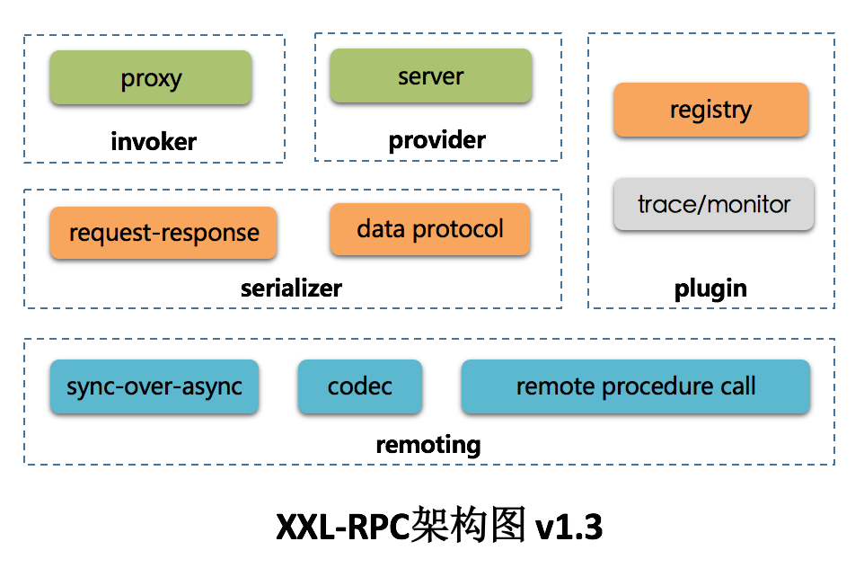

* [一、项目概览](#一数据类型)
    * [简介](#基本类型)
    * [环境](#基本类型)
    * [源码及官网](#包装类型)
* [二、项目使用](#二string)
* [三、项目设计](#三运算)
    * [总体设计](#参数传递)
    * [关键点分析](#float-与-double)
* [四、其他](#四继承)

# 一、项目概览

## 简介

## 环境

## 源码及官网

# 二、项目使用

# 三、项目设计

## 总体设计

## 关键点分析

# 四、其他
