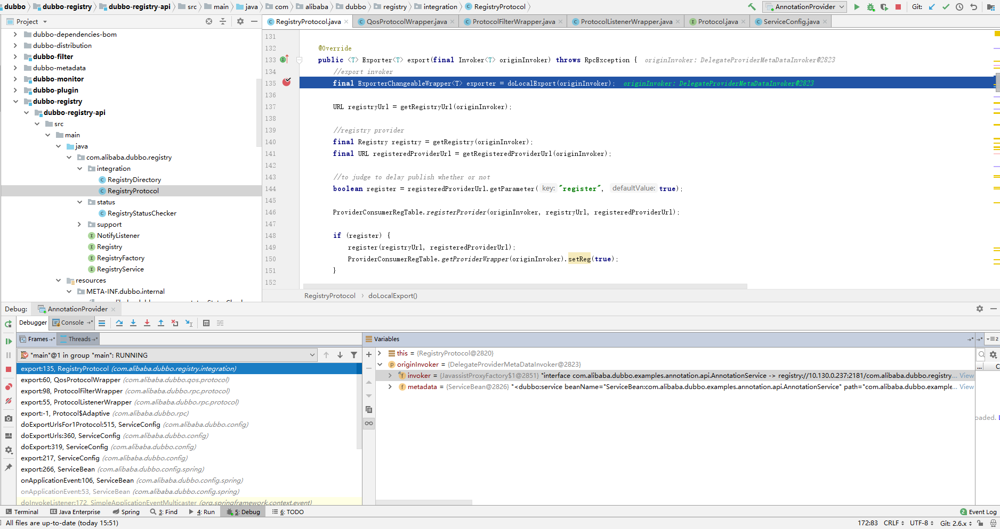
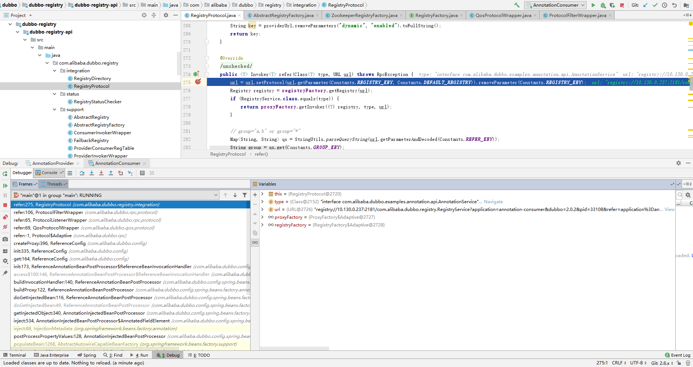
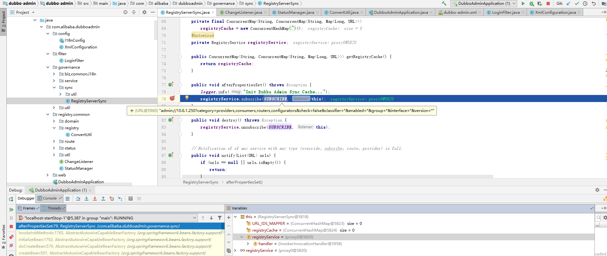
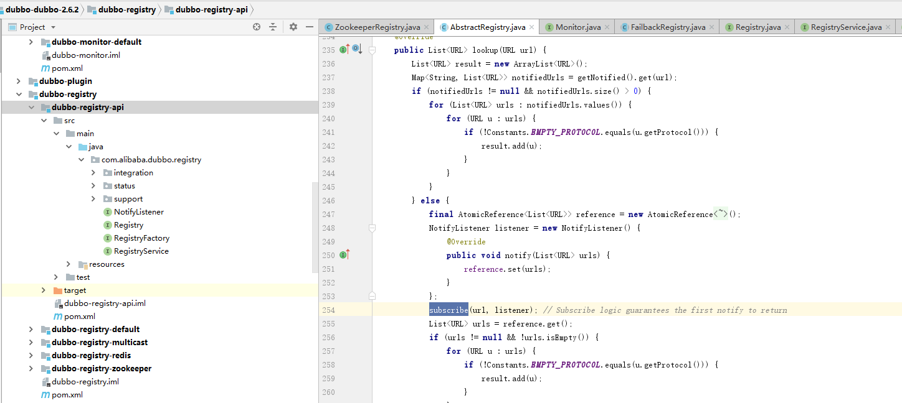
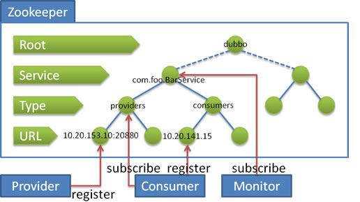

* [一、项目概览](#一数据类型)
    * [1.1 简介](#11-简介) 
    * [1.2 环境](#12-环境)
    * [1.3 源码及官网](#13-源码及官网)
* [二、项目使用](#二项目使用)
* [三、项目设计](#三项目设计)
    * [3.1 总体设计](#31-总体设计)
    * [3.2 关键点分析](#32-关键点分析)
        * [3.2.1 基本的XxlRegistryBaseClient与服务端各种交互实现原理](#321-基本的XxlRegistryBaseClient与服务端各种交互实现原理)  
        * [3.2.2 增强客户端的XxlRegistryClient实现原理](#322-增强客户端的XxlRegistryClient实现原理)
        * [3.2.3 长轮询方式long-polling实现原理](#323-长轮询方式long-polling实现原理)

* [四、其他](#四其他)

# 一、项目概览

## 1.1 简介
注册中心，多种实现方式，推荐使用zookeeper  
## 1.2 环境
    Dubbo2.6.7
## 1.3 源码及官网

[官网](http://dubbo.apache.org/zh-cn/docs/user/references/registry/introduction.html)

# 二、项目使用

- duddo中服务提供方使用注册中心




```aidl
服务提供方配置文件增加注册中心，以zookeeper为例
    <beans xmlns:xsi="http://www.w3.org/2001/XMLSchema-instance"
           xmlns:dubbo="http://dubbo.apache.org/schema/dubbo"
           xmlns="http://www.springframework.org/schema/beans"
           xsi:schemaLocation="http://www.springframework.org/schema/beans http://www.springframework.org/schema/beans/spring-beans-4.3.xsd
           http://dubbo.apache.org/schema/dubbo http://dubbo.apache.org/schema/dubbo/dubbo.xsd">
        <dubbo:application  name="validation-provider" />
        <dubbo:registry  address="zookeeper://10.130.0.237:2181"/>
        <dubbo:protocol  name="dubbo" port="20880"/>
        <bean id="validationService" class="com.alibaba.dubbo.examples.validation.impl.ValidationServiceImpl"/>
        <dubbo:service interface="com.alibaba.dubbo.examples.validation.api.ValidationService" ref="validationService"/>
    </beans>
服务提供者启动时: 向 /dubbo/com.alibaba.dubbo.examples.validation.api.ValidationService/providers 目录下写入自己的 URL 地址
    URL ：dubbo://10.6.1.250:20880/com.alibaba.dubbo.examples.validation.api.ValidationService?anyhost=true&application=validation-provider&dubbo=2.0.0&
    generic=false&interface=com.alibaba.dubbo.examples.validation.api.ValidationService&methods=save,update,delete&pid=243220&side=provider&timestamp=1573550757133
服务提供方服务加载时，调用RegistryProtocol的export方法中register向注册中心进行注册
     public void register(URL registryUrl, URL registedProviderUrl) {
         Registry registry = registryFactory.getRegistry(registryUrl);
         registry.register(registedProviderUrl);
     } 
Zookeeper中具体实现（向目录写入一个临时节点数据url）
    protected void doRegister(URL url) {
        try {
            zkClient.create(toUrlPath(url), url.getParameter(Constants.DYNAMIC_KEY, true));
        } catch (Throwable e) {
            throw new RpcException("Failed to register " + url + " to zookeeper " + getUrl() + ", cause: " + e.getMessage(), e);
        }
    }          
```

- duddo中服务消费方使用注册中心



```aidl
服务消费方配置文件增加注册中心，以zookeeper为例
    <beans xmlns:xsi="http://www.w3.org/2001/XMLSchema-instance"
           xmlns:dubbo="http://dubbo.apache.org/schema/dubbo"
           xmlns="http://www.springframework.org/schema/beans"
           xsi:schemaLocation="http://www.springframework.org/schema/beans http://www.springframework.org/schema/beans/spring-beans-4.3.xsd
           http://dubbo.apache.org/schema/dubbo http://dubbo.apache.org/schema/dubbo/dubbo.xsd">
        <dubbo:application name="validation-consumer"/>
        <dubbo:registry  address="zookeeper://10.130.0.237:2181"/>
        <dubbo:reference id="validationService" interface="com.alibaba.dubbo.examples.validation.api.ValidationService"
                         validation="true"/>
    </beans>
服务消费者启动时: 订阅 /dubbo/com.alibaba.dubbo.examples.validation.api.ValidationService/providers 目录下的提供者 URL 地址。
并向 /dubbo/com.alibaba.dubbo.examples.validation.api.ValidationService/consumers 目录下写入自己的 URL 地址
服务消费者使用服务时，会调用RegistryProtocol的refre方法向注册中心进行注册和订阅
    private <T> Invoker<T> doRefer(Cluster cluster, Registry registry, Class<T> type, URL url) {
        RegistryDirectory<T> directory = new RegistryDirectory<T>(type, url);
        ...
        if (!Constants.ANY_VALUE.equals(url.getServiceInterface())
                && url.getParameter(Constants.REGISTER_KEY, true)) {
            registry.register(subscribeUrl.addParameters(Constants.CATEGORY_KEY, Constants.CONSUMERS_CATEGORY,
                    Constants.CHECK_KEY, String.valueOf(false))); //注册
        }
        directory.subscribe(subscribeUrl.addParameter(Constants.CATEGORY_KEY,
                Constants.PROVIDERS_CATEGORY
                        + "," + Constants.CONFIGURATORS_CATEGORY
                        + "," + Constants.ROUTERS_CATEGORY));//订阅
       ...
       
    }
Zookeeper中订阅具体实现（添加/dubbo/com.alibaba.dubbo.examples.validation.api.ValidationService/providers目录下的监听，数据有变化时，通过NotifyListener进行本地处理）
        for (String path : toCategoriesPath(url)) {
            ConcurrentMap<NotifyListener, ChildListener> listeners = zkListeners.get(url);
            if (listeners == null) {
                zkListeners.putIfAbsent(url, new ConcurrentHashMap<NotifyListener, ChildListener>());
                listeners = zkListeners.get(url);
            }
            ChildListener zkListener = listeners.get(listener);
            if (zkListener == null) {
                listeners.putIfAbsent(listener, new ChildListener() {
                    @Override
                    public void childChanged(String parentPath, List<String> currentChilds) {
                        ZookeeperRegistry.this.notify(url, listener, toUrlsWithEmpty(url, parentPath, currentChilds));
                    }
                });
                zkListener = listeners.get(listener);
            }
            zkClient.create(path, false);
            List<String> children = zkClient.addChildListener(path, zkListener);
            if (children != null) {
                urls.addAll(toUrlsWithEmpty(url, path, children));
            }
        }

```

- duddo admin中使用注册中心

```aidl
    admin启动时: 先订阅Zookeeper的/dubbo目录下的所有URL地址。再通过notify(List<URL> urls) 监听所有URL的变化  
    RegistryServerSync类中订阅时URL为： admin://10.6.1.250?category=providers,consumers,routers,configurators&check=false&classifier=*&enabled=*&group=*&interface=*&version=*
    Zookeeper中订阅具体实现
    protected void doSubscribe(final URL url, final NotifyListener listener) {
         try {
             if (Constants.ANY_VALUE.equals(url.getServiceInterface())) { // url中interface=*时走这个
                 String root = toRootPath();
                 ConcurrentMap<NotifyListener, ChildListener> listeners = zkListeners.get(url);
                 if (listeners == null) {
                     zkListeners.putIfAbsent(url, new ConcurrentHashMap<NotifyListener, ChildListener>());
                     listeners = zkListeners.get(url);
                 }
                 ChildListener zkListener = listeners.get(listener);
                 if (zkListener == null) {
                     listeners.putIfAbsent(listener, new ChildListener() { // /dubbo目录下有服务变化时的监听类，订阅新增加服务类
                         @Override
                         public void childChanged(String parentPath, List<String> currentChilds) { 
                             for (String child : currentChilds) { 
                                 child = URL.decode(child);
                                 if (!anyServices.contains(child)) {
                                     anyServices.add(child);
                                     subscribe(url.setPath(child).addParameters(Constants.INTERFACE_KEY, child,
                                             Constants.CHECK_KEY, String.valueOf(false)), listener);
                                 }
                             }
                         }
                     });
                     zkListener = listeners.get(listener);
                 }
                 zkClient.create(root, false);
                 List<String> services = zkClient.addChildListener(root, zkListener);
                 if (services != null && !services.isEmpty()) {
                     for (String service : services) { // /dubbo目录下具体服务类
                         service = URL.decode(service);
                         anyServices.add(service);
                         subscribe(url.setPath(service).addParameters(Constants.INTERFACE_KEY, service,
                                 Constants.CHECK_KEY, String.valueOf(false)), listener);// 订阅dubbo目录下具体服务类，走else逻辑，服务类中有变化时，走ZookeeperRegistry.this.notify(url, listener, toUrlsWithEmpty(url, parentPath, currentChilds));通知
                     }
                 }
             } else { 
                 List<URL> urls = new ArrayList<URL>();
                 for (String path : toCategoriesPath(url)) {
                     ConcurrentMap<NotifyListener, ChildListener> listeners = zkListeners.get(url);
                     if (listeners == null) {
                         zkListeners.putIfAbsent(url, new ConcurrentHashMap<NotifyListener, ChildListener>());
                         listeners = zkListeners.get(url);
                     }
                     ChildListener zkListener = listeners.get(listener);
                     if (zkListener == null) {
                         listeners.putIfAbsent(listener, new ChildListener() {
                             @Override
                             public void childChanged(String parentPath, List<String> currentChilds) {
                                 ZookeeperRegistry.this.notify(url, listener, toUrlsWithEmpty(url, parentPath, currentChilds));
                             }
                         });
                         zkListener = listeners.get(listener);
                     }
                     zkClient.create(path, false);
                     List<String> children = zkClient.addChildListener(path, zkListener);
                     if (children != null) {
                         urls.addAll(toUrlsWithEmpty(url, path, children));
                     }
                 }
                 notify(url, listener, urls);
             }
         } catch (Throwable e) {
             throw new RpcException("Failed to subscribe " + url + " to zookeeper " + getUrl() + ", cause: " + e.getMessage(), e);
         }
     }
     
 admin中 NotifyListener listener  具体实现，根据变化的URL 按类目放入本地缓存registryCache中
     public void notify(List<URL> urls) {
             if (urls == null || urls.isEmpty()) {
                 return;
             }
             // Map<category, Map<servicename, Map<Long, URL>>>
             final Map<String, Map<String, Map<Long, URL>>> categories = new HashMap<String, Map<String, Map<Long, URL>>>();
             String interfaceName = null;
             for (URL url : urls) {
                 String category = url.getParameter(Constants.CATEGORY_KEY, Constants.PROVIDERS_CATEGORY);
                 if (Constants.EMPTY_PROTOCOL.equalsIgnoreCase(url.getProtocol())) { // NOTE: group and version in empty protocol is *
                     ConcurrentMap<String, Map<Long, URL>> services = registryCache.get(category);
                     if (services != null) {
                         String group = url.getParameter(Constants.GROUP_KEY);
                         String version = url.getParameter(Constants.VERSION_KEY);
                         // NOTE: group and version in empty protocol is *
                         if (!Constants.ANY_VALUE.equals(group) && !Constants.ANY_VALUE.equals(version)) {
                             services.remove(url.getServiceKey());
                         } else {
                             for (Map.Entry<String, Map<Long, URL>> serviceEntry : services.entrySet()) {
                                 String service = serviceEntry.getKey();
                                 if (Tool.getInterface(service).equals(url.getServiceInterface())
                                         && (Constants.ANY_VALUE.equals(group) || StringUtils.isEquals(group, Tool.getGroup(service)))
                                         && (Constants.ANY_VALUE.equals(version) || StringUtils.isEquals(version, Tool.getVersion(service)))) {
                                     services.remove(service);
                                 }
                             }
                         }
                     }
                 } else {
                     if (StringUtils.isEmpty(interfaceName)) {
                         interfaceName = url.getServiceInterface();
                     }
                     Map<String, Map<Long, URL>> services = categories.get(category);
                     if (services == null) {
                         services = new HashMap<String, Map<Long, URL>>();
                         categories.put(category, services);
                     }
                     String service = url.getServiceKey();
                     Map<Long, URL> ids = services.get(service);
                     if (ids == null) {
                         ids = new HashMap<Long, URL>();
                         services.put(service, ids);
                     } 
                     // Make sure we use the same ID for the same URL
                     if (URL_IDS_MAPPER.containsKey(url.toFullString())) {
                         ids.put(URL_IDS_MAPPER.get(url.toFullString()), url);
                     } else {
                         long currentId = ID.incrementAndGet();
                         ids.put(currentId, url);
                         URL_IDS_MAPPER.putIfAbsent(url.toFullString(), currentId);
                     }
                 }
             }
             if (categories.size() == 0) {
                 return;
             }
             for (Map.Entry<String, Map<String, Map<Long, URL>>> categoryEntry : categories.entrySet()) {
                 String category = categoryEntry.getKey();
                 ConcurrentMap<String, Map<Long, URL>> services = registryCache.get(category);
                 if (services == null) {
                     services = new ConcurrentHashMap<String, Map<Long, URL>>();
                     registryCache.put(category, services);
                 } else {// Fix map can not be cleared when service is unregistered: when a unique “group/service:version” service is unregistered, but we still have the same services with different version or group, so empty protocols can not be invoked.
                     Set<String> keys = new HashSet<String>(services.keySet());
                     for (String key : keys) {
                         if (Tool.getInterface(key).equals(interfaceName) && !categoryEntry.getValue().entrySet().contains(key)) {
                             services.remove(key);
                         }
                     }
                 }
                 services.putAll(categoryEntry.getValue());
             }
         }
     
    
```

# 三、项目设计


## 3.1 总体设计-dubbo注册中心接口层分析



- 接口类RegistryService和NotifyListener
```aidl
注册中心实现5个功能方法，注册、取消注册、订阅、取消订阅和查找,
dubbo 有多种注册中心实现，zookeeper实现、multicast实现、Redis实现等

接口RegistryService5个功能定义
    public interface RegistryService {
        void register(URL url); 
        void unregister(URL url);
        void subscribe(URL url, NotifyListener listener);
        void unsubscribe(URL url, NotifyListener listener);
        List<URL> lookup(URL url); -- 被调用的地方还没看
    }
接口NotifyListener,用来在订阅或订阅数据变化时，通知订阅方进行相应的处理（如新增或删除服务提供者，订阅者收到服务提供者列表变化通知，进行本地处理）
    public interface NotifyListener {
        void notify(List<URL> urls);
    }
```
- 抽象类FailbackRegistry
```aidl
抽象类FailbackRegistry定义模板方法，具体实现由zookeeper、multicast、Redis等实现
FailbackRegistry继承AbstractRegistry，先看下AbstractRegistry（实现RegistryService5个方法）
AbstractRegistry有3个变量，保存本地数据
    private final Set<URL> registered = new ConcurrentHashSet<URL>(); //保存注册数据，如当服务提供方注册时，会在本地这个变量中保存服务URL 
    private final ConcurrentMap<URL, Set<NotifyListener>> subscribed = new ConcurrentHashMap<URL, Set<NotifyListener>>();//保存订阅数据，如当服务消费方订阅时，会在本地这个变量中保存订阅URL和监听类
    private final ConcurrentMap<URL, Map<String, List<URL>>> notified = new ConcurrentHashMap<URL, Map<String, List<URL>>>();//保存服务消费订阅URL 及 远程提供方UAL对应关系

AbstractRegistry的register方法
    @Override
    public void register(URL url) {
        if (url == null) {
            throw new IllegalArgumentException("register url == null");
        }
        if (logger.isInfoEnabled()) {
            logger.info("Register: " + url);
        }
        registered.add(url); ////保存注册数据
    }

AbstractRegistry的subscribe方法
    @Override
    public void subscribe(URL url, NotifyListener listener) {
        Set<NotifyListener> listeners = subscribed.get(url);
        if (listeners == null) {
            subscribed.putIfAbsent(url, new ConcurrentHashSet<NotifyListener>());
            listeners = subscribed.get(url);
        }
        listeners.add(listener);//保存订阅数据
    }

AbstractRegistry的lookup方法 - 这个没看到哪块使用这个方法
    @Override
    public List<URL> lookup(URL url) {
        List<URL> result = new ArrayList<URL>();
        Map<String, List<URL>> notifiedUrls = getNotified().get(url);
        if (notifiedUrls != null && notifiedUrls.size() > 0) {
            for (List<URL> urls : notifiedUrls.values()) {
                for (URL u : urls) {
                    if (!Constants.EMPTY_PROTOCOL.equals(u.getProtocol())) {
                        result.add(u);
                    }
                }
            }
        } else {
            final AtomicReference<List<URL>> reference = new AtomicReference<List<URL>>();
            NotifyListener listener = new NotifyListener() {
                @Override
                public void notify(List<URL> urls) {
                    reference.set(urls);
                }
            };
            subscribe(url, listener); // Subscribe logic guarantees the first notify to return
            List<URL> urls = reference.get();
            if (urls != null && !urls.isEmpty()) {
                for (URL u : urls) {
                    if (!Constants.EMPTY_PROTOCOL.equals(u.getProtocol())) {
                        result.add(u);
                    }
                }
            }
        }
        return result;
    }
    
 AbstractRegistry的notify方法(消费方和提供方都有使用)
   1. 消费方从注册中心获取所有服务URL或服务URL有变化时，执行这个监听方法，生成（或重新生成）本地调用远程的方法
   2. 提供方从注册中心获取服务URL的Configurator目录的变化，用来重新根据配置信息生成提供方方法
   protected void notify(URL url, NotifyListener listener, List<URL> urls) { // urls为从注册中心获取所有的提供方URL
          Map<String, List<URL>> result = new HashMap<String, List<URL>>();
          for (URL u : urls) {
              if (UrlUtils.isMatch(url, u)) {
                  String category = u.getParameter(Constants.CATEGORY_KEY, Constants.DEFAULT_CATEGORY);
                  List<URL> categoryList = result.get(category);
                  if (categoryList == null) {
                      categoryList = new ArrayList<URL>();
                      result.put(category, categoryList);
                  }
                  categoryList.add(u);
              }
          }
          if (result.size() == 0) {
              return;
          }
          Map<String, List<URL>> categoryNotified = notified.get(url);
          if (categoryNotified == null) {
              notified.putIfAbsent(url, new ConcurrentHashMap<String, List<URL>>());
              categoryNotified = notified.get(url);
          }
          for (Map.Entry<String, List<URL>> entry : result.entrySet()) {
              String category = entry.getKey();
              List<URL> categoryList = entry.getValue();
              categoryNotified.put(category, categoryList);
              saveProperties(url);
              listener.notify(categoryList);
              //listener.notify的消费方实现 ： 具体实现在RegistryDirectory类型，Map<String, Invoker<T>> newUrlInvokerMap = toInvokers(invokerUrls); 主要是把URL变化Invoker，这块在消费方调用时，再介绍
              //listener.notify的提供方实现 :  具体实现在RegistryProtocol中OverrideListener类型，List<Configurator> configurators = RegistryDirectory.toConfigurators(matchedUrls);RegistryProtocol.this.doChangeLocalExport(originInvoker, newUrl); 主要是根据配置信息，重新生成本地提供方方法
          }
      }  
 

FailbackRegistry继承AbstractRegistry
    5个变量，注册失败，订阅失败，通知失败等（注册中心重连，注册中心掉线，本地监听通知异常等）的URL数据，用于在retryExecutor线程池中执行重新注册，订阅等操作
    private final Set<URL> failedRegistered = new ConcurrentHashSet<URL>();  
    private final Set<URL> failedUnregistered = new ConcurrentHashSet<URL>();  
    private final ConcurrentMap<URL, Set<NotifyListener>> failedSubscribed = new ConcurrentHashMap<URL, Set<NotifyListener>>();  
    private final ConcurrentMap<URL, Set<NotifyListener>> failedUnsubscribed = new ConcurrentHashMap<URL, Set<NotifyListener>>(); 
    private final ConcurrentMap<URL, Map<NotifyListener, List<URL>>> failedNotified = new ConcurrentHashMap<URL, Map<NotifyListener, List<URL>>>();//通知失败的记录结果 和父类notified有关系
    
    retryExecutor线程池（每5秒运行一次）
        this.retryFuture = retryExecutor.scheduleWithFixedDelay(new Runnable() {
            @Override
            public void run() {
                // Check and connect to the registry
                try {
                    retry(); //判断5个变量是否为空，如failedRegistered有值时，就执行doRegister，failedSubscribed有值时就执行doSubscribe
                            //failedNotified有值时就执行NotifyListener.notify(urls);
                } catch (Throwable t) { // Defensive fault tolerance
                    logger.error("Unexpected error occur at failed retry, cause: " + t.getMessage(), t);
                }
            }
        }, retryPeriod, retryPeriod, TimeUnit.MILLISECONDS);
     
     
     //监控通知( 调用父类AbstractRegistry的notify方法)
     doNotify(url, listener, urls);//调用父类的方法，进行本地监控通知，如注册中心，提供方数据有变化时，本地消费方根据提供方URL，重新生成远程调用地址
    
     // ==== Template method ====    具体实现在子类 zookeeper,redis,multicast实现等
     protected abstract void doRegister(URL url);
     protected abstract void doUnregister(URL url);
     protected abstract void doSubscribe(URL url, NotifyListener listener);
     protected abstract void doUnsubscribe(URL url, NotifyListener listener); 
           
        
FailbackRegistry的register方法
    @Override
    public void register(URL url) {
        super.register(url); //调用AbstractRegistry的register
        failedRegistered.remove(url);
        failedUnregistered.remove(url);
        try {
            // Sending a registration request to the server side
            // 具体实现在子类 zookeeper,redis,multicast实现等
            doRegister(url);
        } catch (Exception e) {
            Throwable t = e;
            // If the startup detection is opened, the Exception is thrown directly.
            boolean check = getUrl().getParameter(Constants.CHECK_KEY, true)
                    && url.getParameter(Constants.CHECK_KEY, true)
                    && !Constants.CONSUMER_PROTOCOL.equals(url.getProtocol());
            boolean skipFailback = t instanceof SkipFailbackWrapperException;
            if (check || skipFailback) {
                if (skipFailback) {
                    t = t.getCause();
                }
                throw new IllegalStateException("Failed to register " + url + " to registry " + getUrl().getAddress() + ", cause: " + t.getMessage(), t);
            } else {
                logger.error("Failed to register " + url + ", waiting for retry, cause: " + t.getMessage(), t);
            }
            // Record a failed registration request to a failed list, retry regularly
            failedRegistered.add(url); //注册失败时，保存下，retryExecutor线程池 5秒重试
        }
    }
    
FailbackRegistry的subscribe方法   
   @Override
    public void subscribe(URL url, NotifyListener listener) {
        super.subscribe(url, listener);
        removeFailedSubscribed(url, listener);
        try {
            // Sending a subscription request to the server side
            // 具体实现在子类 zookeeper,redis,multicast实现等
            doSubscribe(url, listener);
        } catch (Exception e) {
            Throwable t = e;
            List<URL> urls = getCacheUrls(url);
            if (urls != null && !urls.isEmpty()) {
                notify(url, listener, urls);
                logger.error("Failed to subscribe " + url + ", Using cached list: " + urls + " from cache file: " + getUrl().getParameter(Constants.FILE_KEY, System.getProperty("user.home") + "/dubbo-registry-" + url.getHost() + ".cache") + ", cause: " + t.getMessage(), t);
            } else {
                // If the startup detection is opened, the Exception is thrown directly.
                boolean check = getUrl().getParameter(Constants.CHECK_KEY, true)
                        && url.getParameter(Constants.CHECK_KEY, true);
                boolean skipFailback = t instanceof SkipFailbackWrapperException;
                if (check || skipFailback) {
                    if (skipFailback) {
                        t = t.getCause();
                    }
                    throw new IllegalStateException("Failed to subscribe " + url + ", cause: " + t.getMessage(), t);
                } else {
                    logger.error("Failed to subscribe " + url + ", waiting for retry, cause: " + t.getMessage(), t);
                }
            }
            // Record a failed registration request to a failed list, retry regularly
            //订阅 失败时，保存下，retryExecutor线程池 5秒重试
            addFailedSubscribed(url, listener);
        }
    }
    
FailbackRegistry的unregister 和 unsubscribe方法类似
```

- 接口类RegistryFactory

```aidl
RegistryFactory注册中心工厂，用来生成RegistryFactory
    @SPI("dubbo") //spi是dubbo的加载扩展的注解，根据URL中的参数或其他配置加载对应的具体实现类，spi在其他文章再介绍
    public interface RegistryFactory {
        @Adaptive({"protocol"})
        Registry getRegistry(URL url);
    }
 
抽象类AbstractRegistryFactory   
    private static final ReentrantLock LOCK = new ReentrantLock();
    // 保存创建过的注册中心类，同一个注册中心地址，只有一个实现类
    private static final Map<String, Registry> REGISTRIES = new ConcurrentHashMap<String, Registry>();
    @Override
    public Registry getRegistry(URL url) {
        url = url.setPath(RegistryService.class.getName())
                .addParameter(Constants.INTERFACE_KEY, RegistryService.class.getName())
                .removeParameters(Constants.EXPORT_KEY, Constants.REFER_KEY);
        String key = url.toServiceStringWithoutResolving();
        // Lock the registry access process to ensure a single instance of the registry
        LOCK.lock();
        try {
            Registry registry = REGISTRIES.get(key);
            if (registry != null) {
                return registry;
            }
            registry = createRegistry(url);
            if (registry == null) {
                throw new IllegalStateException("Can not create registry " + url);
            }
            REGISTRIES.put(key, registry);
            return registry;
        } finally {
            // Release the lock
            LOCK.unlock();
        }
    }
    // 具体实现在子类 zookeeper,redis,multicast实现等
    protected abstract Registry createRegistry(URL url);

```

## 3.2 dubbo注册中心-zookeeper实现分析

 - zookeeper介绍
 
 
 ```aidl
Zookeeper 是 Apacahe Hadoop 的子项目，是一个树型的目录服务，支持变更推送，适合作为 Dubbo 服务的注册中心，工业强度较高，可用于生产环境，并推荐使用 [1]。

流程说明：
    服务提供者启动时: 向 /dubbo/com.foo.BarService/providers 目录下写入自己的 URL 地址
    服务消费者启动时: 订阅 /dubbo/com.foo.BarService/providers 目录下的提供者 URL 地址。并向 /dubbo/com.foo.BarService/consumers 目录下写入自己的 URL 地址
    监控中心启动时: 订阅 /dubbo/com.foo.BarService 目录下的所有提供者和消费者 URL 地址。

支持以下功能：
    当提供者出现断电等异常停机时，注册中心能自动删除提供者信息
    当注册中心重启时，能自动恢复注册数据，以及订阅请求
    当会话过期时，能自动恢复注册数据，以及订阅请求
    当设置 <dubbo:registry check="false" /> 时，记录失败注册和订阅请求，后台定时重试
    可通过 <dubbo:registry username="admin" password="1234" /> 设置 zookeeper 登录信息
    可通过 <dubbo:registry group="dubbo" /> 设置 zookeeper 的根节点，不配置将使用默认的根节点。
    支持 * 号通配符 <dubbo:reference group="*" version="*" />，可订阅服务的所有分组和所有版本的提供者

```

extension


## 3.3 dubbo注册中心-multicast实现分析


## 3.4 dubbo注册中心-Redis实现分析


# 四、其他
