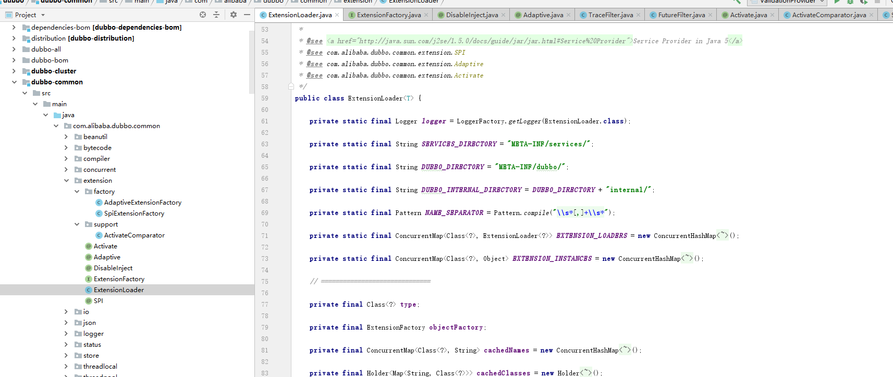

* [一、项目概览](#一数据类型)
    * [1.1 简介](#11-简介) 
    * [1.2 环境](#12-环境)
    * [1.3 源码及官网](#13-源码及官网)
* [二、项目使用](#二项目使用)
* [三、项目设计](#三项目设计)
    * [3.1 总体设计](#31-总体设计)
    * [3.2 关键点分析](#32-关键点分析)
        * [3.2.1 基本的XxlRegistryBaseClient与服务端各种交互实现原理](#321-基本的XxlRegistryBaseClient与服务端各种交互实现原理)  
        * [3.2.2 增强客户端的XxlRegistryClient实现原理](#322-增强客户端的XxlRegistryClient实现原理)
        * [3.2.3 长轮询方式long-polling实现原理](#323-长轮询方式long-polling实现原理)

* [四、其他](#四其他)

# 一、项目概览

## 1.1 简介
    dubbo拓展使用spi及其自适应拓展，要对dubbo源码有更深的了解，需要详细的分析下这块
## 1.2 环境
    Dubbo2.6.7
## 1.3 源码及官网

[官网](http://dubbo.apache.org/zh-cn/docs/source_code_guide/dubbo-spi.html)
[源码](https://github.com/apache/dubbo)

# 二、项目使用

```aidl
代码中类似这样的语句使用dubbo拓展
private static final Protocol protocol = ExtensionLoader.getExtensionLoader(Protocol.class).getAdaptiveExtension();

先看下 http://dubbo.apache.org/zh-cn/docs/source_code_guide/dubbo-spi.html 

```

# 三、项目设计

## 3.1 总体设计-dubbo SPI接口层分析


- Dubbo 的扩展点介绍

```aidl
Dubbo 的扩展点加载从 JDK 标准的 SPI (Service Provider Interface) 扩展点发现机制加强而来。
Dubbo 改进了 JDK 标准的 SPI 的以下问题：
    JDK 标准的 SPI 会一次性实例化扩展点所有实现，如果有扩展实现初始化很耗时，但如果没用上也加载，会很浪费资源。
    如果扩展点加载失败，连扩展点的名称都拿不到了。比如：JDK 标准的 ScriptEngine，通过 getName() 获取脚本类型的名称，但如果 RubyScriptEngine 因为所依赖的 jruby.jar 不存在，导致 RubyScriptEngine 类加载失败，这个失败原因被吃掉了，和 ruby 对应不起来，当用户执行 ruby 脚本时，会报不支持 ruby，而不是真正失败的原因。
    增加了对扩展点 IoC 和 AOP 的支持，一个扩展点可以直接 setter 注入其它扩展点。
在扩展类的 jar 包内 [1]，放置扩展点配置文件 META-INF/dubbo/接口全限定名，内容为：配置名=扩展实现类全限定名，多个实现类用换行符分隔。
示例：

以扩展 Dubbo 的协议为例，在协议的实现 jar 包内放置文本文件：META-INF/dubbo/org.apache.dubbo.rpc.Protocol，内容为：
xxx=com.alibaba.xxx.XxxProtocol
实现类内容 [2]：
package com.alibaba.xxx;
import org.apache.dubbo.rpc.Protocol;
public class XxxProtocol implements Protocol { 
    // ...
}

配置模块中的配置
Dubbo 配置模块中，扩展点均有对应配置属性或标签，通过配置指定使用哪个扩展实现。比如：
<dubbo:protocol name="xxx" />


1.简介
SPI 全称为 Service Provider Interface，是一种服务发现机制。SPI 的本质是将接口实现类的全限定名配置在文件中，并由服务加载器读取配置文件，加载实现类。这样可以在运行时，动态为接口替换实现类。正因此特性，我们可以很容易的通过 SPI 机制为我们的程序提供拓展功能。
SPI 机制在第三方框架中也有所应用，比如 Dubbo 就是通过 SPI 机制加载所有的组件。不过，Dubbo 并未使用 Java 原生的 SPI 机制，而是对其进行了增强，使其能够更好的满足需求。
在 Dubbo 中，SPI 是一个非常重要的模块。基于 SPI，我们可以很容易的对 Dubbo 进行拓展。如果大家想要学习 Dubbo 的源码，SPI 机制务必弄懂。接下来，我们先来了解一下 Java SPI 与 Dubbo SPI 的用法，然后再来分析 Dubbo SPI 的源码。
需要特别说明的是，本篇文章以及本系列其他文章所分析的源码版本均为 dubbo-2.6.4。因此大家在阅读文章的过程中，需注意将代码版本切换到 dubbo-2.6.4 tag 上。
2.SPI 示例
2.1 Java SPI 示例
前面简单介绍了 SPI 机制的原理，本节通过一个示例演示 Java SPI 的使用方法。首先，我们定义一个接口，名称为 Robot。
public interface Robot {
    void sayHello();
}
接下来定义两个实现类，分别为 OptimusPrime 和 Bumblebee。
public class OptimusPrime implements Robot {  
    @Override
    public void sayHello() {
        System.out.println("Hello, I am Optimus Prime.");
    }
}
public class Bumblebee implements Robot {
    @Override
    public void sayHello() {
        System.out.println("Hello, I am Bumblebee.");
    }
}
接下来 META-INF/services 文件夹下创建一个文件，名称为 Robot 的全限定名 org.apache.spi.Robot。文件内容为实现类的全限定的类名，如下：
org.apache.spi.OptimusPrime
org.apache.spi.Bumblebee
做好所需的准备工作，接下来编写代码进行测试。
public class JavaSPITest {
    @Test
    public void sayHello() throws Exception {
        ServiceLoader<Robot> serviceLoader = ServiceLoader.load(Robot.class);
        System.out.println("Java SPI");
        serviceLoader.forEach(Robot::sayHello);
    }
}
最后来看一下测试结果，如下：
从测试结果可以看出，我们的两个实现类被成功的加载，并输出了相应的内容。关于 Java SPI 的演示先到这里，接下来演示 Dubbo SPI。
2.2 Dubbo SPI 示例
Dubbo 并未使用 Java SPI，而是重新实现了一套功能更强的 SPI 机制。Dubbo SPI 的相关逻辑被封装在了 ExtensionLoader 类中，通过 ExtensionLoader，我们可以加载指定的实现类。
Dubbo SPI 所需的配置文件需放置在 META-INF/dubbo 路径下，配置内容如下。
optimusPrime = org.apache.spi.OptimusPrime
bumblebee = org.apache.spi.Bumblebee
与 Java SPI 实现类配置不同，Dubbo SPI 是通过键值对的方式进行配置，这样我们可以按需加载指定的实现类。另外，在测试 Dubbo SPI 时，需要在 Robot 接口上标注 @SPI 注解。下面来演示 Dubbo SPI 的用法：
public class DubboSPITest {
    @Test
    public void sayHello() throws Exception {
        ExtensionLoader<Robot> extensionLoader = 
            ExtensionLoader.getExtensionLoader(Robot.class);
        Robot optimusPrime = extensionLoader.getExtension("optimusPrime");
        optimusPrime.sayHello();
        Robot bumblebee = extensionLoader.getExtension("bumblebee");
        bumblebee.sayHello();
    }
}
测试结果如下：
Dubbo SPI 除了支持按需加载接口实现类，还增加了 IOC 和 AOP 等特性，这些特性将会在接下来的源码分析章节中一一进行介绍。


自适应拓展原理

在 Dubbo 中，很多拓展都是通过 SPI 机制进行加载的，比如 Protocol、Cluster、LoadBalance 等。有时，有些拓展并不想在框架启动阶段被加载，而是希望在拓展方法被调用时，根据运行时参数进行加载。这听起来有些矛盾。拓展未被加载，那么拓展方法就无法被调用（静态方法除外）。拓展方法未被调用，拓展就无法被加载。对于这个矛盾的问题，Dubbo 通过自适应拓展机制很好的解决了。自适应拓展机制的实现逻辑比较复杂，首先 Dubbo 会为拓展接口生成具有代理功能的代码。然后通过 javassist 或 jdk 编译这段代码，得到 Class 类。最后再通过反射创建代理类，整个过程比较复杂。为了让大家对自适应拓展有一个感性的认识，下面我们通过一个示例进行演示。
这是一个与汽车相关的例子，我们有一个车轮制造厂接口 WheelMaker：
public interface WheelMaker {
    Wheel makeWheel(URL url);
}
WheelMaker 接口的自适应实现类如下：
public class AdaptiveWheelMaker implements WheelMaker {
    public Wheel makeWheel(URL url) {
        if (url == null) {
            throw new IllegalArgumentException("url == null");
        }       
    	// 1.从 URL 中获取 WheelMaker 名称
        String wheelMakerName = url.getParameter("Wheel.maker");
        if (wheelMakerName == null) {
            throw new IllegalArgumentException("wheelMakerName == null");
        }
        
        // 2.通过 SPI 加载具体的 WheelMaker
        WheelMaker wheelMaker = ExtensionLoader
            .getExtensionLoader(WheelMaker.class).getExtension(wheelMakerName);
        
        // 3.调用目标方法
        return wheelMaker.makeWheel(URL url);
    }
}
AdaptiveWheelMaker 是一个代理类，与传统的代理逻辑不同，AdaptiveWheelMaker 所代理的对象是在 makeWheel 方法中通过 SPI 加载得到的。makeWheel 方法主要做了三件事情：
    从 URL 中获取 WheelMaker 名称
    通过 SPI 加载具体的 WheelMaker 实现类
    调用目标方法
接下来，我们来看看汽车制造厂 CarMaker 接口与其实现类。
public interface CarMaker {
    Car makeCar(URL url);
}
public class RaceCarMaker implements CarMaker {
    WheelMaker wheelMaker;
 
    // 通过 setter 注入 AdaptiveWheelMaker
    public setWheelMaker(WheelMaker wheelMaker) {
        this.wheelMaker = wheelMaker;
    }
 
    public Car makeCar(URL url) {
        Wheel wheel = wheelMaker.makeWheel(url);
        return new RaceCar(wheel, ...);
    }
}
RaceCarMaker 持有一个 WheelMaker 类型的成员变量，在程序启动时，我们可以将 AdaptiveWheelMaker 通过 setter 方法注入到 RaceCarMaker 中。在运行时，假设有这样一个 url 参数传入：
dubbo://192.168.0.101:20880/XxxService?wheel.maker=MichelinWheelMaker
RaceCarMaker 的 makeCar 方法将上面的 url 作为参数传给 AdaptiveWheelMaker 的 makeWheel 方法，makeWheel 方法从 url 中提取 wheel.maker 参数，得到 MichelinWheelMaker。之后再通过 SPI 加载配置名为 MichelinWheelMaker 的实现类，得到具体的 WheelMaker 实例。
上面的示例展示了自适应拓展类的核心实现 ---- 在拓展接口的方法被调用时，通过 SPI 加载具体的拓展实现类，并调用拓展对象的同名方法。接下来，我们深入到源码中，探索自适应拓展类生成的过程。

```


## 3.2 dubbo扩展源码介绍
- 代码结构


```aidl
三个注解和一个接口和一个类
@SPI                    ： 用于定义接口为扩展点，其接口实现类在META-INF/dubbo目录下建立对应接口文件，这样dubbo就能加载了，
                           如ExtensionFactory接口在META-INF/dubbo/internal/目录下有名称为com.alibaba.dubbo.common.extension.ExtensionFactory文件
                           内容为adaptive=com.alibaba.dubbo.common.extension.factory.AdaptiveExtensionFactory
                                 spi=com.alibaba.dubbo.common.extension.factory.SpiExtensionFactory
@Adaptive               ： 自适应类，放在类或方法上，类上时这个为自适应类，当ExtensionLoader.getExtensionLoader(xxx.class).getAdaptiveExtension();返回的就是这个自适应类，目前平台只有两个AdaptiveExtensionFactory和AdaptiveCompiler
                           方法上时，当ExtensionLoader.getExtensionLoader(xxx.class).getAdaptiveExtension();返回的重新编译的一个自适应类，这个方法也被重新编译成根据URL参数，返回不同的具体实现类
                           返回的是一个实现类。
@Activate               ： 根据条件返回的是一组排序的实现类。很多个实现SPI的扩展点的实现，可以一起加载到dubbo中运行
                           对于集合类扩展点，比如：Filter, InvokerListener, ExportListener, TelnetHandler, StatusChecker 等，可以同时加载多个实现，此时，可以用自动激活来简化配置
ExtensionFactory        ： 扩展工厂接口（是一个SPI扩展点），其提供的功能类似IOC自动注入，在SPI扩展类中可能有依赖其他实现类的，ExtensionFactory就是用来查找这个实现类并注入到SPI扩展类中，
                           ExtensionFactory目前有两个实现类（查找SPI的和查找SpringBean的）和一个自适应类（合并这两个类都进行查找）
ExtensionLoader         ： dubbo扩展主要实现类，其中方法有getExtensionLoader，getAdaptiveExtension，getExtension获取扩展类的，前面三个注解和一个接口，都该类中有使用到                      
```

- ExtensionLoader介绍 - 主要变量
```aidl
-- 下面3个静态变量为定义扩展点文件实现类的描述地址，ExtensionLoader会查找所有依赖JAR的这3个目录，有的话就加载对应实现的class
private static final String SERVICES_DIRECTORY = "META-INF/services/";
private static final String DUBBO_DIRECTORY = "META-INF/dubbo/";
private static final String DUBBO_INTERNAL_DIRECTORY = DUBBO_DIRECTORY + "internal/";
-- 静态变量，扩展类定义的名称可以多个以，分隔
private static final Pattern NAME_SEPARATOR = Pattern.compile("\\s*[,]+\\s*");
-- 静态缓存变量，用来保障一个JVM实例中，一个@SPI扩展接口类只有一个ExtensionLoader实例，Class为扩展接口类
private static final ConcurrentMap<Class<?>, ExtensionLoader<?>> EXTENSION_LOADERS = new ConcurrentHashMap<Class<?>, ExtensionLoader<?>>();
-- 静态缓存变量，用来保障一个JVM实例中，一个@SPI扩展的实现类只有一个实例，Class为实现类
private static final ConcurrentMap<Class<?>, Object> EXTENSION_INSTANCES = new ConcurrentHashMap<Class<?>, Object>();
// ==============================
-- 下面的变量都是实例变量
-- @SPI扩展接口类 如 interface com.alibaba.dubbo.rpc.Protocol
private final Class<?> type;
-- 扩展工厂，为ExtensionFactory的自适应类
private final ExtensionFactory objectFactory;
-- 实现类对应的名称 如 "class com.alibaba.dubbo.rpc.protocol.dubbo.DubboProtocol" -> "dubbo"
private final ConcurrentMap<Class<?>, String> cachedNames = new ConcurrentHashMap<Class<?>, String>();
-- 名称对应实现类 如 "registry" -> "class com.alibaba.dubbo.registry.integration.RegistryProtocol"
private final Holder<Map<String, Class<?>>> cachedClasses = new Holder<Map<String, Class<?>>>();
-- 
private final Map<String, Activate> cachedActivates = new ConcurrentHashMap<String, Activate>();
-- 名称对应实现类的实例 如 "dubbo" -> ProtocolFilterWrapper实例
private final ConcurrentMap<String, Holder<Object>> cachedInstances = new ConcurrentHashMap<String, Holder<Object>>();
-- 
private final Holder<Object> cachedAdaptiveInstance = new Holder<Object>();
-- 
private volatile Class<?> cachedAdaptiveClass = null;
-- @SPI扩展接口类默认使用实现类名称 ，如com.alibaba.dubbo.rpc.Protocol 的 dubbo
private String cachedDefaultName;
-- 
private volatile Throwable createAdaptiveInstanceError;
-- @SPI扩展接口类 其实现类中是包裹类的集合 ，如com.alibaba.dubbo.rpc.Protocol 的包裹类有QosProtocolWrapper  ProtocolFilterWrapper ProtocolListenerWrapper3个
private Set<Class<?>> cachedWrapperClasses;
-- 
private Map<String, IllegalStateException> exceptions = new ConcurrentHashMap<String, IllegalStateException>();
```


- ExtensionLoader介绍 - 获取指定名称扩展（有的是包裹类扩展，如Protocol.class）

```aidl
分析下面实例的过程
    public static void main(String[] args) {
        Protocol protocol = ExtensionLoader.getExtensionLoader(Protocol.class).getExtension("dubbo"); //有包裹类扩展
        Filter protocol = ExtensionLoader.getExtensionLoader(Filter.class).getExtension("cache");//有主动注入处理
    }
getExtensionLoader(Protocol.class)过程
    public static <T> ExtensionLoader<T> getExtensionLoader(Class<T> type) {
        if (type == null)
            throw new IllegalArgumentException("Extension type == null");
        if (!type.isInterface()) {
            throw new IllegalArgumentException("Extension type(" + type + ") is not interface!");
        }
        if (!withExtensionAnnotation(type)) {
            throw new IllegalArgumentException("Extension type(" + type +
                    ") is not extension, because WITHOUT @" + SPI.class.getSimpleName() + " Annotation!");
        }
        //查找缓存，一个@SPI扩展接口类只有一个ExtensionLoader实例
        ExtensionLoader<T> loader = (ExtensionLoader<T>) EXTENSION_LOADERS.get(type);
        if (loader == null) {
            //实例化new ExtensionLoader<T>(type)
            EXTENSION_LOADERS.putIfAbsent(type, new ExtensionLoader<T>(type));
            loader = (ExtensionLoader<T>) EXTENSION_LOADERS.get(type);
        }
        return loader;
    }
    
    private ExtensionLoader(Class<?> type) {
        //type为interface com.alibaba.dubbo.rpc.Protocol
        this.type = type;
        //objectFactory为ExtensionFactory.class的自适应控制类，看“ExtensionLoader介绍 - 获取自适应扩展”
        objectFactory = (type == ExtensionFactory.class ? null : ExtensionLoader.getExtensionLoader(ExtensionFactory.class).getAdaptiveExtension());
    }
 getExtension("dubbo")过程
     public T getExtension(String name) {
            //name为dubbo
            if (name == null || name.length() == 0)
                throw new IllegalArgumentException("Extension name == null");
            if ("true".equals(name)) {
                return getDefaultExtension();
            }
            //缓存类   ,  Holder类中private volatile T value; 在 holder.set(instance)时即一个线程修改了某个变量的值，
            //                   这新值对其他线程来说是立即可见的。（实现可见性）禁止进行指令重排序。（实现有序性）
            Holder<Object> holder = cachedInstances.get(name);
            if (holder == null) {
                cachedInstances.putIfAbsent(name, new Holder<Object>());
                holder = cachedInstances.get(name);
            }
            //缓存类
            Object instance = holder.get();
            //双重锁检查
            if (instance == null) {
                synchronized (holder) {
                    instance = holder.get();
                    if (instance == null) {
                        //根据name实例化SPI实现类  ，如dubbo=com.alibaba.dubbo.rpc.protocol.dubbo.DubboProtocol
                        instance = createExtension(name);
                        holder.set(instance);
                    }
                }
            }
            return (T) instance;
    }
    
    private T createExtension(String name) {
        //getExtensionClasses()获取所有的SPI实现类的class,看下面的介绍getExtensionClasses()过程
        Class<?> clazz = getExtensionClasses().get(name);
        if (clazz == null) {
            throw findException(name);
        }
        try {
            //clazz为spi接口的实现类，一个实现类只有一个实例，保存在EXTENSION_INSTANCES缓存中
            T instance = (T) EXTENSION_INSTANCES.get(clazz);
            if (instance == null) {              
                EXTENSION_INSTANCES.putIfAbsent(clazz, clazz.newInstance());//实例化
                instance = (T) EXTENSION_INSTANCES.get(clazz);
            }
            //注入（类似IOC注入），clazz实例（spi接口的实现类）中有可能有依赖其他SPI或springbean的，检查并注入实现类中,看下面的介绍injectExtension(instance)过程
            injectExtension(instance);
            Set<Class<?>> wrapperClasses = cachedWrapperClasses;
            if (wrapperClasses != null && !wrapperClasses.isEmpty()) {
                //包裹类，SPI接口的实现类中有包裹类的话，那么需要对当前SPI接口的实现类进行包裹处理，返回包裹的类
                //如Protocol的 QosProtocolWrapper  ProtocolFilterWrapper ProtocolListenerWrapper 都实现了Protocol接口并增强方法
                //QosProtocolWrapper中实例化时，传入instance（spi接口的实现类的实例），返回spi接口的增强包裹类，赋值给instance
                //    public QosProtocolWrapper(Protocol protocol) {
                //        if (protocol == null) {
                //            throw new IllegalArgumentException("protocol == null");
                //        }
                //        this.protocol = protocol;
                //    }
                for (Class<?> wrapperClass : wrapperClasses) {
                    instance = injectExtension((T) wrapperClass.getConstructor(type).newInstance(instance));
                }
            }
            return instance;
        } catch (Throwable t) {
            throw new IllegalStateException("Extension instance(name: " + name + ", class: " +
                    type + ")  could not be instantiated: " + t.getMessage(), t);
        }
    }
    getExtensionClasses()过程
         private Map<String, Class<?>> getExtensionClasses() {
            //缓存类 如 "registry" -> "class com.alibaba.dubbo.registry.integration.RegistryProtocol"
            Map<String, Class<?>> classes = cachedClasses.get();
            if (classes == null) {
                synchronized (cachedClasses) {
                    classes = cachedClasses.get();
                    if (classes == null) {
                        //获取所有的SPI实现类的class
                        classes = loadExtensionClasses();
                        cachedClasses.set(classes);
                    }
                }
            }
            return classes;
        }
        // synchronized in getExtensionClasses
        private Map<String, Class<?>> loadExtensionClasses() {
            final SPI defaultAnnotation = type.getAnnotation(SPI.class);
            if (defaultAnnotation != null) {
                String value = defaultAnnotation.value();
                if ((value = value.trim()).length() > 0) {
                    String[] names = NAME_SEPARATOR.split(value);
                    if (names.length > 1) {
                        throw new IllegalStateException("more than 1 default extension name on extension " + type.getName()
                                + ": " + Arrays.toString(names));
                    }
                    //SPI接口类 只能有一个默认实现类名称
                    if (names.length == 1) cachedDefaultName = names[0];
                }
            }
            Map<String, Class<?>> extensionClasses = new HashMap<String, Class<?>>();
            //真正加载对应目录下的class, 如 META-INF/dubbo/ 
            loadDirectory(extensionClasses, DUBBO_INTERNAL_DIRECTORY);
            loadDirectory(extensionClasses, DUBBO_DIRECTORY);
            loadDirectory(extensionClasses, SERVICES_DIRECTORY);
            return extensionClasses;
        }
        //extensionClasses 放入spi实现类名称  和   实现类class 
        private void loadDirectory(Map<String, Class<?>> extensionClasses, String dir) {
            // 如 META-INF/dubbo/internal/com.alibaba.dubbo.rpc.Protocol
            String fileName = dir + type.getName();
            try {
                Enumeration<java.net.URL> urls;
                ClassLoader classLoader = findClassLoader();
                if (classLoader != null) {
                    urls = classLoader.getResources(fileName);
                } else {
                    urls = ClassLoader.getSystemResources(fileName);
                }
                if (urls != null) {
                    while (urls.hasMoreElements()) {
                        //如file:/E:/work-test/dubbo_github/dubbo/dubbo-rpc/dubbo-rpc-api/target/classes/META-INF/dubbo/internal/com.alibaba.dubbo.rpc.Protocol
                        //如file:/E:/work-test/dubbo_github/dubbo/dubbo-registry/dubbo-registry-api/target/classes/META-INF/dubbo/internal/com.alibaba.dubbo.rpc.Protocol
                        //如file:/E:/work-test/dubbo_github/dubbo/dubbo-rpc/dubbo-rpc-dubbo/target/classes/META-INF/dubbo/internal/com.alibaba.dubbo.rpc.Protocol
                        java.net.URL resourceURL = urls.nextElement();
                        // extensionClasses的值如 0 = {HashMap$Node@1768} "registry" -> "class com.alibaba.dubbo.registry.integration.RegistryProtocol"
                        //                        1 = {HashMap$Node@1769} "mock" -> "class com.alibaba.dubbo.rpc.support.MockProtocol"
                        loadResource(extensionClasses, classLoader, resourceURL);
                    }
                }
            } catch (Throwable t) {
                logger.error("Exception when load extension class(interface: " +
                        type + ", description file: " + fileName + ").", t);
            }
        }
        private void loadResource(Map<String, Class<?>> extensionClasses, ClassLoader classLoader, java.net.URL resourceURL) {
                try {
                    //读取resourceURL文件内容, 如dubbo=com.alibaba.dubbo.rpc.protocol.dubbo.DubboProtocol          
                    BufferedReader reader = new BufferedReader(new InputStreamReader(resourceURL.openStream(), "utf-8"));
                    try {
                        String line;
                        while ((line = reader.readLine()) != null) {
                            final int ci = line.indexOf('#');
                            if (ci >= 0) line = line.substring(0, ci);
                            line = line.trim();
                            if (line.length() > 0) {
                                try {
                                    String name = null;
                                    int i = line.indexOf('=');
                                    if (i > 0) {
                                        name = line.substring(0, i).trim();
                                        line = line.substring(i + 1).trim();
                                    }
                                    if (line.length() > 0) {
                                        //加载spi实现类，如Class为com.alibaba.dubbo.rpc.protocol.dubbo.DubboProtocol   name为dubbo
                                        loadClass(extensionClasses, resourceURL, Class.forName(line, true, classLoader), name);
                                    }
                                } catch (Throwable t) {
                                    IllegalStateException e = new IllegalStateException("Failed to load extension class(interface: " + type + ", class line: " + line + ") in " + resourceURL + ", cause: " + t.getMessage(), t);
                                    exceptions.put(line, e);
                                }
                            }
                        }
                    } finally {
                        reader.close();
                    }
                } catch (Throwable t) {
                    logger.error("Exception when load extension class(interface: " +
                            type + ", class file: " + resourceURL + ") in " + resourceURL, t);
                }
         }
        private void loadClass(Map<String, Class<?>> extensionClasses, java.net.URL resourceURL, Class<?> clazz, String name) throws NoSuchMethodException {
            //检查clazz是否为type（SPI）接口类的实现类
            if (!type.isAssignableFrom(clazz)) {
                throw new IllegalStateException("Error when load extension class(interface: " +
                        type + ", class line: " + clazz.getName() + "), class "
                        + clazz.getName() + "is not subtype of interface.");
            }
            //检查clazz（SPI实现类）是否为自适应类
            if (clazz.isAnnotationPresent(Adaptive.class)) {
                if (cachedAdaptiveClass == null) {
                    //自适应类缓存类，一个spi接口只能有一个自适应类
                    cachedAdaptiveClass = clazz;
                } else if (!cachedAdaptiveClass.equals(clazz)) {
                    throw new IllegalStateException("More than 1 adaptive class found: "
                            + cachedAdaptiveClass.getClass().getName()
                            + ", " + clazz.getClass().getName());
                }
            //检查clazz（SPI实现类）是否为包裹类
            } else if (isWrapperClass(clazz)) {
                //包裹类缓存类，一个spi接口可以有多个包裹类，也可以没有
                Set<Class<?>> wrappers = cachedWrapperClasses;
                if (wrappers == null) {
                    cachedWrapperClasses = new ConcurrentHashSet<Class<?>>();
                    wrappers = cachedWrapperClasses;
                }
                wrappers.add(clazz);
            } else {
                //检查clazz（SPI实现类）是否有公开的无参的构造函数，没有的话报错NoSuchMethodException
                clazz.getConstructor();
                if (name == null || name.length() == 0) {
                    name = findAnnotationName(clazz);
                    if (name.length() == 0) {
                        throw new IllegalStateException("No such extension name for the class " + clazz.getName() + " in the config " + resourceURL);
                    }
                }
                String[] names = NAME_SEPARATOR.split(name);
                if (names != null && names.length > 0) {
                    Activate activate = clazz.getAnnotation(Activate.class);
                    //name 和 clazz（SPI实现类）的注解Activate 对应关系  放入缓存
                    if (activate != null) {
                        cachedActivates.put(names[0], activate);
                    }
                    
                    for (String n : names) {
                        //clazz（SPI实现类）和name 对应关系  放入缓存
                        if (!cachedNames.containsKey(clazz)) {
                            cachedNames.put(clazz, n);
                        }
                        //name 和 clazz（SPI实现类）对应关系  放入缓存
                        Class<?> c = extensionClasses.get(n);
                        if (c == null) {
                            extensionClasses.put(n, clazz);
                        } else if (c != clazz) {
                            throw new IllegalStateException("Duplicate extension " + type.getName() + " name " + n + " on " + c.getName() + " and " + clazz.getName());
                        }
                    }
                }
            }
        }
        //检查clazz（SPI实现类）的构造函数是否有以SPI接口参数的，有的话就是包裹类
        private boolean isWrapperClass(Class<?> clazz) {
            try {
                clazz.getConstructor(type);
                return true;
            } catch (NoSuchMethodException e) {
                return false;
            }
        }
    injectExtension(instance)过程
         private T injectExtension(T instance) {
                try {
                    //objectFactory为AdaptiveExtensionFactory
                    if (objectFactory != null) {
                        //instance为SPI接口的实现类
                        for (Method method : instance.getClass().getMethods()) {
                            //检查SPI接口的实现类方法名称是规定的样式，如setCacheFactory
                            if (method.getName().startsWith("set")
                                    && method.getParameterTypes().length == 1
                                    && Modifier.isPublic(method.getModifiers())) {
                                /**
                                 * Check {@link DisableInject} to see if we need auto injection for this property
                                 */
                                // 方法中有DisableInject注解的不注入
                                if (method.getAnnotation(DisableInject.class) != null) {
                                    continue;
                                }
                                //方法参数如public void com.alibaba.dubbo.cache.filter.CacheFilter.setCacheFactory(com.alibaba.dubbo.cache.CacheFactory)
                                Class<?> pt = method.getParameterTypes()[0];
                                try {
                                    //如cacheFactory
                                    String property = method.getName().length() > 3 ? method.getName().substring(3, 4).toLowerCase() + method.getName().substring(4) : "";
                                    //使用AdaptiveExtensionFactory从其他SPI类或Springbean查找依赖的实例类，看下objectFactory.getExtension过程
                                    Object object = objectFactory.getExtension(pt, property);
                                    if (object != null) {
                                        //调用如setCacheFactory注入如cacheFactory实例
                                        method.invoke(instance, object);
                                    }
                                } catch (Exception e) {
                                    logger.error("fail to inject via method " + method.getName()
                                            + " of interface " + type.getName() + ": " + e.getMessage(), e);
                                }
                            }
                        }
                    }
                } catch (Exception e) {
                    logger.error(e.getMessage(), e);
                }
                return instance;
            }
            objectFactory.getExtension过程              
                //AdaptiveExtensionFactory中的实现，先走SpiExtensionFactory，再SpringExtensionFactory 查找
                public <T> T getExtension(Class<T> type, String name) {
                    for (ExtensionFactory factory : factories) {     
                        //获取扩展类，获取到了就直接返回
                        T extension = factory.getExtension(type, name);
                        if (extension != null) {
                            return extension;
                        }
                    }
                    return null;
                }
                public class SpiExtensionFactory implements ExtensionFactory {           
                    @Override
                    public <T> T getExtension(Class<T> type, String name) {
                        if (type.isInterface() && type.isAnnotationPresent(SPI.class)) {
                            ExtensionLoader<T> loader = ExtensionLoader.getExtensionLoader(type);
                            if (!loader.getSupportedExtensions().isEmpty()) {
                                //获取SPI接口的自适应类返回，用来注入对象中
                                return loader.getAdaptiveExtension();
                            }
                        }
                        return null;
                    }            
                }
               //SpringExtensionFactory中的实现
                public <T> T getExtension(Class<T> type, String name) {
                    for (ApplicationContext context : contexts) {                       
                        if (context.containsBean(name)) {
                            //通过Spring的ApplicationContext上下文环境，按名称获取bean
                            Object bean = context.getBean(name);
                            if (type.isInstance(bean)) {
                                return (T) bean;
                            }
                        }
                    }              
                    logger.warn("No spring extension (bean) named:" + name + ", try to find an extension (bean) of type " + type.getName());                
                    if (Object.class == type) {
                        return null;
                    }                
                    for (ApplicationContext context : contexts) {
                        try {
                            //通过Spring的ApplicationContext上下文环境，按class类型获取bean
                            return context.getBean(type);
                        } catch (NoUniqueBeanDefinitionException multiBeanExe) {
                            logger.warn("Find more than 1 spring extensions (beans) of type " + type.getName() + ", will stop auto injection. Please make sure you have specified the concrete parameter type and there's only one extension of that type.");
                        } catch (NoSuchBeanDefinitionException noBeanExe) {
                            if (logger.isDebugEnabled()) {
                                logger.debug("Error when get spring extension(bean) for type:" + type.getName(), noBeanExe);
                            }
                        }
                    }               
                    logger.warn("No spring extension (bean) named:" + name + ", type:" + type.getName() + " found, stop get bean.");               
                    return null;
                }
```


- ExtensionLoader介绍 - 获取自适应扩展

```aidl
分析下面实例的过程
    public static void main(String[] args) {       
        Compiler protocol = ExtensionLoader.getExtensionLoader(Compiler.class).getAdaptiveExtension();//自适应注解在类上
        Protocol protocol = ExtensionLoader.getExtensionLoader(Protocol.class).getAdaptiveExtension();//自适应注解在方法上
    }
    @SPI("javassist")
    public interface Compiler {
        Class<?> compile(String code, ClassLoader classLoader);
    }    
    @Adaptive
    public class AdaptiveCompiler implements Compiler {
        ...
    }
    @SPI("dubbo")
    public interface Protocol {
        int getDefaultPort();
        @Adaptive
        <T> Exporter<T> export(Invoker<T> invoker) throws RpcException;
        @Adaptive
        <T> Invoker<T> refer(Class<T> type, URL url) throws RpcException;
        void destroy();
    }
getAdaptiveExtension()过程
    public T getAdaptiveExtension() {
        //缓存中获取，一个SPI类只有一个自适应注解
        Object instance = cachedAdaptiveInstance.get();
        if (instance == null) {
            if (createAdaptiveInstanceError == null) {
                synchronized (cachedAdaptiveInstance) {
                    instance = cachedAdaptiveInstance.get();
                    if (instance == null) {
                        try {
                            //创建自适应注解
                            instance = createAdaptiveExtension();
                            cachedAdaptiveInstance.set(instance);
                        } catch (Throwable t) {
                            createAdaptiveInstanceError = t;
                            throw new IllegalStateException("fail to create adaptive instance: " + t.toString(), t);
                        }
                    }
                }
            } else {
                throw new IllegalStateException("fail to create adaptive instance: " + createAdaptiveInstanceError.toString(), createAdaptiveInstanceError);
            }
        }  
        return (T) instance;
    }    


```


- ExtensionLoader介绍 - 获取集合类扩展


# 四、其他
