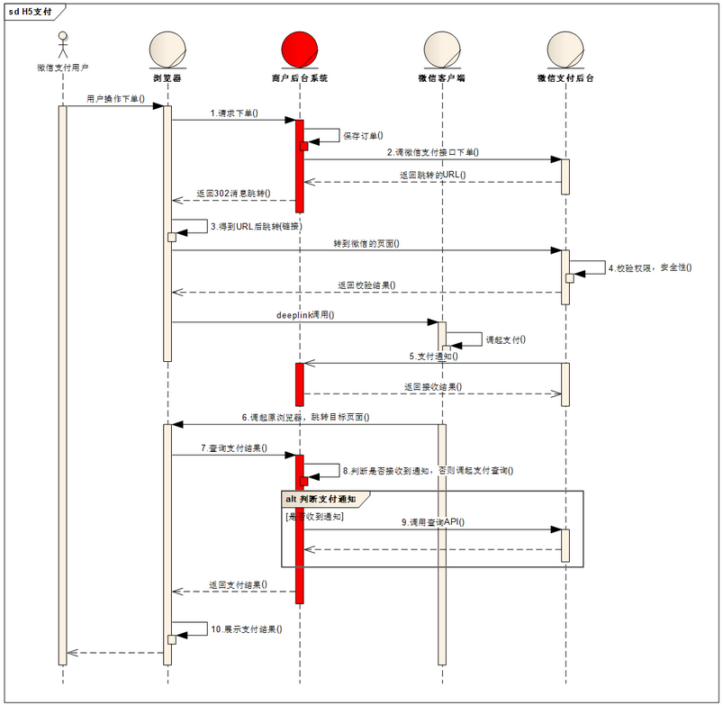

* [一、项目概览](#一数据类型)
    * [1.1 简介](#11-简介) 
    * [1.2 环境](#12-环境)
    * [1.3 源码及官网](#13-源码及官网)
* [二、项目使用](#二项目使用)
* [三、项目设计](#三项目设计)
    * [3.1 总体设计](#31-总体设计)
    * [3.2 关键点分析](#32-关键点分析)
        * [3.2.1 微信扫码付实现](#321-微信扫码付实现)  
        * [3.2.2 微信公众号支付和微信浏览器中h5支付实现](#322-微信公众号支付和微信浏览器中h5支付实现)  
        * [3.2.3 微信移动设备中浏览器h5支付实现](#323-微信移动设备中浏览器h5支付实现)  
        * [3.2.4 支付宝电脑支付实现](#324-支付宝电脑支付实现) 
        * [3.2.5 支付宝手机H5支付实现](#325-支付宝手机H5支付实现) 
        * [3.2.6 支付宝二维码支付实现](#326-支付宝二维码支付实现)        
              
* [四、其他](#四其他)

# 一、项目概览

## 1.1 简介
- spring-boot-pay是支付服务：支付宝，微信，银联详细代码案例。

## 1.2 环境
```aidl
JDK1.8、Maven、Eclipse、SpringBoot1.5.10、
spring-boot-starter-thymeleaf、Dubbo2.6.2、zookeeper3.5.3
```
## 1.3 源码及官网

[gitee源码](https://gitee.com/52itstyle/spring-boot-pay)

# 二、项目使用


# 三、项目设计

## 3.1 总体设计
无

## 3.2 关键点分析

### 3.2.1 微信扫码付实现

- 模式一开发前，商户必须在公众平台后台设置支付回调URL。URL实现的功能：接收用户扫码后微信支付系统回调的productid和openid；

```aidl
Native支付
Native支付是商户系统按微信支付协议生成支付二维码，用户再用微信“扫一扫”完成支付的模式。
该模式适用于PC网站支付、实体店单品或订单支付、媒体广告支付等场景。 

微信官网API：https://pay.weixin.qq.com/wiki/doc/api/native.php?chapter=6_4

@ApiOperation(value="二维码支付(模式一)根据商品ID预先生成二维码")
@RequestMapping(value="qcPay1",method=RequestMethod.POST)
public String  qcPay1(Product product,ModelMap map) {
    logger.info("二维码支付(模式一)");
    weixinPayService.weixinPay1(product);
    String img= "../qrcode/"+product.getProductId()+".png";  
    map.addAttribute("img", img);
    return "weixinpay/qcpay";
}

@Override //根据分配appid等直接生成支付链接
public void weixinPay1(Product product) {
    //商户支付回调URL设置指引：进入公众平台-->微信支付-->开发配置-->扫码支付-->修改 加入回调URL
    //注意参数初始化 这只是个Demo
    SortedMap<Object, Object> packageParams = new TreeMap<Object, Object>();
    //封装通用参数
    ConfigUtil.commonParams(packageParams);
    packageParams.put("product_id", product.getProductId());//真实商品ID
    packageParams.put("time_stamp", PayCommonUtil.getCurrTime());
    //生成签名
    String sign = PayCommonUtil.createSign("UTF-8", packageParams, ConfigUtil.API_KEY);
    //组装二维码信息(注意全角和半角：的区别 狗日的腾讯)
    StringBuffer qrCode = new StringBuffer();
    qrCode.append("weixin://wxpay/bizpayurl?");
    qrCode.append("appid="+ConfigUtil.APP_ID);
    qrCode.append("&mch_id="+ConfigUtil.MCH_ID);
    qrCode.append("&nonce_str="+packageParams.get("nonce_str"));
    qrCode.append("&product_id="+product.getProductId());
    qrCode.append("&time_stamp="+packageParams.get("time_stamp"));
    qrCode.append("&sign="+sign);
    String imgPath= Constants.QRCODE_PATH+Constants.SF_FILE_SEPARATOR+product.getProductId()+".png";
    /**
     * 生成二维码
     * 1、这里如果是一个单独的服务的话，建议直接返回qrCode即可，调用方自己生成二维码
     * 2、 如果真要生成，生成到系统绝对路径
     */
    ZxingUtils.getQRCodeImge(qrCode.toString(), 256, imgPath);
}

/**
 * 模式一支付回调URL(生成二维码见 qrCodeUtil)
 * 商户支付回调URL设置指引：进入公众平台-->微信支付-->开发配置-->扫码支付-->修改
 * @Author  科帮网
 * @param request
 * @param response
 * @throws Exception  void
 * @Date	2017年8月3日
 * 更新日志
 * 2017年8月3日  科帮网 首次创建
 *
 */
@SuppressWarnings({ "unchecked", "rawtypes"})
@ApiOperation(value="模式一支付回调URL")
@RequestMapping(value="bizpayurl",method=RequestMethod.POST)
public void bizpayurl(HttpServletRequest request, HttpServletResponse response) throws Exception {
    logger.info("模式一支付回调URL");
    //读取参数
    InputStream inputStream = request.getInputStream();
    StringBuffer sb = new StringBuffer();
    String s;
    BufferedReader in = new BufferedReader(new InputStreamReader(inputStream, "UTF-8"));
    while ((s = in.readLine()) != null) {
        sb.append(s);
    }
    in.close();
    inputStream.close();
    
    //解析xml成map
    Map<String, String> map = XMLUtil.doXMLParse(sb.toString());
    //过滤空 设置 TreeMap
    SortedMap<Object, Object> packageParams = new TreeMap<Object, Object>();
    Iterator it = map.keySet().iterator();
    while (it.hasNext()) {
        String parameter = (String) it.next();
        String parameterValue = map.get(parameter);

        String v = "";
        if (null != parameterValue) {
            v = parameterValue.trim();
        }
        packageParams.put(parameter, v);
    }
    //判断签名是否正确
    if (PayCommonUtil.isTenpaySign("UTF-8", packageParams, ConfigUtil.API_KEY)) {
        //统一下单
        SortedMap<Object, Object> params = new TreeMap<Object, Object>();
        ConfigUtil.commonParams(params);
        //随即生成一个 入库 走业务逻辑
        String out_trade_no=Long.toString(System.currentTimeMillis());
        params.put("body", "模式一扫码支付");// 商品描述
        params.put("out_trade_no", out_trade_no);// 商户订单号
        params.put("total_fee", "100");// 总金额
        params.put("spbill_create_ip", "192.168.1.66");// 发起人IP地址
        params.put("notify_url", notify_url);// 回调地址
        params.put("trade_type", "NATIVE");// 交易类型
        
        String paramsSign = PayCommonUtil.createSign("UTF-8", params, ConfigUtil.API_KEY);
        params.put("sign", paramsSign);// 签名
        String requestXML = PayCommonUtil.getRequestXml(params);

        String resXml = HttpUtil.postData(ConfigUtil.UNIFIED_ORDER_URL, requestXML); //调用微信的统一下单接口
        Map<String, String>  payResult = XMLUtil.doXMLParse(resXml);
        String returnCode = (String) payResult.get("return_code");
        if("SUCCESS".equals(returnCode)){
            String resultCode = (String) payResult.get("result_code");
            if("SUCCESS".equals(resultCode)){
                logger.info("(订单号：{}生成微信支付码成功)",out_trade_no);
                
                String prepay_id = payResult.get("prepay_id");
                SortedMap<Object, Object> prepayParams = new TreeMap<Object, Object>();
                ConfigUtil.commonParams(params);
                prepayParams.put("prepay_id", prepay_id); //把下单接口中的预支付prepay_id返回给微信平台，之后用户扫码支付
                prepayParams.put("return_code", "SUCCESS"); 
                prepayParams.put("result_code", "SUCCESS");
                String prepaySign =  PayCommonUtil.createSign("UTF-8", prepayParams, ConfigUtil.API_KEY);
                prepayParams.put("sign", prepaySign);
                String prepayXml = PayCommonUtil.getRequestXml(prepayParams);
                
                //通知微信 预下单成功
                BufferedOutputStream out = new BufferedOutputStream(response.getOutputStream());
                out.write(prepayXml.getBytes());
                out.flush();
                out.close();
            }else{
                String errCodeDes = (String) map.get("err_code_des");
                logger.info("(订单号：{}生成微信支付码(系统)失败[{}])",out_trade_no,errCodeDes);
            }
        }else{
            String returnMsg = (String) map.get("return_msg");
            logger.info("(订单号：{} 生成微信支付码(通信)失败[{}])",out_trade_no,returnMsg);
        }
    }else{
        logger.info("签名错误");
    }
}

/**
 * 支付后台回调   用户扫码支付后，微信平台通知支付结果
 * @Author  科帮网
 * @param request
 * @param response
 * @throws Exception  void
 * @Date	2017年7月31日
 * 更新日志
 * 2017年7月31日  科帮网 首次创建
 *
 */
@SuppressWarnings({ "unchecked", "rawtypes" })
@ApiOperation(value="支付后台回调")
@RequestMapping(value="pay",method=RequestMethod.POST)
public void weixin_notify(HttpServletRequest request, HttpServletResponse response) throws Exception {
    // 读取参数
    InputStream inputStream = request.getInputStream();
    StringBuffer sb = new StringBuffer();
    String s;
    BufferedReader in = new BufferedReader(new InputStreamReader(inputStream, "UTF-8"));
    while ((s = in.readLine()) != null) {
        sb.append(s);
    }
    in.close();
    inputStream.close();

    // 解析xml成map
    Map<String, String> m = new HashMap<String, String>();
    m = XMLUtil.doXMLParse(sb.toString());

    // 过滤空 设置 TreeMap
    SortedMap<Object, Object> packageParams = new TreeMap<Object, Object>();
    Iterator it = m.keySet().iterator();
    while (it.hasNext()) {
        String parameter = (String) it.next();
        String parameterValue = m.get(parameter);

        String v = "";
        if (null != parameterValue) {
            v = parameterValue.trim();
        }
        packageParams.put(parameter, v);
    }
    // 账号信息
    String key = ConfigUtil.API_KEY; // key
    // 判断签名是否正确
    if (PayCommonUtil.isTenpaySign("UTF-8", packageParams, key)) {
        logger.info("微信支付成功回调");
        // ------------------------------
        // 处理业务开始
        // ------------------------------
        String resXml = "";
        if ("SUCCESS".equals((String) packageParams.get("result_code"))) {
            // 这里是支付成功
            String orderNo = (String) packageParams.get("out_trade_no"); //根据out_trade_no商品订单号，确认是哪个订单完成支付
            logger.info("微信订单号{}付款成功",orderNo);
            //这里 根据实际业务场景 做相应的操作
            // 通知微信.异步确认成功.必写.不然会一直通知后台.八次之后就认为交易失败了.
            resXml = "<xml>" + "<return_code><![CDATA[SUCCESS]]></return_code>" + "<return_msg><![CDATA[OK]]></return_msg>" + "</xml> ";
        } else {
            logger.info("支付失败,错误信息：{}",packageParams.get("err_code"));
            resXml = "<xml>" + "<return_code><![CDATA[FAIL]]></return_code>" + "<return_msg><![CDATA[报文为空]]></return_msg>" + "</xml> ";
        }
        // ------------------------------
        // 处理业务完毕
        // ------------------------------
        BufferedOutputStream out = new BufferedOutputStream(response.getOutputStream());
        out.write(resXml.getBytes());
        out.flush();
        out.close();
    } else {
        logger.info("通知签名验证失败");
    }
}

```

- 模式二与模式一相比，流程更为简单，不依赖设置的回调支付URL。商户后台系统先调用微信支付的统一下单接口，微信后台系统返回链接参数code_url，商户后台系统将code_url值生成二维码图片，用户使用微信客户端扫码后发起支付。注意：code_url有效期为2小时，过期后扫码不能再发起支付。

```aidl
微信官网API：https://pay.weixin.qq.com/wiki/doc/api/native.php?chapter=6_5

@ApiOperation(value="二维码支付(模式二)下单并生成二维码")
@RequestMapping(value="qcPay2",method=RequestMethod.POST)
public String  qcPay2(Product product,ModelMap map) {
    logger.info("二维码支付(模式二)");
    //参数自定义  这只是个Demo
    product.setProductId("20170721");
    product.setBody("两个苹果八毛钱 ");
    product.setSpbillCreateIp("192.168.1.66");
    String message  =  weixinPayService.weixinPay2(product);
    if(Constants.SUCCESS.equals(message)){
        String img= "../qrcode/"+product.getOutTradeNo()+".png";
        map.addAttribute("img", img);
    }else{
        //失败
    }
    return "weixinpay/qcpay";
}

/**
 * 微信支付要求商户订单号保持唯一性（建议根据当前系统时间加随机序列来生成订单号）。
 * 重新发起一笔支付要使用原订单号，避免重复支付；已支付过或已调用关单、撤销的订单号不能重新发起支付。
 * 注意：支付金额和商品描述必须一样，下单后金额或者描述如果有改变也会出现订单号重复。
 */
@SuppressWarnings("rawtypes")
@Override
public String weixinPay2(Product product) {
    logger.info("订单号：{}生成微信支付码",product.getOutTradeNo());
    String  message = Constants.SUCCESS;
    try {
        String imgPath= Constants.QRCODE_PATH+Constants.SF_FILE_SEPARATOR+product.getOutTradeNo()+".png";
        // 账号信息
        String key = ConfigUtil.API_KEY; // key
        String trade_type = "NATIVE";// 交易类型 原生扫码支付
        SortedMap<Object, Object> packageParams = new TreeMap<Object, Object>();
        ConfigUtil.commonParams(packageParams);
        packageParams.put("product_id", product.getProductId());// 商品ID
        packageParams.put("body", product.getBody());// 商品描述
        packageParams.put("out_trade_no", product.getOutTradeNo());// 商户订单号
        String totalFee = product.getTotalFee();
        totalFee =  CommonUtil.subZeroAndDot(totalFee);
        packageParams.put("total_fee", totalFee);// 总金额
        packageParams.put("spbill_create_ip", product.getSpbillCreateIp());// 发起人IP地址
        packageParams.put("notify_url", notify_url);// 回调地址
        packageParams.put("trade_type", trade_type);// 交易类型
        String sign = PayCommonUtil.createSign("UTF-8", packageParams, key);
        packageParams.put("sign", sign);// 签名

        String requestXML = PayCommonUtil.getRequestXml(packageParams); 
        String resXml = HttpUtil.postData(ConfigUtil.UNIFIED_ORDER_URL, requestXML); //调用微信的统一下单接口，返回code_url，用来给用户扫码支付
        Map map = XMLUtil.doXMLParse(resXml);
        String returnCode = (String) map.get("return_code");
        if("SUCCESS".equals(returnCode)){
            String resultCode = (String) map.get("result_code");
            if("SUCCESS".equals(resultCode)){
                logger.info("订单号：{}生成微信支付码成功",product.getOutTradeNo());
                String urlCode = (String) map.get("code_url"); 
                ConfigUtil.shorturl(urlCode);//转换为短链接
                ZxingUtils.getQRCodeImge(urlCode, 256, imgPath);// 生成二维码
            }else{
                String errCodeDes = (String) map.get("err_code_des");
                logger.info("订单号：{}生成微信支付码(系统)失败:{}",product.getOutTradeNo(),errCodeDes);
                message = Constants.FAIL;
            }
        }else{
            String returnMsg = (String) map.get("return_msg");
            logger.info("(订单号：{}生成微信支付码(通信)失败:{}",product.getOutTradeNo(),returnMsg);
            message = Constants.FAIL;
        }
    } catch (Exception e) {
        logger.error("订单号：{}生成微信支付码失败(系统异常))",product.getOutTradeNo(),e);
        message = Constants.FAIL;
    }
    return message;
}


支付回调与模式一样

```

### 3.2.2 微信公众号支付和微信浏览器中h5支付实现


```
JSAPI支付是用户在微信中打开商户的H5页面，商户在H5页面通过调用微信支付提供的JSAPI接口调起微信支付模块完成支付。应用场景有：
    ◆ 用户在微信公众账号内进入商家公众号，打开某个主页面，完成支付
    ◆ 用户的好友在朋友圈、聊天窗口等分享商家页面连接，用户点击链接打开商家页面，完成支付
    ◆ 将商户页面转换成二维码，用户扫描二维码后在微信浏览器中打开页面后完成支付

@ApiOperation(value="JSAPI支付(需要公众号内支付)")
@RequestMapping(value="pay",method=RequestMethod.POST)
public String  pay(Product product,ModelMap map) {
    logger.info("H5支付(需要公众号内支付)");
    String url =  weixinPayService.weixinPayMobile(product);
    return "redirect:"+url;
}

@Override
public String weixinPayMobile(Product product) {
    String totalFee = product.getTotalFee();
    //redirect_uri 需要在微信支付端添加认证网址
    totalFee =  CommonUtil.subZeroAndDot(totalFee);
    String redirect_uri = server_url+"weixinMobile/dopay?outTradeNo="+product.getOutTradeNo()+"&totalFee="+totalFee;
    //也可以通过state传递参数 redirect_uri 后面加参数未经过验证
    return SnsAPI.connectOauth2Authorize(ConfigUtil.APP_ID, redirect_uri, true,null);
}

/**
 * 预下单(对于已经产生的订单)
 * @Author  科帮网
 * @param request
 * @param response
 * @return
 * @throws Exception  String
 * @Date	2017年7月31日
 * 更新日志
 * 2017年7月31日  科帮网 首次创建
 *
 */
@SuppressWarnings("rawtypes")
@ApiOperation(value="预下单")
@RequestMapping(value="dopay",method=RequestMethod.POST)
public String dopay(HttpServletRequest request, HttpServletResponse response) throws Exception {
    String orderNo = request.getParameter("outTradeNo");
    String totalFee = request.getParameter("totalFee");
    //获取code 这个在微信支付调用时会自动加上这个参数 无须设置
    String code = request.getParameter("code");
    //获取用户openID(JSAPI支付必须传openid)
    String openId = MobileUtil.getOpenId(code);
    String notify_url =server_url+"/weixinMobile/WXPayBack";//回调接口
    String trade_type = "JSAPI";// 交易类型H5支付 也可以是小程序支付参数
    SortedMap<Object, Object> packageParams = new TreeMap<Object, Object>();
    ConfigUtil.commonParams(packageParams);
    packageParams.put("body","报告");// 商品描述
    packageParams.put("out_trade_no", orderNo);// 商户订单号
    packageParams.put("total_fee", totalFee);// 总金额
    packageParams.put("spbill_create_ip", AddressUtils.getIpAddr(request));// 发起人IP地址
    packageParams.put("notify_url", notify_url);// 回调地址
    packageParams.put("trade_type", trade_type);// 交易类型
    packageParams.put("openid", openId);//用户openID
    String sign = PayCommonUtil.createSign("UTF-8", packageParams,ConfigUtil.API_KEY);
    packageParams.put("sign", sign);// 签名
    String requestXML = PayCommonUtil.getRequestXml(packageParams);
    String resXml = HttpUtil.postData(ConfigUtil.UNIFIED_ORDER_URL, requestXML);
    Map map = XMLUtil.doXMLParse(resXml);
    String returnCode = (String) map.get("return_code");
    String returnMsg = (String) map.get("return_msg");
    StringBuffer url = new StringBuffer();
    if("SUCCESS".equals(returnCode)){
        String resultCode = (String) map.get("result_code");
        String errCodeDes = (String) map.get("err_code_des");
        if("SUCCESS".equals(resultCode)){
            //获取预支付交易会话标识
            String prepay_id = (String) map.get("prepay_id");
            String prepay_id2 = "prepay_id=" + prepay_id;
            String packages = prepay_id2;
            SortedMap<Object, Object> finalpackage = new TreeMap<Object, Object>();
            String timestamp = DateUtil.getTimestamp();
            String nonceStr = packageParams.get("nonce_str").toString();
            finalpackage.put("appId",  ConfigUtil.APP_ID);
            finalpackage.put("timeStamp", timestamp);
            finalpackage.put("nonceStr", nonceStr);
            finalpackage.put("package", packages);  
            finalpackage.put("signType", "MD5");
            //这里很重要  参数一定要正确 狗日的腾讯 参数到这里就成大写了
            //可能报错信息(支付验证签名失败 get_brand_wcpay_request:fail)
            sign = PayCommonUtil.createSign("UTF-8", finalpackage,ConfigUtil.API_KEY);
            url.append("redirect:/weixinMobile/payPage?");
            url.append("timeStamp="+timestamp+"&nonceStr=" + nonceStr + "&package=" + packages);
            url.append("&signType=MD5" + "&paySign=" + sign+"&appid="+ ConfigUtil.APP_ID);
            url.append("&orderNo="+orderNo+"&totalFee="+totalFee);
        }else{
            logger.info("订单号:{}错误信息:{}",orderNo,errCodeDes);
            url.append("redirect:/weixinMobile/error?code=0&orderNo="+orderNo);//该订单已支付
        }
    }else{
        logger.info("订单号:{}错误信息:{}",orderNo,returnMsg);
        url.append("redirect:/weixinMobile/error?code=1&orderNo="+orderNo);//系统错误
    }
    return url.toString();
}

@ApiOperation(value="公众号H5支付主页")
@RequestMapping(value="payPage",method=RequestMethod.GET)
public String pay(HttpServletRequest request, HttpServletResponse response) throws Exception {
    //这里因为无法测试、模板下是个JSP页面、无法正常运行，请自行修改逻辑
    return "weixinpay/payPage";
}

jsp文件
    <title>微信支付</title>
    <meta charset="UTF-8"/>
    <meta name="viewport" content="width=device-width, initial-scale=1.0, minimum-scale=1.0, maximum-scale=1.0, user-scalable=no"/>
    <meta name="apple-mobile-web-app-capable" content="yes"/>
    <meta name="apple-mobile-web-app-status-bar-style" content="black"/>
    <meta name="format-detection" content="telephone=no"/>
    <link   rel="stylesheet" type="text/css" href="<%=basePath%>static/css/pay.css"/>
    <script type="text/javascript" src="<%=basePath%>static/js/flexible.js" ></script>
    <script type="text/javascript" src="<%=basePath%>static/js/jquery-1.10.2.min.js"></script>
    <script src="http://res.wx.qq.com/open/js/jweixin-1.0.0.js"></script>
    </head>
    <body>
            <article class="order-main ">
                <div class="ph_order">
                    <div class=" affirm-info">
                        <h4 id="orderNo"></h4>
                        <h3 id="totalFee"></h3>
                        <div class="detail-dl">
                            <dl>
                                <dt>收款方</dt>
                                <dd>科帮网</dd>
                            </dl>
                            <dl>
                                <dt>商&nbsp;&nbsp;&nbsp;品</dt>
                                <dd id="productName">在线订单</dd>
                            </dl>
                        </div>
                        <div  onclick="callpay()" class="pay-info">立即支付</div>
                    </div>
    
                </div>
            </article>
    </body>
    <script type="text/javascript">
    var orderNo = '<%=orderNo%>';
    var totalFee  = '<%=totalFee%>';
    $(function(){
        $(".affirm-info").height($(window).height());
        $(window).resize(function(){
            //main-body高度适应屏幕
            $(".affirm-info").height($(window).height());
        });
        init();
    });
    function onBridgeReady(){
        WeixinJSBridge.invoke('getBrandWCPayRequest',{
                 "appId" : "<%=appId%>",
                 "timeStamp" : "<%=timeStamp%>",
                 "nonceStr" : "<%=nonceStr%>", 
                 "package" : "<%=packageValue%>",
                 "signType" : "MD5",
                 "paySign" : "<%=paySign%>" 
             },function(res){
                //使用以上方式判断前端返回,微信团队郑重提示：res.err_msg将在用户支付成功后返回    ok，但并不保证它绝对可靠。
             if(res.err_msg == "get_brand_wcpay_request:ok"){
                 //微信 自带 支付成功效果
                 var url = "自定义http 跳转到支付系统页面";
                 window.location.href=url;
             }else if(res.err_msg == "get_brand_wcpay_request:cancel"){  
                 alert("用户取消支付!");  
             }else if(res.err_msg == "get_brand_wcpay_request：fail"){  
                 alert("支付失败!");  
             }  
        })
    }
    function callpay(){  
          if (typeof WeixinJSBridge == "undefined"){
             if( document.addEventListener ){
                   document.addEventListener('WeixinJSBridgeReady', onBridgeReady, false);
               }else if (document.attachEvent){
                   document.attachEvent('WeixinJSBridgeReady', onBridgeReady); 
                   document.attachEvent('onWeixinJSBridgeReady', onBridgeReady);
              }
           }else{
             onBridgeReady();
           }
    }
    function init(){
        $("#orderNo").html("科帮网-订单编号："+orderNo);
        totalFee = accDiv(totalFee,100);
        $("#totalFee").html("￥"+totalFee);
    }
    function accDiv(arg1,arg2){
        var t1=0,t2=0,r1,r2;
        try{t1=arg1.toString().split(".")[1].length;}catch(e){}
        try{t2=arg2.toString().split(".")[1].length;}catch(e){}
        with(Math){
            r1=Number(arg1.toString().replace(".",""));
            r2=Number(arg2.toString().replace(".",""));
            return (r1/r2)*pow(10,t2-t1);
        }
    }
    </script>
    </html>

	
```

### 3.2.3 微信移动设备中浏览器h5支付实现


```
H5支付
H5支付主要是在手机、ipad等移动设备中通过浏览器来唤起微信支付的支付产品。

接口文档：https://pay.weixin.qq.com/wiki/doc/api/H5.php?chapter=15_4

@ApiOperation(value="纯H5支付(不建议在APP端使用)")
@RequestMapping(value="h5pay",method=RequestMethod.POST)
public String  h5pay(Product product,ModelMap map) {
    logger.info("纯H5支付(不建议在APP端使用)");
    //mweb_url为拉起微信支付收银台的中间页面，可通过访问该url来拉起微信客户端，完成支付,mweb_url的有效期为5分钟。
    String mweb_url =  weixinPayService.weixinPayH5(product);
    if(StringUtils.isNotBlank(mweb_url)){
        return "redirect:"+mweb_url;
    }else{
        return "redirect:https://blog.52itstyle.com";//自定义错误页面
    }
}

@Override //调用下单接口，得到url，给用户支付
public String weixinPayH5(Product product) {
    logger.info("订单号：{}发起H5支付",product.getOutTradeNo());
    String  mweb_url = "";
    try {
        // 账号信息
        String key = ConfigUtil.API_KEY; // key
        String trade_type = "MWEB";//交易类型 H5 支付 
        SortedMap<Object, Object> packageParams = new TreeMap<Object, Object>();
        ConfigUtil.commonParams(packageParams);
        packageParams.put("product_id", product.getProductId());// 商品ID
        packageParams.put("body", product.getBody());// 商品描述
        packageParams.put("out_trade_no", product.getOutTradeNo());// 商户订单号
        String totalFee = product.getTotalFee();
        totalFee =  CommonUtil.subZeroAndDot(totalFee);
        packageParams.put("total_fee", totalFee);// 总金额
        //H5支付要求商户在统一下单接口中上传用户真实ip地址 spbill_create_ip
        packageParams.put("spbill_create_ip", product.getSpbillCreateIp());// 发起人IP地址
        packageParams.put("notify_url", notify_url);// 回调地址
        packageParams.put("trade_type", trade_type);// 交易类型
        //H5支付专用 
        JSONObject value = new JSONObject();
        value.put("type", "WAP");
        value.put("wap_url", "https://blog.52itstyle.com");////WAP网站URL地址
        value.put("wap_name", "科帮网充值");//WAP 网站名
        JSONObject scene_info = new JSONObject();
        scene_info.put("h5_info", value);
        packageParams.put("scene_info", scene_info.toString());
        
        String sign = PayCommonUtil.createSign("UTF-8", packageParams, key);
        packageParams.put("sign", sign);// 签名

        String requestXML = PayCommonUtil.getRequestXml(packageParams);
        String resXml = HttpUtil.postData(ConfigUtil.UNIFIED_ORDER_URL, requestXML);
        Map map = XMLUtil.doXMLParse(resXml);
        String returnCode = (String) map.get("return_code");
        if("SUCCESS".equals(returnCode)){
            String resultCode = (String) map.get("result_code");
            if("SUCCESS".equals(resultCode)){
                logger.info("订单号：{}发起H5支付成功",product.getOutTradeNo());
                mweb_url = (String) map.get("mweb_url");
            }else{
                String errCodeDes = (String) map.get("err_code_des");
                logger.info("订单号：{}发起H5支付(系统)失败:{}",product.getOutTradeNo(),errCodeDes);
            }
        }else{
            String returnMsg = (String) map.get("return_msg");
            logger.info("(订单号：{}发起H5支付(通信)失败:{}",product.getOutTradeNo(),returnMsg);
        }
    } catch (Exception e) {
        logger.error("订单号：{}发起H5支付失败(系统异常))",product.getOutTradeNo(),e);
    }
    return mweb_url;
}


支付回调与扫码支付回调一样

```


### 3.2.4 银联支付PC和手机h5支付实现


```
网关支付产品主要适用于持卡人在商户网站B2C购物支付场景，持卡人通过点击银联在线支付图标，并跳转银联页面完成支付信息录入，最终完成支付。
从PC端发起的交易为WEB网关支付交易，从移动端发起的交易为WAP网关支付交易。

官网API： https://open.unionpay.com/tjweb/acproduct/list?apiservId=448

@ApiOperation(value="电脑支付")
@RequestMapping(value="pcPay",method=RequestMethod.POST)
public String  pcPay(Product product,ModelMap map) {
    logger.info("电脑支付");
    product.setPayWay(PayWay.PC.getCode());
    String form  =  unionPayService.unionPay(product);
    map.addAttribute("form", form);
    return "unionpay/pay";
}
@ApiOperation(value="手机H5支付")
@RequestMapping(value="mobilePay",method=RequestMethod.POST)
public String  mobilePay(Product product,ModelMap map) {
    logger.info("手机H5支付");
    product.setPayWay(PayWay.MOBILE.getCode());
    String form  =  unionPayService.unionPay(product);
    map.addAttribute("form", form);
    return "unionpay/pay";
}

/**
 * 银联支付返回一个form表单
 * @Author  科帮网
 * @param product
 * @return 
 * @Date	2017年8月2日
 * 更新日志
 * 2017年8月2日  科帮网 首次创建
 *
 */
@Override
public String unionPay(Product product) {
    Map<String, String> requestData = new HashMap<String, String>();
    /***银联全渠道系统，产品参数，除了encoding自行选择外其他不需修改***/
    requestData.put("version", UnionConfig.version);   			  //版本号，全渠道默认值
    requestData.put("encoding", UnionConfig.encoding_UTF8); 	  //字符集编码，可以使用UTF-8,GBK两种方式
    requestData.put("signMethod", "01");            			  //签名方法，只支持 01：RSA方式证书加密
    requestData.put("txnType", "01");               			  //交易类型 ，01：消费
    requestData.put("txnSubType", "01");            			  //交易子类型， 01：自助消费
    requestData.put("bizType", "000201");           			  //业务类型，B2C网关支付，手机wap支付
    //渠道类型，这个字段区分B2C网关支付和手机wap支付；07：PC,平板  08：手机
    if(product.getPayWay()==PayWay.MOBILE.getCode()){//手机支付
        requestData.put("channelType", "08");     
    }else{//PC支付
        requestData.put("channelType", "07");
    }
    //前台回调地址(自定义)
    String frontUrl = "http://git.oschina.net/52itstyle";
    requestData.put("frontUrl", frontUrl);
    /***商户接入参数 测试账号***/
    requestData.put("merId", UnionConfig.merId);    	          //商户号码，请改成自己申请的正式商户号或者open上注册得来的777测试商户号
    requestData.put("accessType", "0");             			  //接入类型，0：直连商户 
    requestData.put("orderId", product.getOutTradeNo());          //商户订单号，8-40位数字字母，不能含“-”或“_”，可以自行定制规则		
    requestData.put("txnTime", UnionConfig.getCurrentTime());     //订单发送时间，取系统时间，格式为YYYYMMDDhhmmss，必须取当前时间，否则会报txnTime无效
    requestData.put("currencyCode", "156");         			  //交易币种（境内商户一般是156 人民币）
    requestData.put("txnAmt", CommonUtil.subZeroAndDot(product.getTotalFee()));             //交易金额，单位分，不要带小数点
    //这里组织穿透数据 业务以及交易类型(使用json数据报错)
    requestData.put("reqReserved","自定义参数");	      //请求方保留域，如需使用请启用即可；透传字段（可以实现商户自定义参数的追踪）本交易的后台通知,对本交易的交易状态查询交易、对账文件中均会原样返回，商户可以按需上传，长度为1-1024个字节		
    
    //前台通知地址 （需设置为外网能访问 http https均可），支付成功后的页面 点击“返回商户”按钮的时候将异步通知报文post到该地址
    //如果想要实现过几秒中自动跳转回商户页面权限，需联系银联业务申请开通自动返回商户权限
    //异步通知参数详见open.unionpay.com帮助中心 下载  产品接口规范  网关支付产品接口规范 消费交易 商户通知
    //requestData.put("frontUrl", UnionConfig.frontUrl);
    
    //后台通知地址（需设置为【外网】能访问 http https均可），支付成功后银联会自动将异步通知报文post到商户上送的该地址，失败的交易银联不会发送后台通知
    //后台通知参数详见open.unionpay.com帮助中心 下载  产品接口规范  网关支付产品接口规范 消费交易 商户通知
    //注意:1.需设置为外网能访问，否则收不到通知    2.http https均可  3.收单后台通知后需要10秒内返回http200或302状态码 
    //    4.如果银联通知服务器发送通知后10秒内未收到返回状态码或者应答码非http200，那么银联会间隔一段时间再次发送。总共发送5次，每次的间隔时间为0,1,2,4分钟。
    //    5.后台通知地址如果上送了带有？的参数，例如：http://abc/web?a=b&c=d 在后台通知处理程序验证签名之前需要编写逻辑将这些字段去掉再验签，否则将会验签失败
    requestData.put("backUrl", notify_url);
    
    //////////////////////////////////////////////////
    //
    //       报文中特殊用法请查看 PCwap网关跳转支付特殊用法.txt
    //
    //////////////////////////////////////////////////
    
    /**请求参数设置完毕，以下对请求参数进行签名并生成html表单，将表单写入浏览器跳转打开银联页面**/
    Map<String, String> submitFromData = AcpService.sign(requestData,UnionConfig.encoding_UTF8);  //报文中certId,signature的值是在signData方法中获取并自动赋值的，只要证书配置正确即可。
    //requestFrontUrl的测试环境值为https://gateway.test.95516.com/gateway/api/frontTransReq.do
    String requestFrontUrl = SDKConfig.getConfig().getFrontRequestUrl();  //获取请求银联的前台地址：对应属性文件acp_sdk.properties文件中的acpsdk.frontTransUrl
    String form = AcpService.createAutoFormHtml(requestFrontUrl, submitFromData,UnionConfig.encoding_UTF8);   //生成自动跳转的Html表单
    
    logger.info("打印请求HTML，此为请求报文，为联调排查问题的依据：{}",form);
    //将生成的html写到浏览器中完成自动跳转打开银联支付页面；这里调用signData之后，将html写到浏览器跳转到银联页面之前均不能对html中的表单项的名称和值进行修改，如果修改会导致验签不通过
    //resp.getWriter().write(html);
    return form;// from内容为from表单，用来向银联地址发送消费请求
}

form值填充的页面
    <!DOCTYPE html>
    <!-- 哈哈哈 我是个天才 -->
    <html xmlns:th="http://www.thymeleaf.org">
    <head>
    <meta http-equiv="Content-Type" content="text/html; charset=utf-8"></meta>
    <title>银联支付</title>
    </head>
    <body th:utext=${form}>
        电脑支付
    </body>
    </html>
用户在跳转后的银联支付页面输入信息，进行支付，支付结果异步通知

@ApiOperation(value="银联回调通知")
@RequestMapping(value="pay",method=RequestMethod.POST)
public void union_notify(HttpServletRequest request, HttpServletResponse response) throws Exception {
    logger.info("银联接收后台通知开始");
    String encoding = request.getParameter(SDKConstants.param_encoding);
    // 获取银联通知服务器发送的后台通知参数
    Map<String, String> reqParam = getAllRequestParam(request);
    //打印参数
    logger.info(reqParam.toString());
    Map<String, String> valideData = null;
    if (null != reqParam && !reqParam.isEmpty()) {
        Iterator<Entry<String, String>> it = reqParam.entrySet().iterator();
        valideData = new HashMap<String, String>(reqParam.size());
        while (it.hasNext()) {
            Entry<String, String> e = it.next();
            String key = (String) e.getKey();
            String value = (String) e.getValue();
            value = new String(value.getBytes(encoding), encoding);
            valideData.put(key, value);
        }
    }
    //重要！验证签名前不要修改reqParam中的键值对的内容，否则会验签不过
    if (!AcpService.validate(valideData, encoding)) {
        logger.info("银联验证签名结果[失败].");
    } else {
        logger.info("银联验证签名结果[成功].");
        String outtradeno =valideData.get("orderId");//订单号
        String reqReserved = valideData.get("reqReserved");//辅助信息(字段穿透)
        logger.info("处理相关业务逻辑{},{}",outtradeno,reqReserved);
        response.getWriter().print("ok");//返回给银联服务器http 200  状态码
    }
}

```

### 3.2.4 支付宝电脑支付实现


```
通过电脑网站支付功能，用户在商家 PC 网站消费后界面会自动跳转到支付宝 PC 网站收银台完成付款。 交易资金直接打入商家支付宝账户，实时到账。
官网API：https://docs.open.alipay.com/270/105899/

@ApiOperation(value="电脑支付")
@RequestMapping(value="pcPay",method=RequestMethod.POST)
public String  pcPay(Product product,ModelMap map) {
    logger.info("电脑支付");
    String form  =  aliPayService.aliPayPc(product);
    map.addAttribute("form", form);
    return "alipay/pay";
}

@Override
public String aliPayPc(Product product) {
    logger.info("支付宝PC支付下单");
    AlipayTradePagePayRequest alipayRequest = new AlipayTradePagePayRequest();
    String returnUrl = "前台回调地址 http 自定义";
    alipayRequest.setReturnUrl(returnUrl);//前台通知
    alipayRequest.setNotifyUrl(notify_url);//后台回调
    JSONObject bizContent = new JSONObject();
    bizContent.put("out_trade_no", product.getOutTradeNo());
    bizContent.put("total_amount", product.getTotalFee());//订单金额:元
    bizContent.put("subject",product.getSubject());//订单标题
    bizContent.put("seller_id", Configs.getPid());//实际收款账号，一般填写商户PID即可
    bizContent.put("product_code", "FAST_INSTANT_TRADE_PAY");//电脑网站支付
    bizContent.put("body", "两个苹果五毛钱");
    /**
     * 这里有三种模式可供选择
     * 如果在系统内支付，并且是弹出层支付，建议选择模式二、其他模式会跳出当前iframe(亲测有效)
     */
    bizContent.put("qr_pay_mode", "2");
    String biz = bizContent.toString().replaceAll("\"", "'");
    alipayRequest.setBizContent(biz);
    logger.info("业务参数:"+alipayRequest.getBizContent());
    String form = Constants.FAIL;
    try {
        form = AliPayConfig.getAlipayClient().pageExecute(alipayRequest).getBody();
    } catch (AlipayApiException e) {
        logger.error("支付宝构造表单失败",e);
    }
    return form; //form表单的html格式
}

这个页面会直接调整到支付宝页面（{form}的内容自动调整），用户再输入账号信息，完成支付
<!DOCTYPE html>
<!-- 哈哈哈 我是个天才 -->
<html xmlns:th="http://www.thymeleaf.org">
<head>
<meta http-equiv="Content-Type" content="text/html; charset=utf-8"></meta>
<title>支付宝电脑网站支付</title>
</head>
<body th:utext=${form}>
	电脑支付
</body>
</html>

异步结果通知接口
@ApiOperation(value="支付宝支付回调(二维码、H5、网站)")
@RequestMapping(value="pay",method=RequestMethod.POST)
public void alipay_notify(HttpServletRequest request, HttpServletResponse response) throws Exception {
    String  message = "success";
    Map<String, String> params = new HashMap<String, String>();
    // 取出所有参数是为了验证签名
    Enumeration<String> parameterNames = request.getParameterNames();
    while (parameterNames.hasMoreElements()) {
        String parameterName = parameterNames.nextElement();
        params.put(parameterName, request.getParameter(parameterName));
    }
    //验证签名 校验签名
    boolean signVerified = false;
    try {
        signVerified = AlipaySignature.rsaCheckV1(params, Configs.getAlipayPublicKey(), AliPayConfig.CHARSET, AliPayConfig.SIGN_TYPE);
        //各位同学这里可能需要注意一下,2018/01/26 以后新建应用只支持RSA2签名方式，目前已使用RSA签名方式的应用仍然可以正常调用接口，注意下自己生成密钥的签名算法
        //signVerified = AlipaySignature.rsaCheckV1(params, Configs.getAlipayPublicKey(), "UTF-8","RSA2");
        //有些同学通过 可能使用了这个API导致验签失败，特此说明一下
        //signVerified = AlipaySignature.rsaCheckV2(params, Configs.getAlipayPublicKey(), "UTF-8");//正式环境
    } catch (AlipayApiException e) {
        e.printStackTrace();
        message =  "failed";
    }
    if (signVerified) {
        logger.info("支付宝验证签名成功！");
        // 若参数中的appid和填入的appid不相同，则为异常通知
        if (!Configs.getAppid().equals(params.get("app_id"))) {
            logger.info("与付款时的appid不同，此为异常通知，应忽略！");
            message =  "failed";
        }else{
            String outtradeno = params.get("out_trade_no");
            //在数据库中查找订单号对应的订单，并将其金额与数据库中的金额对比，若对不上，也为异常通知
            String status = params.get("trade_status");
            if (status.equals("WAIT_BUYER_PAY")) { // 如果状态是正在等待用户付款
                logger.info(outtradeno + "订单的状态正在等待用户付款");
            } else if (status.equals("TRADE_CLOSED")) { // 如果状态是未付款交易超时关闭，或支付完成后全额退款
                logger.info(outtradeno + "订单的状态已经关闭");
            } else if (status.equals("TRADE_SUCCESS") || status.equals("TRADE_FINISHED")) { // 如果状态是已经支付成功
                logger.info("(支付宝订单号:"+outtradeno+"付款成功)");
                //这里 根据实际业务场景 做相应的操作
            } else {
                
            }
        }
    } else { // 如果验证签名没有通过
        message =  "failed";
        logger.info("验证签名失败！");
    }
    BufferedOutputStream out = new BufferedOutputStream(response.getOutputStream());
    out.write(message.getBytes());
    out.flush();
    out.close();
}
```

### 3.2.5 支付宝手机H5支付实现


```
适用于商家在移动端网页应用中集成支付宝支付功能。
商家在网页中调用支付宝提供的网页支付接口调起支付宝客户端内的支付模块，商家网页会跳转到支付宝中完成支付，
支付完后跳回到商家网页内，最后展示支付结果。若无法唤起支付宝客户端，则在一定的时间后会自动进入网页支付流程。

官网API：https://docs.open.alipay.com/203/105285/

@ApiOperation(value="手机H5支付")
@RequestMapping(value="mobilePay",method=RequestMethod.POST)
public String  mobilePay(Product product,ModelMap map) {
    logger.info("手机H5支付");
    String form  =  aliPayService.aliPayMobile(product);
    map.addAttribute("form", form);
    return "alipay/pay";
}

@Override
public String aliPayMobile(Product product) {
    logger.info("支付宝手机支付下单");
    AlipayTradeWapPayRequest alipayRequest = new AlipayTradeWapPayRequest();
    String returnUrl = "回调地址 http 自定义";
    alipayRequest.setReturnUrl(returnUrl);//前台通知
    alipayRequest.setNotifyUrl(notify_url);//后台回调
    JSONObject bizContent = new JSONObject();
    bizContent.put("out_trade_no", product.getOutTradeNo());
    bizContent.put("total_amount", product.getTotalFee());//订单金额:元
    bizContent.put("subject",product.getSubject());//订单标题
    bizContent.put("seller_id", Configs.getPid());//实际收款账号，一般填写商户PID即可
    bizContent.put("product_code", "QUICK_WAP_PAY");//手机网页支付
    bizContent.put("body", "两个苹果五毛钱");
    String biz = bizContent.toString().replaceAll("\"", "'");
    alipayRequest.setBizContent(biz);
    logger.info("业务参数:"+alipayRequest.getBizContent());
    String form = Constants.FAIL;
    try {
        form = AliPayConfig.getAlipayClient().pageExecute(alipayRequest).getBody();
    } catch (AlipayApiException e) {
        logger.error("支付宝构造表单失败",e);
    }
    return form;
}

这个页面会直接调整到支付宝页面（{form}的内容自动调整），用户再输入账号信息，完成支付
<!DOCTYPE html>
<!-- 哈哈哈 我是个天才 -->
<html xmlns:th="http://www.thymeleaf.org">
<head>
<meta http-equiv="Content-Type" content="text/html; charset=utf-8"></meta>
<title>支付宝电脑网站支付</title>
</head>
<body th:utext=${form}>
	电脑支付
</body>
</html>

支付结果回调与电脑支付中一样

```

### 3.2.6 支付宝二维码支付实现


```
扫码支付，指用户打开支付宝钱包中的“扫一扫”功能，扫描商家展示在某收银场景下的二维码并进行支付的模式。该模式适用于线下实体店支付、面对面支付等场景。

官网API：https://docs.open.alipay.com/194/106078/

@ApiOperation(value="二维码支付")
@RequestMapping(value="qcPay",method=RequestMethod.POST)
public String  qcPay(Product product,ModelMap map) {
    logger.info("二维码支付");
    String message  =  aliPayService.aliPay(product);
    if(Constants.SUCCESS.equals(message)){
        String img= "../qrcode/"+product.getOutTradeNo()+".png";
        map.addAttribute("img", img);
    }else{
        //失败
    }
    return "alipay/qcpay";
}
@Override
public String aliPay(Product product) {
    logger.info("订单号：{}生成支付宝支付码",product.getOutTradeNo());
    String  message = Constants.SUCCESS;
    //二维码存放路径
    System.out.println(Constants.QRCODE_PATH);
    String imgPath= Constants.QRCODE_PATH+Constants.SF_FILE_SEPARATOR+product.getOutTradeNo()+".png";
    String outTradeNo = product.getOutTradeNo();
    String subject = product.getSubject();
    String totalAmount =  CommonUtil.divide(product.getTotalFee(), "100").toString();
    // 如果该字段为空，则默认为与支付宝签约的商户的PID，也就是appid对应的PID
    String sellerId = "";
    // (必填) 商户门店编号，通过门店号和商家后台可以配置精准到门店的折扣信息，详询支付宝技术支持
    String storeId = "test_store_id";
    // 业务扩展参数，目前可添加由支付宝分配的系统商编号(通过setSysServiceProviderId方法)，详情请咨询支付宝技术支持
    ExtendParams extendParams = new ExtendParams();
    extendParams.setSysServiceProviderId("2088100200300400500");
    // 订单描述，可以对交易或商品进行一个详细地描述，比如填写"购买商品2件共15.00元"
    String body = product.getBody();
    // 支付超时，定义为120分钟
    String timeoutExpress = "120m";
    // 创建扫码支付请求builder，设置请求参数
    AlipayTradePrecreateRequestBuilder builder = new AlipayTradePrecreateRequestBuilder()
    .setSubject(subject)
    .setTotalAmount(totalAmount)
    .setOutTradeNo(outTradeNo)
    .setSellerId(sellerId)
    .setBody(body)//128长度 --附加信息
    .setStoreId(storeId)
    .setExtendParams(extendParams)
    .setTimeoutExpress(timeoutExpress)
    .setNotifyUrl(notify_url);//支付宝服务器主动通知商户服务器里指定的页面http路径,根据需要设置
    
    AlipayF2FPrecreateResult result = AliPayConfig.getAlipayTradeService().tradePrecreate(builder);
    switch (result.getTradeStatus()) {
    case SUCCESS:
        logger.info("支付宝预下单成功: )");
        
        AlipayTradePrecreateResponse response = result.getResponse();
        dumpResponse(response);
        ZxingUtils.getQRCodeImge(response.getQrCode(), 256, imgPath);
        break;
        
    case FAILED:
        logger.info("支付宝预下单失败!!!");
        message = Constants.FAIL;
        break;
        
    case UNKNOWN:
        logger.info("系统异常，预下单状态未知!!!");
        message = Constants.FAIL;
        break;
        
    default:
        logger.info("不支持的交易状态，交易返回异常!!!");
        message = Constants.FAIL;
        break;
    }
    return message;
}

给用户扫码用的界面
<!DOCTYPE html>
<!-- 哈哈哈 我是个天才 -->
<html xmlns:th="http://www.thymeleaf.org">
<head>
<meta http-equiv="Content-Type" content="text/html; charset=utf-8"></meta>
<title>支付宝二维码支付</title>
</head>
<body>
	
</body>
</html>

支付结果回调与电脑支付中一样

```

### 3.2.7 支付宝APP支付实现


```
扫码支付，指用户打开支付宝钱包中的“扫一扫”功能，扫描商家展示在某收银场景下的二维码并进行支付的模式。该模式适用于线下实体店支付、面对面支付等场景。
官网API：https://docs.open.alipay.com/194/106078/
```


# 四、其他
