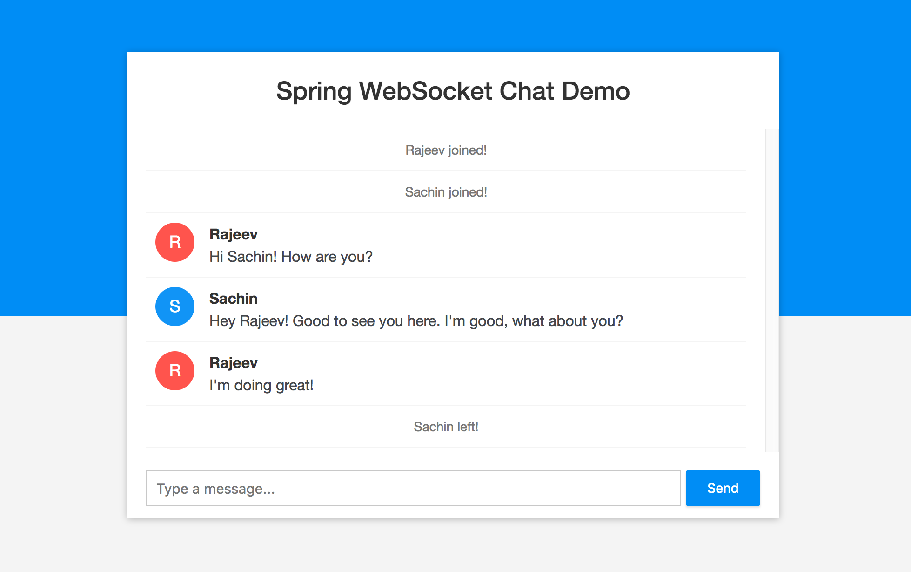

* [一、项目概览](#一数据类型)
    * [1.1 简介](#11-简介) 
    * [1.2 环境](#12-环境)
    * [1.3 源码及官网](#13-源码及官网)
* [二、项目使用](#二项目使用)
* [三、项目设计](#三项目设计)
    * [3.1 总体设计](#31-总体设计)
    * [3.2 关键点分析](#32-关键点分析)
        * [3.2.1 springboot和webseockert实现](#321-springboot和webseockert实现)  
* [四、其他](#四其他)

# 一、项目概览

## 1.1 简介
- spring-boot-websocket-chat-demo是websocket实现的聊天室案例，实时推送信息到客户端。

## 1.2 环境
```aidl
    Java - 1.8.x
    Maven - 3.x.x
```
## 1.3 源码及官网

[github源码](https://github.com/callicoder/spring-boot-websocket-chat-demo)

# 二、项目使用



- 多人打开客户端，输入名称并聊天

# 三、项目设计

## 3.1 总体设计
无

## 3.2 关键点分析

### 3.2.1 springboot和webseockert实现

```aidl
服务端配置
@Configuration
@EnableWebSocketMessageBroker
public class WebSocketConfig implements WebSocketMessageBrokerConfigurer {
    @Override
    public void registerStompEndpoints(StompEndpointRegistry registry) {
        registry.addEndpoint("/ws").withSockJS();
    }
    @Override
    public void configureMessageBroker(MessageBrokerRegistry registry) {
        registry.setApplicationDestinationPrefixes("/app");
        registry.enableSimpleBroker("/topic");   // Enables a simple in-memory broker       
    }
} 

@Controller
public class ChatController {
    @MessageMapping("/chat.sendMessage") //注解提供服务地址，/app/chat.sendMessage
    @SendTo("/topic/public")    //注解发送返回的对象到/topic/public，监听这个topic客户端就收到对象
    public ChatMessage sendMessage(@Payload ChatMessage chatMessage) {
        return chatMessage;
    }
    @MessageMapping("/chat.addUser")
    @SendTo("/topic/public")
    public ChatMessage addUser(@Payload ChatMessage chatMessage,
                               SimpMessageHeaderAccessor headerAccessor) {
        // Add username in web socket session
        headerAccessor.getSessionAttributes().put("username", chatMessage.getSender());
        return chatMessage;
    }
}
@Component
public class WebSocketEventListener {
    private static final Logger logger = LoggerFactory.getLogger(WebSocketEventListener.class);
    @Autowired
    private SimpMessageSendingOperations messagingTemplate;
    @EventListener 
    public void handleWebSocketConnectListener(SessionConnectedEvent event) { //有新客户端连接时
        logger.info("Received a new web socket connection");
    }
    @EventListener
    public void handleWebSocketDisconnectListener(SessionDisconnectEvent event) {//有客户端断开时
        StompHeaderAccessor headerAccessor = StompHeaderAccessor.wrap(event.getMessage());
        String username = (String) headerAccessor.getSessionAttributes().get("username");
        if(username != null) {
            logger.info("User Disconnected : " + username);
            ChatMessage chatMessage = new ChatMessage();
            chatMessage.setType(ChatMessage.MessageType.LEAVE);
            chatMessage.setSender(username);
            messagingTemplate.convertAndSend("/topic/public", chatMessage);
        }
    }
}        

客户端JS

function connect(event) {
    username = document.querySelector('#name').value.trim();
    if(username) {
        usernamePage.classList.add('hidden');
        chatPage.classList.remove('hidden');
        var socket = new SockJS('/ws');  //连接服务器端
        stompClient = Stomp.over(socket);
        stompClient.connect({}, onConnected, onError);
    }
    event.preventDefault();
}

function onConnected() {
    // Subscribe to the Public Topic
    stompClient.subscribe('/topic/public', onMessageReceived); //连接成功后，监听这个/topic/public
    // Tell your username to the server
    stompClient.send("/app/chat.addUser",    //连接成功后，发送信息给服务器端
        {},
        JSON.stringify({sender: username, type: 'JOIN'})
    )
    connectingElement.classList.add('hidden');
}

function onError(error) {
    connectingElement.textContent = 'Could not connect to WebSocket server. Please refresh this page to try again!';
    connectingElement.style.color = 'red';
}

function sendMessage(event) {
    var messageContent = messageInput.value.trim();
    if(messageContent && stompClient) {
        var chatMessage = {
            sender: username,
            content: messageInput.value,
            type: 'CHAT'
        };
        stompClient.send("/app/chat.sendMessage", {}, JSON.stringify(chatMessage));
        messageInput.value = '';
    }
    event.preventDefault();
}

function onMessageReceived(payload) {
    var message = JSON.parse(payload.body);
    var messageElement = document.createElement('li');
    if(message.type === 'JOIN') {
        messageElement.classList.add('event-message');
        message.content = message.sender + ' joined!';
    } else if (message.type === 'LEAVE') {
        messageElement.classList.add('event-message');
        message.content = message.sender + ' left!';
    } else {
        messageElement.classList.add('chat-message');
        var avatarElement = document.createElement('i');
        var avatarText = document.createTextNode(message.sender[0]);
        avatarElement.appendChild(avatarText);
        avatarElement.style['background-color'] = getAvatarColor(message.sender);
        messageElement.appendChild(avatarElement);
        var usernameElement = document.createElement('span');
        var usernameText = document.createTextNode(message.sender);
        usernameElement.appendChild(usernameText);
        messageElement.appendChild(usernameElement);
    }
    var textElement = document.createElement('p');
    var messageText = document.createTextNode(message.content);
    textElement.appendChild(messageText);
    messageElement.appendChild(textElement);
    messageArea.appendChild(messageElement);
    messageArea.scrollTop = messageArea.scrollHeight;
}

例子：
（单对单发送和群发）https://blog.csdn.net/liyongzhi1992/article/details/81221103
（android）https://blog.csdn.net/u013564742/article/details/81041740
（android）https://cloud.tencent.com/developer/article/1368229


```

# 四、其他
